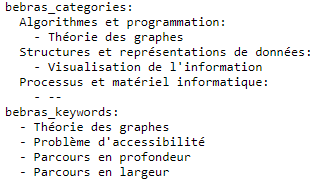

## Lancer le site Web en local

1. Premièrement, veillez à avoir Node installé : [Node website](https://nodejs.org/en/download/)
2. Une fois Node installé et le repo clone, lancez la commande: 
```bash
npm install
```
3. Ensuite lancez
```bash
npm run reload_tasks
```
4. Et pour finalement lancer la plateforme Web en local lancez:
```bash
npm run dev
```
Ouvrez [http://localhost:3000](http://localhost:3000) avec votre navigateur pour voir le résultat.

## Maintenance

Les différents choix que nous avons pu faire concernant le format des
données ainsi que leur stockage ont également été fait dans l'optique de
faciliter l'ajout de futures tâches. Pour ce faire il faut les 3 étapes
suivantes :

1. Ajouter les nouvelles tâches dans le dataset
2. Dans les nouvelles tâches ajouter les nouvelles métadonnées
3. Générer le fichier entier de métadonnées, images et PDF

Nous allons expliquer en détails les 3 étapes à suivre ci-dessous.

#### Ajouter les tâches dans le dataset

Dans le projet, toutes les tâches sont actuellement stockées dans le
dossier : /task_dataset/. Dans celui-ci, chaque nouvelle tâche devrait
être dans le format suivant :


    202X-.../
        graphics/
        interactivity/
        202X-...-deu.task.md
        202X-...-fra.task.md
        202X-...-ita.task.md


#### Ajouter les métadonnées

Pour les nouvelles tâches, rajouter les métadonnées concernant les
keywords, les catégories et potentielles sous-catégories en suivant le
format suivant: 



Dans l'exemple ci-dessus, la tâche possède trois catégories définies dans "*bebras_categories*": "*Algorithmes et programmation*","*Structures et représentations de données*" et "*Processus et matériel informatique*". Les deux premières ont également besoin d'être augmentées d'une sous-catégorie,
dans ce cas "*Théorie des graphes*" et "*Visualisation de l'information*" respectivement. Pour les catégories sans sous-catégories, il faut mettre une sous-catégorie dénomée "--" comme dans l'exemple. Finalement, les mots-clés sont définis "*bebras_keywords*".

#### Générer le fichier de métadonnées

Pour finaliser l'ajout des tâches, il faut appeler la commande
```bash
npm run reload_tasks
```
Si tout a été bien effectué
précédemment, la commande devrait générer le nouveau fichier de
métadonnées ainsi que les images et les PDF.


### Changement de classification

Afin d'augmenter ou modifier les catégories/sous-catégories existantes,
il faut aller dans le fichier app/types/Task.ts. Il se trouve à
l'intérieur la définition de nos cinq catégories dans la constante **CategoryNames** ainsi que la définition des deux sous-catégories dans **AlgoSubCategoryNames** et **StrucSubCategoryNames**. La modification de ces objets entraînera la modification des catégories dans le site Web. Tout ce qu'il reste à faire est de mettre à jour les métadonnées des tâches impactées par le changement de catégories et de regénérer le ficher task.ts en exécutant dans un terminal.
```bash
npm run reload_tasks
```
