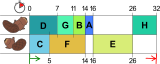
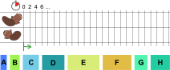
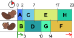

## Body

")

Das Bauen eines Biberdamms lässt sich in mehrere Teilaufgaben zerlegen (Bäume fällen, Äste entfernen, Stämme zum Wasser transportieren, usw.). Das Bild rechts zeigt alle 8&nbsp;Teilaufgaben A, B, C, D, E, F, G, H, jeweils mit der Anzahl der Stunden, die man zu ihrer Erledigung braucht. Die Teilaufgaben sind nicht ganz unabhängig voneinander: Ein Pfeil von X nach Y bedeutet, dass Teilaufgabe X vollständig erledigt sein muss, bevor man mit Teilaufgabe Y anfängt. 

Biberin Ulla will dem Biber Otso helfen, den Damm schneller zu bauen. Sie teilen die Teilaufgaben untereinander auf und erstellen folgenden Arbeitsplan, der die Abhängigkeiten aus dem Bild oben erfüllt.

Damit würde der Damm in 32 Stunden fertig. Das geht aber schneller!

## Question/Challenge - for the brochures

Erstelle einen Arbeitsplan, mit dem der Damm in möglichst kurzer Zeit fertig wird.

## Question/Challenge - for the online challenge

Erstelle einen Arbeitsplan, mit dem der Damm in möglichst kurzer Zeit fertig wird.
Ziehe dazu die Aufgaben nach unten in den Plan.
Aufgaben, die noch nicht begonnen werden können, sind grau gefärbt.
Wenn du mit dem Plan noch nicht zufrieden bist, ziehe Aufgaben zurück nach oben.

## Answer Options/Interactivity Description

:::comment
The students shall drag and drop the jobs from a row into the two rows of the schedule. Any arrangement of jobs is accepted.
:::

## Answer Explanation

Im Arbeitsplan aus der Aufgabe hat der erste Biber eine lange Pause (10 Stunden), und der zweite Biber hat insgesamt 8 Stunden lang Leerlauf. Die beiden wären schneller fertig, wenn sie ständig arbeiteten.

Man kommt zu einem insgesamt schnelleren Arbeitsplan, wenn man darauf achtet, dass die beiden grössten Aufgaben E(10) und F(9) nicht vom selben Biber ausgeführt werden. Hier ist ein möglicher Arbeitsplan, der mit 23 Stunden auskommt. Schneller geht es nicht, denn die beiden Biber arbeiten ohne Pause.

## It's Informatics

Menschen sind ungeduldig, und deshalb wird oft verlangt, dass Arbeiten möglichst schnell erledigt werden. Wenn eine Arbeit aufgeteilt werden kann (ob nun unter mehreren Menschen, Maschinen oder Bibern), dann spielt die Verteilung der Teilaufgaben auf die Arbeitenden für die Schnelligkeit eine wichtige Rolle. 
Genauso müssen auch Computer ihre Berechnungsaufgaben oft geschickt auf verschiedene Prozessorkerne aufteilen. 

Für solche _Scheduling-Probleme_ gibt es viele verschiedene, von der Informatik gut untersuchte Strategien. Der erste Arbeitsplan in dieser Biberaufgabe wurde so erstellt, dass unter den anstehenden Teilaufgaben, jene mit der längsten Dauer einem gerade arbeitslosen Biber zugeteilt wurde – in diesem Fall eine schlechte Strategie. Oft funktioniert es besser, wenn kurze Teilaufgaben zuerst erledigt werden: Die Strategie _Shortest-Job-Next_ (engl. für kürzeste Teilaufgabe zuerst) minimiert zudem auch die durchschnittliche Wartezeit bis zur Fertigstellung pro Teilaufgabe. 

## Keywords and Websites

 - Scheduling: https://de.wikipedia.org/wiki/Scheduling
 - Shortest-Job-Next: https://de.wikipedia.org/wiki/Shortest-Job-Next

## Wording and Phrases

(Not reported from original file)

## Comments

(Not reported from original file)