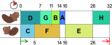
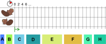

## Body

")
La construction d'un barrage par des castors peut être divisée en plusieurs tâches (abattre des arbres, enlever les branches, transporter les troncs jusqu'à la rivière, etc.). L'image de droite montre les huit tâches A, B, C, D, E, F, G et H et le nombre d'heures nécessaires à chacune pour construire un barrage. Les tâches ne sont pas complètement indépendantes les unes des autres: un flèche de X à Y signifie que la tâche X doit être terminée avec de pouvoir commencer la tâche Y.

La castore Ulla veut aider le castor Otso à construire le barrage plus vite. Ils se répartissent les tâches et font le plan de travail suivant en tenant compte des dépendances indiquées plus haut.

Le barrage serait ainsi terminé en 32 heures. Mais c'est possible de le faire plus vite!

## Question/Challenge - for the brochures

Fais un plan de travail qui permet de finir le barrage le plus vite possible.

## Question/Challenge - for the online challenge

Fais un plan de travail qui permet de finir le barrage le plus vite possible.
Pour cela, glisse les tâches dans le plan du bas. Les tâches qui ne peuvent pas encore être commencées sont en gris. Si tu n'es pas content de ton plan de travail, glisse à nouveau les tâches vers le haut.

## Answer Options/Interactivity Description

:::comment
The students shall drag and drop the jobs from a row into the two rows of the schedule. Any arrangement of jobs is accepted.
:::

## Answer Explanation

Dans le plan de travail de l'exercice, le premier castor a une longue pause (10 heures), et le deuxième castor a en tout 8 heures de libre. Ils auraient terminé plus vite s'ils travaillaient en permanence.

On obtient un plan de travail plus rapide si l'on fait attention à ce que les deux tâches les plus longues E(10) et F(9) ne soient pas effectuées par le même castor. Voici un plan de travail qui ne dure que 23 heures. Ce n'est pas possible de terminer le barrage plus vite, car les deux castors travaillent ici déjà sans pause.

## It's Informatics

L'être humain est impatient de nature, c'est pourquoi il est souvent souhaitable de finir des travaux aussi rapidement que possible. Lorsqu'un travail peut être réparti (que ce soit entre différentes personnes, machines ou castors), la répartition des différentes tâches entre les travailleurs joue un rôle important dans la durée du travail. Similairement, les ordinateurs doivent souvent répartir leur tâches entre différents processeurs de manière optimale.

Il existe plusieurs stratégies bien étudiées pour de tels problèmes d'_ordonnancement_ en informatique. Pour le premier plan de travail de cet exercice, les plus longues tâches parmi toutes celles à réaliser ont été assignées au castor qui ne travaillait pas à ce moment-là – une mauvaise stratégie dans ce cas. Cela fonctionne souvent mieux lorsque les tâches les plus courtes sont effectuées en premier: la stratégie _Shortest job first_ ("le plus court processus en premier" en anglais) minimise aussi le temps d'attente moyen pour chaque tâche.

## Keywords and Websites

 - Ordonnancement: https://fr.wikipedia.org/wiki/Ordonnancement_de_travaux_informatiques
 - Shortest job fext: https://fr.wikipedia.org/wiki/Shortest_job_first

## Wording and Phrases

(Not reported from original file)

## Comments

(Not reported from original file)