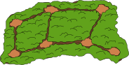
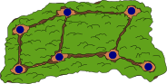
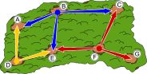

## Body

Die Förster wollen die Tiere auf den Wegen im Wald beobachten. Von jeder Lichtung aus können sie alle abgehenden Wege bis zur nächsten Lichtung beobachten. Es sollen möglichst wenig Förster alle Wege beobachten.

## Question/Challenge - for the brochures

Wähle möglichst wenige Lichtungen, von denen die Förster alle Wege beobachten können!

## Question/Challenge - for the online challenge

Wähle möglichst wenige Lichtungen, von denen die Förster alle Wege beobachten können! Klicke dazu auf die Lichtungen. Klicke noch einmal, um sie wieder abzuwählen.

## Answer Options/Interactivity Description

<!-- empty -->

:::comment 
Interactive task: It is possible to click at an glade to put a ranger on it. Then all ways next to the glade are marked. If you click again on an glade with a ranger, the ranger and the marked ways are removed (except the ways that are observed by other rangers).
:::

## Answer Explanation

Das Bild zeigt die minimale Lösung, bei der Förster auf nur drei Lichtungen stehen und alle Wege beobachten können.

Es gibt acht Wege, die beobachtet werden müssen. Wenn nur zwei Förster alle Wege beobachten könnten, müsste es eine Lichtung geben, von der mindestens vier Wege fortführen.  Aber eine solche Lichtung gibt es nicht in diesem Wald. Daher sind zwei Förster zu wenig.

Es sind also mindestens drei Förster zur Beobachtung aller Wege notwendig. Daher ist die hier angegebene Lösung eine Lösung mit der kleinstmöglichen Anzahl an Förstern. Tatsächlich gibt es keine weitere Lösung mit genau drei Förstern.

Aus der Anzahl der zu überblickenden Wege und der Tatsache, dass es keine Lichtungen mit mehr als drei wegführenden Wegen gibt, können wir schliessen: Jeder Förster muss mindestens zwei Wege überblicken, die die anderen Förster nicht überblicken.

Um die Sackgasse zwischen Lichtung F und G zu überblicken, muss ein Förster auf der Lichtung F platziert werden. Um den Weg zwischen Lichtung B und C zu überblicken, muss der zweite Förster von der Lichtung B aus beobachten. Um die letzten zwei Wege mit nur einem Förster zu überblicken, muss dieser auf der Lichtung D platziert werden. Somit kommt man zwingend auf die angegebene Lösung und es kann keine weiteren geben.

## It's Informatics

Beziehungen zwischen Dingen (z.B. Wege zwischen Lichtungen) können als sogenannter _Graph_ dargestellt werden.
Ein Graph besteht aus _Knoten_ (hier: die Lichtungen), dargestellt als Kreise, und _Kanten_ (hier: die Wege), dargestellt als Linien zwischen den Knoten. Der Graph dieser Aufgabe schaut so aus:

Bei dieser Biberaufgabe soll man in dem Graphen eine kleinste Anzahl an Knoten finden, sodass jede Kante bei mindestens einem dieser Knoten beginnt oder endet. So eine Teilmenge der Knoten nennen Informatiker eine _minimale Knotenüberdeckung_ (engl. _minimal vertex cover_).
Solche Knotenüberdeckungsprobleme finden wir im Alltag zum Beispiel beim Suchen der besten Stellen für Strassenlampen oder für das geschickte Platzieren von Überwachungskameras.

## Keywords and Websites

 - Graph: https://de.wikipedia.org/wiki/Graph_(Graphentheorie)
 - Knotenüberdeckung: https://de.wikipedia.org/wiki/Knoten%C3%BCberdeckung/

## Wording and Phrases

Lichtung: baumlose Stelle im Wald
Weg: eine einfach begehbare Verbindung zwischen zwei Lichtungen.

## Comments

(Not reported from original file)
