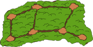

## Body

Les gardes forestiers veulent observer les animaux sur les sentiers de la forêt. Depuis chaque clairière, ils peuvent voir tous les sentiers allant de cette clairière à une clairière suivante. Il doit y avoir aussi peu de gardes forestiers que possible qui surveillent les sentiers.

## Question/Challenge - for the brochures

Choisis des clairières afin que tous les sentiers puissent être surveillés par aussi peu de gardes forestiers que possible

## Question/Challenge - for the online challenge

Sélectionne des clairières afin que tous les sentiers puissent être surveillés par aussi peu de gardes forestiers que possible. Clique pour cela sur les clairières; clique à nouveau pour les désélectionner.

## Answer Options/Interactivity Description

<!-- empty -->

:::comment 
Interactive task: It is possible to click at an glade to put a ranger on it. Then all ways next to the glade are marked. If you click again on an glade with a ranger, the ranger and the marked ways are removed (except the ways that are observed by other rangers).
:::

## Answer Explanation

L'image montre la solution minimale permettant aux gardes forestiers de surveiller tous les sentiers à partir de trois clairières.

Il y a huit sentiers à surveiller. Si seuls deux gardes forestiers suffisaient pour surveiller tous les sentiers, il devrait y avoir une clairière de laquelle partent au moins quatre sentiers, mais il n'y a pas de telle clairière dans cette forêt. Deux gardes forestiers ne suffisent donc pas.

Il faut donc au minimum trois gardes forestiers pour assurer la surveillance de tous les sentiers. La solution présentée ici a donc le plus petit nombre de gardes forestiers possible. Il n'y a pas d'autre solution avec exactement trois gardes forestiers.

Nous pouvons déduire du nombre de sentiers et du fait qu'il n'y a aucune clairière de laquelle plus de trois sentiers partent que chaque garde forestier doit surveiller au moins deux sentiers qu'aucun autre garde forestier ne surveille.

Un garde forestier doit être placé sur la clairière F afin de surveiller le sentier entre les clairières F et G. Pour surveiller le sentier entre les clairières B et C, le deuxième garde forestier doit observer la forêt depuis la clairière B. Le dernier garde forestier doit être dans la clairière D pour que les deux derniers sentiers puissent être surveillés par un seul garde forestier. On obtient ainsi la solution donnée ici et il n'en existe pas d'autre.

## It's Informatics

Les relations entre des choses (par exemple des sentiers entre des clairières) peuvent être représentées par ce que l'on appelle un _graphe_. Un graphe est constitué de _nœuds_ (ici, les clairières) et d'_arêtes_ (ici, les sentiers) représentées par des lignes reliant les nœuds. Le graphe de cet exercice ressemble à ceci:

Dans cet exercice du castor, il faut trouver le plus petit nombre de nœuds afin que chacune des arêtes commence ou finisse sur l'un des ces nœuds. Les informaticien·nes appelent un tel ensemble de nœuds une _couverture par sommets_ ou une _transversale_ (engl. _minimal vortex cover_). Dans la vie quotidienne, on recontre de tels problèmes de couverture par sommets lorsque l'on cherche les meilleurs emplacements pour des lampadaires ou pour des caméras de surveillance, par exemple.

## Keywords and Websites

 - Graphe: https://fr.wikipedia.org/wiki/Graphe_(mathématiques_discrètes)
 - Couverture par sommets: https://fr.wikipedia.org/wiki/Problème_de_couverture_par_sommets

## Wording and Phrases

Lichtung: baumlose Stelle im Wald
Weg: eine einfach begehbare Verbindung zwischen zwei Lichtungen.

## Comments

(Not reported from original file)
