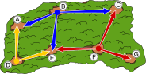

## Body

I forestali vogliono osservare gli animali sui sentieri del bosco. Da ogni radura possono osservare tutti i sentieri collegati con la radura successiva. Tutti i sentieri devono essere osservati dal minor numero possibile di forestali.

## Question/Challenge - for the brochures

Scegli il minor numero possibile di radure da cui i forestali possano osservare tutti i sentieri!

## Question/Challenge - for the online challenge

Scegli il minor numero possibile di radure da cui i forestali possano osservare tutti i sentieri! Clicca sulle radure per selezionarle. Clicca di nuovo per deselezionarle.

## Answer Options/Interactivity Description

<!-- empty -->

:::comment 
Interactive task: It is possible to click at an glade to put a ranger on it. Then all ways next to the glade are marked. If you click again on an glade with a ranger, the ranger and the marked ways are removed (except the ways that are observed by other rangers).
:::

## Answer Explanation

L'immagine mostra la soluzione minima in cui i forestali possono stare solo su tre radure e osservare tutti i sentieri.

Ci sono otto sentieri che devono essere osservati. Se solo due forestali potessero osservare tutti i sentieri, dovrebbe esserci una radura da cui partono almeno quattro sentieri.  Ma non c'è una tale radura in questo bosco. Pertanto, due forestali non sono sufficienti.

Quindi, sono necessari almeno tre forestali per osservare tutti i sentieri. Di conseguenza, la soluzione data qui è una soluzione con il minor numero possibile di forestali. In effetti, non esiste un'altra soluzione con esattamente tre forestali.

Dal numero di sentieri da osservare e dal fatto che non ci sono radure con più di tre sentieri collegati, possiamo concludere che ogni forestale deve osservare almeno due sentieri che gli altri forestali non osservano.

Per osservare il vicolo cieco tra la radura F e G, un forestale deve essere posizionato sulla radura F. Per osservare il sentiero tra la radura B e C, il secondo forestale deve osservare dalla radura B. Per osservare gli ultimi due sentieri con un solo forestale, quest'ultimo deve essere posizionato sulla radura D. In questo modo, la soluzione data è definitiva e non può esserci altro.

## It's Informatics

Le relazioni tra le cose (per esempio i sentieri tra le radure) possono essere rappresentate come un cosiddetto _grafo_. Un grafo è composto da _vertici_ (qui: le radure), rappresentati come cerchi, e _archi_ (qui: i sentieri), rappresentati come linee tra i vertici. Il grafo di questo compito si presenta così:

In questo compito, devi trovare il minor numero di vertici nel grafo in modo che ogni arco inizi o finisca in almeno uno di questi vertici. Gli informatici chiamano un tale sottoinsieme di nodi una _copertura minima dei vertici_.
Troviamo questi problemi di copertura dei vertici nella vita di tutti i giorni, per esempio quando si cercano le migliori posizioni per i lampioni o per il posizionamento intelligente delle telecamere di sorveglianza.

## Keywords and Websites

 - Grafo: https://it.wikipedia.org/wiki/Grafo
 - Copertura dei vertici: https://it.wikipedia.org/wiki/Copertura_dei_vertici

## Wording and Phrases

Lichtung: baumlose Stelle im Wald
Weg: eine einfach begehbare Verbindung zwischen zwei Lichtungen.

## Comments

(Not reported from original file)
