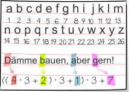
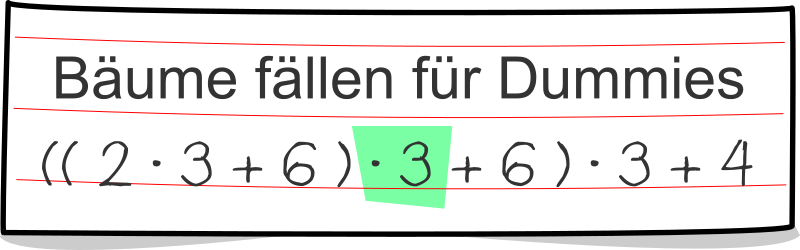

## Body

Susi ist mit Tim in der Biber-Bibliothek. Sie wollen ein Buch ausleihen: "Dämme bauen, aber gern!"

Tim geht zu Regal 1, greift in Reihe 3, Fach 6 und holt das Buch heraus. Susi ist beeindruckt. Tim erklärt Susi, wie man den Ort eines Buches bestimmt:

Man nimmt von jedem Wort im Titel den Anfangsbuchstaben und bestimmt seine Position im Alphabet. Nach und nach werden diese Positionen addiert, aber vor jedem Addieren wird der bisher erreichte Wert mit 3 multipliziert.
Für das gewünschte Buch ergibt sich 136. Schon ist klar, wo das Buch steht.

Nun stellt Susi für ihre Lieblingsbücher die entsprechenden Rechnungen auf. In einem Fall hat sie aber einen Fehler gemacht.

## Question/Challenge - for the brochures

In welchem?

## Question/Challenge - for the online challenge

In welchem?

## Answer Options/Interactivity Description

:::comment 
The title of the books have to be in italian/french. Do only use 4 words, and the first letters should be one of the first 8 letters of the alphabeth.
:::

--: | :-----+ | --: | :-----+ |
 A) | ![ansA] |  B) | ![ansB] |
 C) | ![ansC] |  D) | ![ansD]

[ansA]: graphics/deu/2021-AT-04-answerA-compatible.svg "Antwort A"
[ansB]: graphics/deu/2021-AT-04-answerB-compatible.svg "Antwort B"
[ansC]: graphics/deu/2021-AT-04-answerC-compatible.svg "Antwort C"
[ansD]: graphics/deu/2021-AT-04-answerD-compatible.svg "Antwort D"

## Answer Explanation

Susi hat fast alles richtig gemacht: Sie hat immer die richtigen Positionswerte addiert, und sie hat die Zwischenergebnisse immer mit 3 multipliziert – mit einer Ausnahme: In Antwort B hat sie Letzteres einmal vergessen.

## It's Informatics

Mit den "Orts-Bestimmungs-Ausdrücken" ermöglicht die Bibliothek ihren Besuchern, die Standorte der Bücher genau zu bestimmen. So muss niemand lange suchen. Eines müssen die Bibliothek und Besucher aber beachten: Für verschiedene Bücher können die Ausdrücke und damit auch deren Ergebnisse gleich sein. Zum Beispiel stehen "Bäume fällen für Dummies" und "Biber finden Fichten dufte" im gleichen Fach. Die Fächer dürfen also nicht zu klein sein, oder sie müssen flexibel angepasst werden können.

Auch bei Daten, die in Computerspeichern abgelegt werden, ist es eine gute Idee, wenn ihr Speicherort direkt aus den Daten selbst berechnet werden kann. Dafür wurden in der Informatik _Hash-Funktionen_ entwickelt: mathematische Funktionen, die aus dem Inhalt der Daten bzw. eines Teils der Daten einen Wert berechnen, der direkt den Speicherort angibt – so wie bei den Buchtiteln in dieser Biberaufgabe. Gute Hash-Funktionen sorgen dafür, dass sich in möglichst wenigen Fällen der gleiche Wert ergibt. Kommt eine solche Kollision doch einmal vor, kennt die Informatik gute Methoden, damit umzugehen.

## Keywords and Websites

 - Hashfunktion: https://de.wikipedia.org/wiki/Hashfunktion
 - Hashtabelle: https://de.wikipedia.org/wiki/Hashtabelle
 - http://www.abenteuer-informatik.de/PDF/ai2020_oa_leseversion.pdf, Kapitel 11: Ordnung im Chaos

## Wording and Phrases

(Not reported from original file)

## Comments

