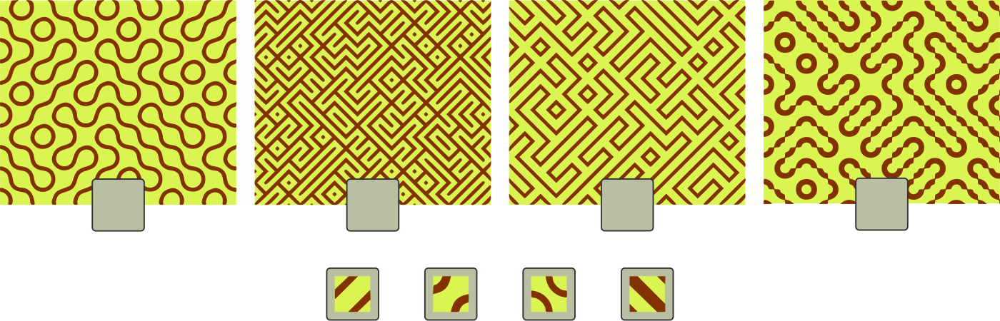

## Body

Die folgenden Muster wurde jeweils durch eine einzelne Fliese erzeugt.
Die einzelnen Fliesen sind vergrössert dargestellt.

## Question/Challenge - for the brochures

Ordne die Fliesen ihren möglichen Mustern zu.

## Question/Challenge - for the online challenge

Ordne die Fliesen ihren möglichen Mustern zu. Ziehe dazu die einzelnen Fliesen in die grauen Felder unter den Mustern. Klicke auf die Fliesen, um sie wieder zurückzulegen.

## Answer Options/Interactivity Description

<!-- empty -->

:::comment
Der Teilnehmer macht die Zuordnung mittels Klicken und Ziehen.
:::

## Answer Explanation

Das ist die richtige Zuordnung:

Legt man jeweils 5 Fliesen aneinander und vergleicht sie genauer, erkennt man deutliche Unterschiede:

Fliese ![tile3] hat als einzige der Fliesen vier Seiten, die nicht genau zueinander passen. Nur dadurch können Linien mit veränderlicher Breite wie in Muster D entstehen.
Fliese ![tile4] ist die einzige, die quadratischen Punkte in Muster B erzeugen kann, nämlich mit jeweils vier zusammenstossenden Dreiecken. Zudem hat sie den grössten Flächenanteil von Braun gegenüber Gelb, genau wie B; auch daran kann man die Zusammengehörigkeit erkennen. 
Somit verbleibt für die runden Formen von Fliese ![tile2] nur Muster A als mögliches Ergebnis und für die geraden Formen von Fliese ![tile1] nur Muster C.

[tile1]: graphics/2021-AT-06-tile1.svg "Fliese 1 (18px)"
[tile2]: graphics/2021-AT-06-tile2.svg "Fliese 2 (18px)"
[tile3]: graphics/2021-AT-06-tile3.svg "Fliese 3 (18px)"
[tile4]: graphics/2021-AT-06-tile4.svg "Fliese 4 (18px)"

## It's Informatics

Diese Fliesen sind nach Sébastien Truchet (* 1657; † 1729) benannt, der an verschiedenen Varianten dieser Fliesen gearbeitet hat. Kacheln mit 4 gleichen Seiten bilden eine Untermenge von Truchet-Kacheln (Truchet-Kacheln müssen aber nicht unbedingt 4 gleiche Seiten haben, wie in 3 von den Mustern oben).
Dass mit ganz einfachen Bausteinen komplexe Muster erstellt werden können, ist eine interessante Eigenschaft, die uns in der Informatik immer wieder begegnet.
Truchet-Kacheln werden in der Mathematik und der Informatik untersucht und in Computerspielen verwendet, um Labyrinthe oder Dekorationen zu erstellen.

## Keywords and Websites

 - Truchet-Kacheln: https://en.wikipedia.org/wiki/Truchet_tiles

## Wording and Phrases

einzelne Fliese: der kleinste Bauteil des Musters

## Comments

(Not reported from original file)
