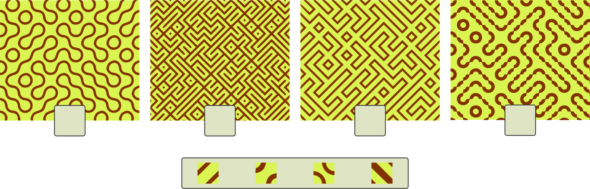
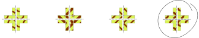

## Body

Les motifs suivants ont été créés en n'utilisant qu'un seul type de pavé. Les images des pavés individuels sont agrandies.

## Question/Challenge - for the brochures

Assigne chaque pavé au motif correspondant.

## Question/Challenge - for the online challenge

Assigne chaque pavé au motif correspondant. Glisse les pavés individuels dans les cases grises sous les motifs. Clique sur les pavés assignés pour les remettre en bas.

## Answer Options/Interactivity Description

<!-- empty -->

:::comment
Der Teilnehmer macht die Zuordnung mittels Klicken und Ziehen.
:::

## Answer Explanation

Voici la bonne attribution:

En mettant cinq mêmes pavés côte à côte et en comparant les différents pavés, on voit de claires différences:

Le pavé ![tile3] est le seul pavé dont les quatre côtés ne vont pas exatement ensemble. C'est le seul moyen pour obtenir des lignes de largueurs différentes comme dans le motif D.
Le pavé ![tile4] est le seul avec lequel on peut créer des points carrés comme sur le motif B, en mettant bout à bout quatre coins avec un triangle. De plus, il a la plus grande proportion de brun par rapport au jaune, comme le motif B.
Il ne reste donc que le pavé ![tile2] pour former le motif A aux formes arrondies, alors que les lignes droites du motif C ne peuvent être créées qu'avec le pavé ![tile1].

[tile1]: graphics/2021-AT-06-tile1.svg "Pavé 1 (18px)"
[tile2]: graphics/2021-AT-06-tile2.svg "Pavé 2 (18px)"
[tile3]: graphics/2021-AT-06-tile3.svg "Pavé 3 (18px)"
[tile4]: graphics/2021-AT-06-tile4.svg "Pavé 4 (18px)"

## It's Informatics

Ces pavés sont nommé d'après Sébastien Truchet (* 1657; † 1729), qui en a développé différentes variantes. Les pavés ayant quatre côtés pareils forment un sous-ensemble des pavés de Truchet (mais les pavés de Truchet ne doivent pas forcément avoir quatre côtés pareils, comme dans trois des motifs de cet exercice).
Le fait que des motifs complets peuvent être générés à partir d'éléments très simple est une propriété intéressante que l'on rencontre souvent en informatique. Les pavés de Truchet sont étudiés en mathématiques et en informatique, et sont utilisé dans les jeux vidéos pour créér des labyrinthes et des décors.

## Keywords and Websites

 - Pavés de Truchet: https://en.wikipedia.org/wiki/Truchet_tiles
 - Sébastien Truchet: https://fr.wikipedia.org/wiki/Sébastien_Truchet

## Wording and Phrases

einzelne Fliese: der kleinste Bauteil des Musters

## Comments

(Not reported from original file)
