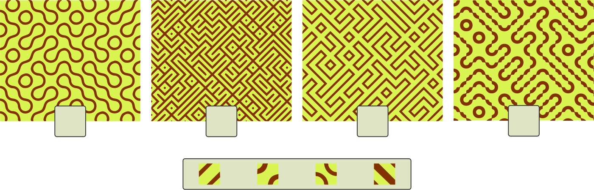
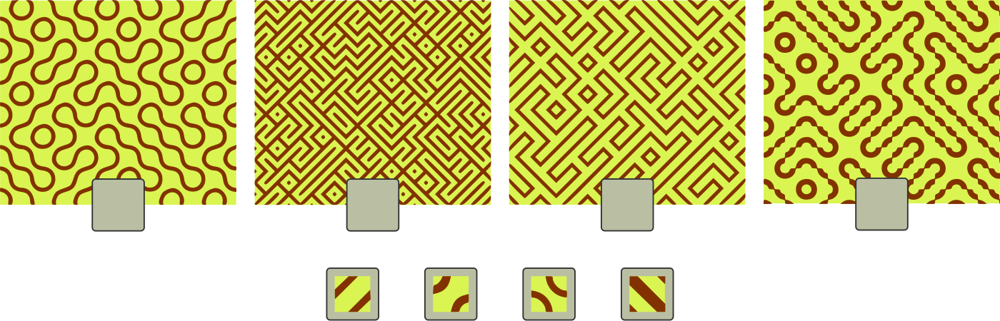
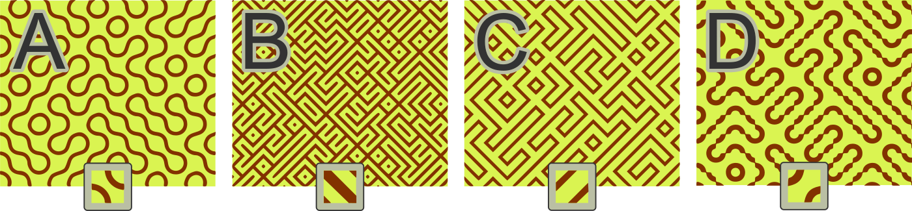
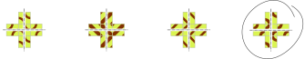

## Body

I seguenti modelli sono stati creati ciascuno da una singola piastrella. 
Le singole piastrelle sono mostrate ingrandite.

## Question/Challenge - for the brochures

Abbina le piastrelle ai loro possibili modelli.

## Question/Challenge - for the online challenge

Abbina le piastrelle ai loro possibili modelli. Per farlo, trascina le singole piastrelle nei campi grigi sotto i modelli. Clicca sulle piastrelle per rimetterle al loro posto iniziale.

## Answer Options/Interactivity Description

<!-- empty -->

:::comment
Der Teilnehmer macht die Zuordnung mittels Klicken und Ziehen.
:::

## Answer Explanation

Questa è la classificazione corretta:

Se metti 5 piastrelle una accanto all'altra e le compari più da vicino, puoi vedere delle chiare differenze:

La piastrella ![tile3] è l'unica delle piastrelle con quattro lati che non si adattano esattamente l'uno all'altro. Questo è l'unico modo per creare linee di larghezza variabile come nel modello D.
La piastrella ![tile4] è l'unica che può creare punti quadrati nel modello B, cioè con quattro triangoli che si incontrano. Inoltre, ha la superficie del marrone più ampia rispetto al giallo, proprio come B; questo dimostra anche che fa parte del modello B. 
Rimane solo il modello A come possibile risultato per le forme rotonde della piastrella ![tile2] e solo il modello C per le forme diritte della piastrella ![tile1].

[tile1]: graphics/2021-AT-06-tile1.svg "Piastrella 1 (18px)"
[tile2]: graphics/2021-AT-06-tile2.svg "Piastrella 2 (18px)"
[tile3]: graphics/2021-AT-06-tile3.svg "Piastrella 3 (18px)"
[tile4]: graphics/2021-AT-06-tile4.svg "Piastrella 4 (18px)"

## It's Informatics

Queste piastrelle prendono il nome da Sébastien Truchet (* 1657; † 1729), che ha lavorato su diverse varianti di queste piastrelle. Le piastrelle con 4 lati uguali formano un sottogruppo di piastrelle Truchet (ma le piastrelle Truchet non devono necessariamente avere 4 lati uguali, come in 3 degli schemi precedenti).
Il fatto che schemi complessi possano essere creati con blocchi di costruzione molto semplici è una proprietà interessante che incontriamo ancora e ancora nell'informatica.
Le piastrelle Truchet sono studiate in matematica e in informatica e utilizzate nei giochi di computer per creare labirinti o decorazioni.

## Keywords and Websites

 - Piastrelle Truchet: https://it.wikinew.wiki/wiki/Truchet_tiles

## Wording and Phrases

einzelne Fliese: der kleinste Bauteil des Musters

## Comments

(Not reported from original file)
