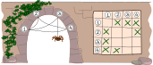
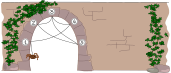
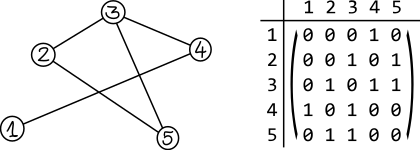

## Body

Spinne Thekla möchte möglichst viele verschiedene Netze bauen. Deshalb hat sie sich ein Verfahren ausgedacht, den genauen Aufbau ihrer Netze festzuhalten.

Das macht sie so: Sie nummeriert die Endpunkte des Netzes von 1 bis $N$ und verwendet Felder in einem Raster nach folgender Regel:
  - Wenn es einen Faden gibt, der Endpunkt $x$ mit Endpunkt $y$ verbindet, dann wird das Feld in Spalte $x$ und Zeile $y$ mit einem Kreuzchen markiert.
  
  Ein Faden der Endpunkt $x$ mit Endpunkt $y$ verbindet, verbindet auch Endpunkt $y$ mit Endpunkt $x$.

Thekla baut nun dieses Netz:

## Question/Challenge - for the brochures

Wie hält Thekla den Aufbau dieses Netzes fest?

## Question/Challenge - for the online challenge

Wie hält Thekla den Aufbau dieses Netzes fest?

## Answer Options/Interactivity Description

| :-----: | :-----: | :-----: | :-----: | 
|A)|B)|C)|D)|
|![ansA]|![ansB]|![ansC]|![ansD]|

[ansA]: graphics/2021-CA-02-answerA.svg "Antwort A"
[ansB]: graphics/2021-CA-02-answerB.svg "Antwort B"
[ansC]: graphics/2021-CA-02-answerC.svg "Antwort C"
[ansD]: graphics/2021-CA-02-answerD.svg "Antwort D"

:::comment 
Interaktive Option:
Statt der Überprüfung vorgegebener Antwortmöglichkeiten könnte der Schüler gefragt werden, eine leere Matrix selbst zu vervollständigen. Auswahl erfolgt durch Klicken der Zellen. Nochmaliges Klicken entgernt die Markierung wieder.
:::

## Answer Explanation

---+ | --:
Antwort A ist richtig, denn alle Felder sind gemäss der Regel richtig markiert.    |![ansA]
Bei Antwort B wurde eine zusätzliche Verbindung fälschlich eingezeichnet (Endpunkt 1 nach Endpunkt 2 in beide Richtungen) und eine wurde vergessen (Endpunkt 2 nach Endpunkt 5 in beide Richtungen).    |![explB]
Antwort C: Nach der hier vorgeschriebenen Regel können in der Diagonale von links oben nach rechts unten keine Markierung vorhanden sein. Denn das wären ja Verbindungen eines Endpunkts mit sich selbst. Dies könnte zwar in manchen Netzen durchaus erlaubt sein kann, kommt in unserem Spinnennetz aber nicht vor. Bei Antwort C hätten wir aber 2 solche Verbindungen (bei Endpunkt 1 und bei Endpunkt 4).   |![explC]
Antwort D: Alle Darstellungen von Netzen sollten symmetrisch sein bezüglich der Diagonalen von links oben nach rechts unten. In dieser Antwort findet sich zwar die Verbindung von Endpunkt 2 nach Endpunkt 5, die entsprechende Verbindung zurück von Endpunkt 5 nach Endpunkt 2 fehlt aber.   |![explD]    

[ansA]: graphics/2021-CA-02-answerA.svg "Richtige Lösung"
[explB]: graphics/2021-CA-02-explanationB.svg "Erklärung B"
[explC]: graphics/2021-CA-02-explanationC.svg "Erklärung C"
[explD]: graphics/2021-CA-02-explanationD.svg "Erklärung D"

## It's Informatics

Das Spinnennetz kann als _Graph_ betrachtet werden, ein Konzept, das häufig in der Informatik verwendet wird.

Ein Graph besteht aus _Knoten_ (den Endpunkten des Netzes) und _Kanten_ (den Fäden zwischen den Endpunkten). Graphen werden zum Beispiel auch verwendet, um Objekte und die Beziehungen zwischen Objekten darzustellen. Ein Graph könnte beispielsweise zeigen, wie Personen in sozialen Medien befreundet sind, oder Flüge zwischen Ländern.

In dieser Aufgabe wird gezeigt, wie man die Struktur eines Spinnennetzes in einem Raster speichern kann. Gewisse Eigenschaften, wie zum Beispiel das genaue Aussehen des Netzes, gehen dabei verloren. In vielen Fällen ist man aber nicht an den genauen geometrischen Eigenschaften eines Netzes interessiert, sondern nur an seiner Struktur. Die wesentlichen Informationen bleiben erhalten: Wie viele Knoten gibt es? Und zwischen welchen Knotenpaaren gibt es eine Kante?

Die vorgestellte Möglichkeit ist nur eine von vielen Möglichkeiten, die Struktur eines Netzes festzuhalten. Die Methode ist nicht sehr sparsam, denn es werden für jede Verbindung beide Richtungen gespeichert, was nicht notwendig wäre, und auch die freien Diagonalenfelder wären gar nicht notwendig. Dafür weist dieses Verfahren den Vorteil auf, dass Darstellungsfehler teilweise erkannt werden können. Antwort C und Antwort D konnten zum Beispiel als falsch erkannt werden, ohne auf das Netz Bezug zu nehmen.

Die vorgestellte Darstellungsform wird _Adjazenzmatrix_ genannt.

## Keywords and Websites

 - Adjazenzmatrix: https://de.wikipedia.org/wiki/Adjazenzmatrix

## Wording and Phrases

Endpunkt: Stelle, wo die Spinnfäden an der Mauer angeheftet sind.
Die Spinne baut das Netz.
Die Endpunkte werden mit Spinnfäden verbunden.

## Comments

(Not reported from original file)
