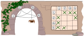
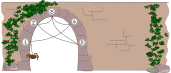
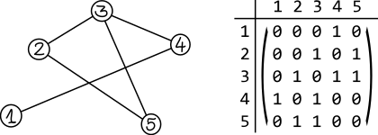

## Body

Il ragno Thekla vuole costruire quante più ragnatele diverse possibili. Per questo ha inventato un metodo per documentare l'esatta costruzione delle sue ragnatele.

Il metodo funziona così: numera i punti finali della ragnatela da 1 a $N$ e usa i campi in una griglia secondo la seguente regola:
  - Se c'è un filo che collega il punto finale $x$ con il punto finale $y$, allora il campo nella colonna $x$ e nella riga $y$ è segnato con una "x".
  
  Un filo che collega il punto finale $x$ con il punto finale $y$ collega anche il punto finale $y$ con il punto finale $x$.

Thekla costruisce ora questa ragnatela:

## Question/Challenge - for the brochures

Come documenta Thekla la costruzione di questa ragnatela?

## Question/Challenge - for the online challenge

Come documenta Thekla la costruzione di questa ragnatela?

## Answer Options/Interactivity Description

--: | :-----+ | --: | :-----+ 
 A) | ![ansA] |  B) | ![ansB] 
 C) | ![ansC] |  D) | ![ansD]

[ansA]: graphics/2021-CA-02-answerA.svg "risposta A"
[ansB]: graphics/2021-CA-02-answerB.svg "risposta B"
[ansC]: graphics/2021-CA-02-answerC.svg "risposta C"
[ansD]: graphics/2021-CA-02-answerD.svg "risposta D"

:::comment 
Interaktive Option:
Statt der Überprüfung vorgegebener Antwortmöglichkeiten könnte der Schüler gefragt werden, eine leere Matrix selbst zu vervollständigen. Auswahl erfolgt durch Klicken der Zellen. Nochmaliges Klicken entgernt die Markierung wieder.
:::

## Answer Explanation

---+ | --:
La risposta corretta è A, perché tutti i campi sono segnati correttamente secondo la regola.    |![ansA]
Nella risposta B, una connessione aggiuntiva è stata disegnata in modo errato (punto finale 1 al punto finale 2 in entrambe le direzioni) e una è stata dimenticata (punto finale 2 al punto finale 5 in entrambe le direzioni).    |![explB]
Risposta C: Secondo la regola qui descritta, non ci possono essere segni nella diagonale dall'alto a sinistra al basso a destra. Perché sarebbero connessioni di un punto finale con se stesso. Questo potrebbe essere permesso in alcune ragnatele, ma non si verifica nella nostra ragnatela. Nella risposta C, invece, avremmo 2 connessioni di questo tipo (al punto finale 1 e al punto finale 4).   |![explC]
Risposta D: Tutte le rappresentazioni di ragnatele devono essere simmetriche rispetto alle diagonali dall'alto a sinistra al basso a destra. In questa risposta, la connessione dal punto finale 2 al punto finale 5 è presente, ma manca la connessione corrispondente di ritorno dal punto finale 5 al punto finale 2.   |![explD]    

[ansA]: graphics/2021-CA-02-answerA.svg "soluzione giusta"
[explB]: graphics/2021-CA-02-explanationB.svg "spiegazione B"
[explC]: graphics/2021-CA-02-explanationC.svg "spiegazione C"
[explD]: graphics/2021-CA-02-explanationD.svg "spiegazione D"

## It's Informatics

La ragnatela può essere considerata un _grafo_, un concetto spesso usato in informatica.

Un grafo è composto da _vertici_ (i punti finali della ragnatela) ed _archi_ (i fili tra i punti finali). I grafi sono anche usati, per esempio, per rappresentare gli oggetti e le relazioni tra loro. Per esempio, un grafo potrebbe mostrare come le persone sono amiche nelle reti sociali, o i voli tra paesi.

Questo compito mostra come memorizzare la struttura di una ragnatela in una griglia. Alcune proprietà, come l'aspetto esatto della ragnatela, si perdono nel processo. In molti casi, tuttavia, non si è interessati alle proprietà geometriche esatte di una rete, ma solo alla sua struttura. Le informazioni essenziali sono conservate: quanti vertici ci sono? E tra quali coppie di vertici c'è un arco?

La possibilità presentata è solo uno dei tanti modi per registrare la struttura di una rete. Il metodo non è molto economico, perché entrambe le direzioni sono memorizzate per ogni connessione, il che non sarebbe necessario, e i campi diagonali liberi non sarebbero affatto necessari. D'altra parte, questo metodo ha il vantaggio che gli errori di rappresentazione possono essere parzialmente rilevati. La risposta C e la risposta D, per esempio, potrebbero essere riconosciute come sbagliate senza fare riferimento alla rete.

La forma di rappresentazione presentata si chiama _matrice delle adiacenze_.

## Keywords and Websites

 - Matrice delle adiacenze: https://it.wikipedia.org/wiki/Matrice_delle_adiacenze

## Wording and Phrases

Endpunkt: Stelle wo die Spinnfäden an der Mauer angeheftet sind.
Die Spinne baut das Netz.
Die Endpunkte werden mit Spinnfäden verbunden.

## Comments

(Not reported from original file)
