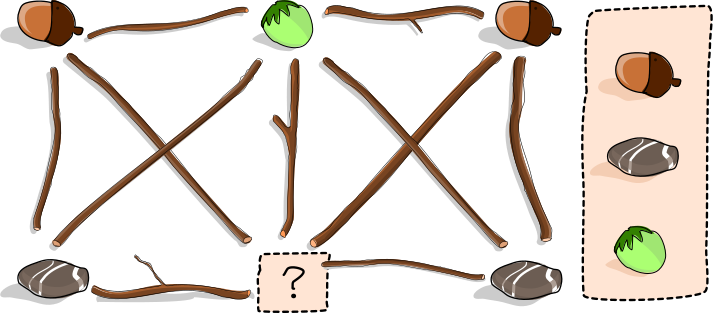

## Body

Anja will im Garten ein Kunstwerk schaffen und hat dafür verschiedene Sachen gesammelt: Mehrere Eicheln, Haselnüsse, Steine und eine Erdbeere. Sie legt einige der Sachen auf den Rasen.

Danach legt Anja Äste zwischen diese Sachen. Dabei befolgt sie folgende Regel: Ein Ast darf nicht zwischen zwei gleichen Sachen liegen – zum Beispiel nicht zwischen zwei Eicheln.
Hier ist das fertige Kunstwerk:

Während Anja weg ist, kommt ihr Bruder und isst die Erdbeere.

## Question/Challenge - for the brochures

Kannst du ihm helfen, die Tat zu verschleiern?

Platziere eine andere Sache an die Stelle der Erdbeere und entferne genau einen Ast. Am Ende soll Anjas Regel auch für das veränderte Kunstwerk gelten.

## Question/Challenge - for the online challenge

Kannst du ihm helfen, die Tat zu verschleiern?

Platziere eine andere Sache an die Stelle der Erdbeere und entferne genau einen Ast. Am Ende soll Anjas Regel auch für das veränderte Kunstwerk gelten.

Klicke so oft auf die Stelle mit dem Fragezeichen, bis dort die richtige Sache liegt. 
Klicke auf einen Ast, um ihn zu entfernen; klicke noch einmal, um ihn wieder zurückzulegen.

## Answer Options/Interactivity Description

<!-- empty -->

:::comment
Interactivity description: Click on the question mark to change between the different objects, click on the branches to take them away. Click again to put them back.
:::

## Answer Explanation

Wenn man die Erdbeere durch eine Haselnuss ersetzt, verletzt der Ast 3 in der Mitte Anjas Regel: Er liegt zwischen zwei gleichen Sachen, nämlich zwei Haselnüssen. Deshalb muss dieser Ast entfernt werden.

Bei den beiden anderen möglichen Ersetzungen muss man mehr als einen Ast entfernen:
 - Wird die Erdbeere durch eine Eichel ersetzt, muss man die Äste 2 und 4 entfernen.
 - Wird die Erdbeere durch einen Stein ersetzt, muss man die Äste 1 und 5 entfernen.

 

 
## It's Informatics

Anjas Kunstwerk kann als _Graph_ dargestellt werden. Ein Graph besteht aus _Knoten_ (den Plätzen für die Sachen) sowie aus _Kanten_ (den Ästen), die jeweils zwei Knoten miteinander verbinden. Graphen sind sehr vielseitig und werden bei vielen Informatik-Aufgabenstellungen zur Modellierung verwendet.
Wenn zwei Knoten direkt durch eine Kante verbunden sind, sind sie _Nachbarn_ voneinander. Eine Gruppe von Knoten, in der jeder Knoten Nachbar von jedem anderen ist, heisst _Clique_. 
Im unserem Graphen haben wir zwei Cliquen mit vier Knoten: die rechte und die linke Hälfte des Graphen. (Die Haselnuss oben und das Fragezeichen gehören zu beiden Cliquen.)
Aus Anjas Regel folgt, dass alle Knoten einer Clique mit unterschiedliche Sachen belegt sein müssen.
Um die Regel einzuhalten, brauchen wir also mindestens so viele unterschiedliche Sachen wie eine Clique Knoten hat.
Nachdem die Erdbeere entfernt wurde, haben wir aber nur noch 3 verschiedene Sachen. 
Also dürfen jetzt noch Cliquen mit höchstens 3 Knoten übrig bleiben, wenn die Regel weiterhin erfüllt bleiben soll. 
Es muss also eine Kante (ein Ast) entfernt werden, sodass beide Cliquen mit vier Knoten kaputt gehen.

Anjas Regel entspricht einer Regel im sogenannten _Färbungsproblem_ für Graphen: Wir ordnen jedem Knoten eines Graphen eine Farbe zu, wobei Nachbarn unterschiedliche Farben haben müssen. (Die Farben entsprechen den verschiedenen Arten von Sachen.) Das Ziel ist meistens, möglichst wenig Farben zu benützen.
Das Problem, wie man einen Graphen mit der minimalen Anzahl von Farben einfärbt, hat viele Anwendungen. Einige Beispiele sind die Planung von Sportwettkämpfen, das Entwerfen eines Sitzplans und sogar das Lösen eines Sudoku-Rätsels.

## Keywords and Websites

 - Färbeproblem: https://de.wikipedia.org/wiki/Färbung_(Graphentheorie)
 - minimale Kantenfärbung, Kantenfärbung: https://de.wikipedia.org/wiki/Kantenfärbung
 - Clique: https://de.wikipedia.org/wiki/Clique_(Graphentheorie)

## Wording and Phrases

 - Kunstwerk – ein mit Sachen und Ästen gelegter Graph
 - zwischen zwei Dingen liegen – zwei Sachen (Knoten) miteinander verbinden
 - Sachen – Eicheln, Steine, Haselnüsse, Erdbeere
 - Ast entfernen – eine Verbindung (Kante) zwischen zwei Sachen (Knoten) aufheben

## Comments

(Not reported from original file)
