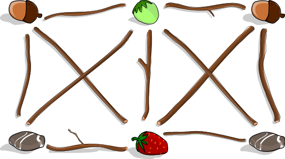
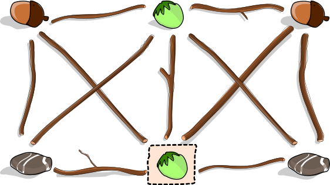
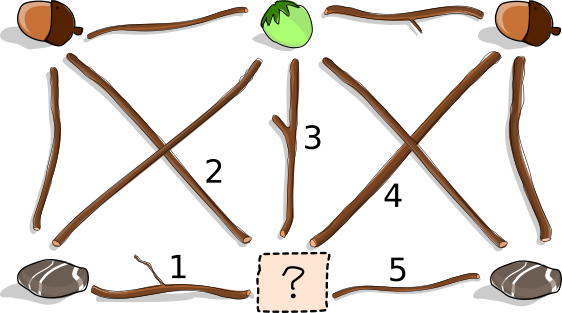

## Body

Anja veut créer une œuvre d'art dans le jardin et a ramassé pour cela différents objets: plusieurs glands, noisettes et cailloux ainsi qu'une fraise. Elle met quelques objets dans l'herbe.

Ensuite, Anja dispose des branches entre ces objets. Elle suit pour cela la règle suivante: une branche ne doit pas se trouver entre deux objets pareils, par exemple entre deux glands. Voici l'œuvre d'art terminée:

Le frère d'Anja vient et mange la fraise pendant qu'elle n'est pas là.

## Question/Challenge - for the brochures

Peux-tu aider le frère d'Anja à dissimuler son méfait?

Place un autre objet à la place de la fraise et enlève exactement une branche. L'œuvre d'art modifiée doit respecter la règle d'Anja.

<!-- SD: Ist das ausreichend?-->

## Question/Challenge - for the online challenge

Peux-tu aider le frère d'Anja à dissimuler son méfait? Place un autre objet à la place de la fraise et enlève exactement une branche. L'œuvre d'art modifiée doit respecter la règle d'Anja.

Clique sur le point d'interrogation jusqu'à ce que l'objet désiré apparaisse. Clique sur une branche pour l'enlever; clique à nouveau pour la remettre.

## Answer Options/Interactivity Description

<!-- empty -->

:::comment
Interactivity description: Click on the question mark to change between the different objects, click on the branches to take them away. Click again to put them back.
:::

## Answer Explanation

Lorsque l'on remplace la fraise par une noisette, la branche 3 ne respecte plus la règle d'Anja: elle se trouve entre deux objets pareils, à savoir deux noisettes. Cette branche doit donc être enlevée. 

Les deux autres remplacements possibles nécessitent d'enlever plus d'une branche:
 - Si la fraise est remplacée par un gland, il faut enlever les branches 2 et 4.
 - Si la fraise est remplacée par un caillou, il faut enlever les branches 1 et 5.

 

## It's Informatics

L'œuvre d'Anja peut être représentée par un _graphe_. Un graphe est composé de _nœuds_ (les emplacements des objets) et d'_arêtes_ (les branches) qui relient deux objets chacune. Les graphes sont des outils polyvalents et sont souvent utilisés lors de la modélisation de problèmes en informatique.

Lorsque deux nœuds sont directement reliés par une arête, ils sont _voisins_ l'un de l'autre. Un groupe de nœuds dans lequel chaque nœud est voisin de chaque autre nœuds est appelé une _clique_. Nous avons deux cliques de quatre nœuds dans notre graphe: la moitié gauche et la moitié droite du graphe (la noisette en haut et le point d'interrogation en bas appartiennent aux deux cliques).

La règle d'Anja implique que tous les nœuds d'une clique doivent être occupés par des objets différents. Pour respecter la règle, nous avons donc besoin d'autant d'objets différents qu'il y a de nœuds dans une clique. Nous n'avons cependant plus que trois objets différents une fois que la fraise a été enlevée. Il ne peut donc rester que des cliques comportant au maximum 3 nœuds si la règle doit être respectée. Il faut donc enlever une arête (une branche) afin de détruire les deux cliques à quatre nœuds.

La règle d'Anja correspond à une règle du problème de _coloration de graphe_: on assigne une couleur à chaque nœud d'un graphe, et les nœuds voisins doivent être de couleurs différentes (les couleurs correspondent ici aux différents types d'objets). Le but est souvent d'utiliser le moins de couleurs possibles. Le problème consistant à colorer un graphe avec le moins de couleurs possibles a beaucoup d'applications. Quelques exemple sont la planification d'une compétition, l'élaboration d'un plan de table et même la résolution d'un sudoku.

## Keywords and Websites

 - Coloration de graphe: https://fr.wikipedia.org/wiki/Coloration_de_graphe
 - Coloration des arêtes d'un graphe: https://fr.wikipedia.org/wiki/Coloration_des_arêtes_d%27un_graphe
 - Clique: https://fr.wikipedia.org/wiki/Clique_(théorie_des_graphes)

## Wording and Phrases

 - Kunstwerk — ein mit Sachen und Ästen gelegter Graph
 - zwischen zwei Dingen liegen — zwei Sachen (Knoten) miteinander verbinden
 - Sachen — Eicheln, Steine, Haselnüsse, Erdbeere
 - Ast entfernen — eine Verbindung (Kante) zwischen zwei Sachen (Knoten) aufheben

## Comments

(Not reported from original file)
