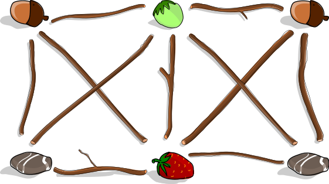
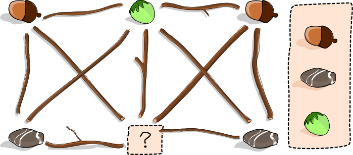
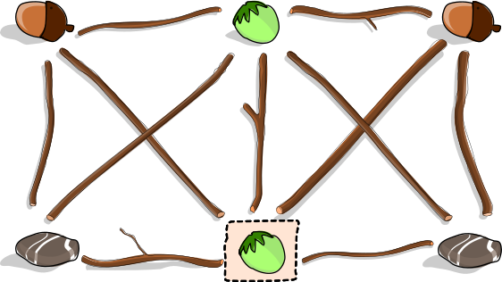
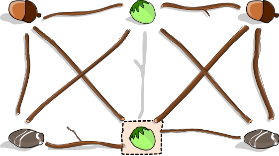
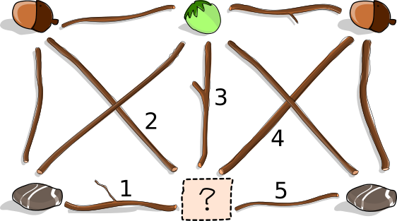

## Body

Anja vuole creare un'opera d'arte in giardino, per farlo ha raccolto diverse cose: ghiande, nocciole, pietre e una fragola. Mette alcune cose sul prato.

Poi Anja mette dei rami tra queste cose. Segue la seguente regola: un ramo non può trovarsi tra due cose identiche - per esempio, non tra due ghiande.

Ecco l'opera d'arte finita:

Mentre Anja è via, suo fratello arriva e mangia la fragola.

## Question/Challenge - for the brochures

Puoi aiutarlo a coprire il misfatto?

Metti un'altra cosa al posto della fragola e rimuovi esattamente un ramo. Alla fine, la regola di Anja dovrebbe applicarsi anche all'opera d'arte modificata.

## Question/Challenge - for the online challenge

Puoi aiutarlo a coprire il misfatto? 
Metti un'altra cosa al posto della fragola e rimuovi esattamente un ramo. Alla fine, la regola di Anja dovrebbe applicarsi anche all'opera d'arte modificata.

Clicca sul luogo con il punto interrogativo per decidere cosa piazzarci. 
Clicca su un ramo per rimuoverlo; clicca di nuovo per rimetterlo a posto.

## Answer Options/Interactivity Description

<!-- empty -->

:::comment
Interactivity description: Click on the question mark to change between the different objects, click on the branches to take them away. Click again to put them back.
:::

## Answer Explanation

Se si sostituisce la fragola con una nocciola, il ramo 3 al centro vìola la regola di Anja: si trova tra due cose identiche, cioè due nocciole. Pertanto, questo ramo deve essere rimosso.

Per le altre due possibili sostituzioni, è necessario rimuovere più di un ramo:
 - Se la fragola è sostituita da una ghianda, è necessario rimuovere i rami 2 e 4.
 - Se la fragola è sostituita da una pietra, è necessario rimuovere i rami 1 e 5.

 

## It's Informatics

L'opera d'arte di Anja può essere rappresentata come un _grafo_. Un grafo è composto da _vertici_ (i luoghi delle cose) e da _archi_ (i rami), ognuno dei quali collega due vertici. I grafi sono molto versatili e sono utilizzati per la modellazione in molti compiti di informatica.
Quando due vertici sono collegati direttamente da un arco, sono _vicini_ l'uno all'altro. Un gruppo di vertici in cui ogni vertice è un vicino a ogni altro vertice è chiamato _cricca_. 
Nel nostro grafo, abbiamo due cricche con quattro vertici: la metà destra e la metà sinistra del grafo (la nocciola sopra e il punto interrogativo appartengono a entrambe le cricche).
Segue dalla regola di Anja che tutti i nodi di una cricca debbano essere occupati da cose diverse.
Per mantenere la regola, abbiamo bisogno di almeno tante cose diverse quanti sono i vertici di una cricca.
Dopo aver rimosso la fragola, abbiamo solo 3 cose diverse. 
Così ora possono rimanere cricche con un massimo di 3 vertici per continuare a soddisfare la regola. 
Quindi un arco (un ramo) deve essere rimosso in modo che entrambe le cricche con quattro vertici siano rotte.

La regola di Anja corrisponde a una regola del cosiddetto _problema della colorazione dei grafi_: Assegniamo un colore ad ogni vertice di un grafo, dove i vicini devono avere colori diversi. (I colori corrispondono a i diversi tipi di cose.) L'obiettivo è di solito quello di usare il minor numero possibile di colori.
Il problema di come colorare un grafo con il numero minimo di colori ha molte applicazioni. Alcuni esempi sono la pianificazione di competizioni sportive, la progettazione di un piano di posti a sedere e persino la risoluzione di un Sudoku.

## Keywords and Websites

 - Colorazione dei grafi: https://it.wikipedia.org/wiki/Colorazione_dei_grafi
 - Cricca: https://it.wikipedia.org/wiki/Cricca_(teoria_dei_grafi)

## Wording and Phrases

 - Kunstwerk – ein mit Sachen und Ästen gelegter Graph
 - zwischen zwei Dingen liegen – zwei Sachen (Knoten) miteinander verbinden
 - Sachen – Eicheln, Steine, Haselnüsse, Erdbeere
 - Ast entfernen – eine Verbindung (Kante) zwischen zwei Sachen (Knoten) aufheben

## Comments

(Not reported from original file)
