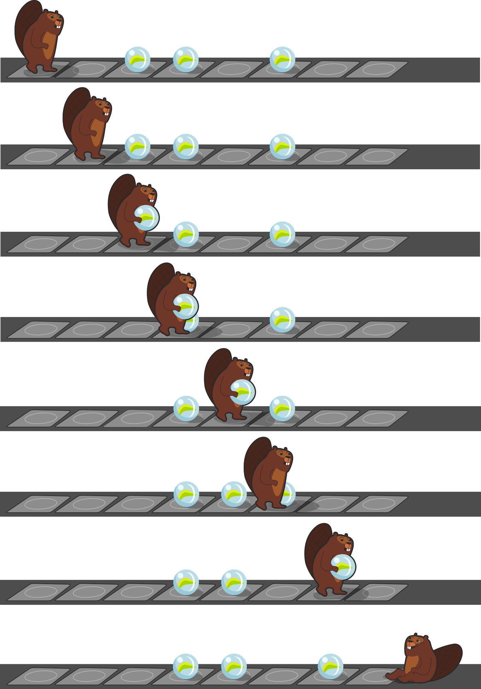

## Body

---+ | --:
Sur un ruban, un castor se déplace d'une case à la suivante de gauche à droite. Sur chaque case du ruban peut se trouver une bille.|

Si le castor arrive sur une case avec une bille et a les mains libres, il la soulève et la prend avec en la portant dans ses bras.|

Il dépose la bille sur la prochaine case libre.|

Le castor ne peut porter qu'une seul bille à la fois, et il n'y a la place que pour une bille sur chaque case.

---+ | --:
Si le castor porte déjà une bille en arrivant sur une case avec une autre bille...|

... il dépasse celle-ci...|

... et pose sa bille sur la prochaine case vide.|

Il peut ensuite à nouveau soulever la bille suivante.

## Question/Challenge - for the brochures

Le castor se trouve devant une partie du ruban sur laquelle sont posées trois billes. Sur quelles cases les billes se trouvent-elles une fois que le castor a traversé cette partie du ruban?

")

## Question/Challenge - for the online challenge

Le castor se trouve devant une partie du ruban sur laquelle sont posées trois billes. Sur quelles cases les billes se trouvent-elles une fois que le castor a traversé cette partie du ruban?

")

## Answer Options/Interactivity Description

:::center
--: | :-----
A) | ![ansA] 
B) | ![ansB] 
C) | ![ansC] 
D) | ![ansD]
E) | ![ansE]
:::

[ansA]: graphics/2021-CH-07a-answerA.svg "réponse A (400px)"
[ansB]: graphics/2021-CH-07a-answerB.svg "réponse B (400px)"
[ansC]: graphics/2021-CH-07a-answerC.svg "réponse C (400px)"
[ansD]: graphics/2021-CH-07a-answerD.svg "réponse D (400px)"
[ansE]: graphics/2021-CH-07a-answerE.svg "réponse E (400px)"

:::comment
Interaktivität:
Statt den 4 Antworten könnte der Schüler das Ergebnis selbst durch Klicken und Ziehen herstellen. Eine Schaltfläche zu Wiederherstellung (Reset) sollte dann vorhanden sein.
:::

## Answer Explanation

La bonne réponse est C:

![ansC]

L'image suivante montre le déroulement:

## It's Informatics

En informatique, des opérations relativement simples donnent souvent des résultats intéressants. Cet exercice en est un bon exemple. La démarche du castor est un _algorithme_. Il se base sur le fait que le castor peut adopter deux états différents (portant une bille ou n'en portant pas) et qu'il peut trouver deux sortes de cases sur son chemin (occupées ou libres).

Aussi simple que soit l'exemple dans cet exercice, il contient plusieurs des éléments essentiels d'une _machine de Turing_.
Une machine de Turing (qui doit son nom au mathématicien Alan Turing) est un ordinateur particulier qui a une structure très simple. En principe, une machine de Turing peut exécuter tous les algorithmes qu'un ordinateur traditionnel peut exécuter. En pratique, les machines de Turing ne sont pas utilisées comme ordinateur, car nous pouvons construire des ordinateurs qui sont bien plus efficaces, même s'ils sont plus compliqués. Les machines de Turing sont surtout utiles pour la théorie. Leur structure simple permet de prouver des affirmations simples les concernant; et si l'on peut prouver qu'un exercice ne peut pas être résolu par une machine de Turing, cela veut dire qu'aucun de nos ordinateurs ne peut le résoudre non plus.

Une machine de Turing est composée:
- D'un _ruban_ de longueur infinie divisé en _cases_. Chaque case peut contenir un _symbole_. Dans notre cas, il s'agit des cases sur lesquelles le castor se déplace.
- D'une quantité finie de _symboles_. Souvent, on n'utilise que `0` et `1` comme symboles. Dans notre exemple, une bille représente le `1` et une position libre le `0`.
- D'une tête de lecture/écriture qui peut se déplacer sur le ruban dans les deux directions tout en lisant les symboles écrits et en écrivant de nouveaux symboles sur le ruban. Dans notre exemple, le castor joue le rôle de la tête de lecture/écriture.
- D'un registre d'_états_ de taille finie. Le comportement de la tête de lecture/écriture peut changer en fonction de l'état. Dans notre cas, il n'y a que deux états: "portant une bille" ou "ne portant pas de bille".
- D'un ensemble de règles, ou _table d'actions_: que ce passe-t-il, en fonction de l'état, lorsqu'un symbole précis est lu sur le ruban? Les actions possibles sont: un changement d'état, l'écriture d'un nouveau symbole et le déplacement de la tête de lecture d'une case vers la gauche ou vers la droite.

## Keywords and Websites

 - Machine de Turing: https://fr.wikipedia.org/wiki/Machine_de_Turing

## Wording and Phrases

tragen - Der Biber trägt eine Kugel (in den Händen) oder nicht. Klare Unterscheidung von 2 Zuständen.

## Comments

(Not reported from original file)
