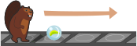

## Body

---+ | --:
Il castoro si sposta campo per campo da sinistra a destra su un nastro. Lungo il nastro può trovare una biglia.|

Ogni volta che il castoro incontra un campo con una biglia e ha le mani libere, raccoglie la biglia e la porta con sé.  |

Al primo campo libero, il castoro posa la biglia.|

Il castoro può portare solo una biglia alla volta e c'è spazio solo per una biglia su ogni quadrato. 

---+ | --:
Se il castoro sta già trasportando una biglia quando raggiunge un campo con un'altra biglia, ...|

... poi lui le passa accanto ...|

... e pone la sua biglia sul prossimo campo libero. |

Dopodiché, può raccogliere di nuovo la biglia successiva.

## Question/Challenge - for the brochures

Il castoro sta di fronte a una zona del nastro dove ci sono tre biglie. Su quali quadrati si trovano le biglie quando il castoro ha attraversato l'area?

")

## Question/Challenge - for the online challenge

Il castoro sta di fronte a una zona del nastro dove ci sono tre biglie. Su quali quadrati si trovano le biglie quando il castoro ha attraversato l'area?

")

## Answer Options/Interactivity Description

:::center
--: | :-----
A) | ![ansA] 
B) | ![ansB] 
C) | ![ansC] 
D) | ![ansD]
E) | ![ansE]
:::

[ansA]: graphics/2021-CH-07a-answerA.svg "Risposta A (400px)"
[ansB]: graphics/2021-CH-07a-answerB.svg "Risposta B (400px)"
[ansC]: graphics/2021-CH-07a-answerC.svg "Risposta C (400px)"
[ansD]: graphics/2021-CH-07a-answerD.svg "Risposta D (400px)"
[ansE]: graphics/2021-CH-07a-answerE.svg "Risposta E (400px)"

:::comment
Interaktivität:
Statt den 4 Antworten könnte der Schüler das Ergebnis selbst durch Klicken und Ziehen herstellen. Eine Schaltfläche zu Wiederherstellung (Reset) sollte dann vorhanden sein.
:::

## Answer Explanation

La risposta corretta è C.

![ansC]

La figura seguente mostra il processo:

")

## It's Informatics

Nell'informatica, anche operazioni relativamente semplici portano spesso a risultati interessanti. Questo compito è un buon esempio. La procedura del castoro è un _algoritmo_. Si basa sul fatto che il castoro può assumere 2 stati diversi (portare una biglia o no) e che può trovare 2 tipi diversi di quadrati sul suo cammino (occupati e vuoti).

Per quanto semplice sia l'esempio in questo compito, contiene alcuni degli elementi essenziali di una _macchina di Turing_.
Una macchina di Turing (dal nome del matematico Alan Turing) è un computer speciale con una struttura molto semplice. In teoria, una macchina di Turing può eseguire tutti gli algoritmi che un computer convenzionale può eseguire. In pratica, però, le macchine di Turing non sono usate come computer perché possiamo costruire computer più complicati ma molto più efficienti. Le macchine di Turing sono utili soprattutto in teoria. A causa della loro semplice struttura, è relativamente facile dimostrare affermazioni sulle macchine di Turing e se si può dimostrare che un compito non è risolvibile per le macchine di Turing, allora nessuno dei nostri computer può risolverlo. 

Una macchina di Turing è composta da:
   - Un _nastro_ di qualsiasi lunghezza, composto da singoli _campi_. Ogni campo può contenere un _simbolo_. Nel nostro esempio, questi sono i quadrati su cui si muove il castoro.
   - Un insieme finito di _simboli_. Spesso solo `0` e `1` sono usati come simboli. Nel nostro esempio, una biglia sta per `1` e un campo libero per `0`.
   - Una testina di lettura-scrittura che può muoversi in entrambe le direzioni sul nastro, leggendo i simboli sul nastro e anche scrivendo nuovi simboli. Nel nostro esempio, il castoro ha il ruolo della testa di lettura-scrittura.
   - Un insieme finito di cosiddetti _stati_. Il comportamento della testina di lettura-scrittura può cambiare a seconda dello stato. Nel nostro caso, ci sono solo due stati, cioè "portare la biglia" e "non portare la biglia".
   - Un insieme di regole: cosa succede, a seconda dello stato, quando un certo simbolo viene letto dal nastro? Le azioni possibili sono: un cambio di stato, la scrittura di un nuovo simbolo sul nastro e lo spostamento della testina di lettura-scrittura di un campo a sinistra o a destra.

## Keywords and Websites

 - Macchina di Turing: https://it.wikipedia.org/wiki/Macchina_di_Turing

## Wording and Phrases

tragen - Der Biber trägt eine Kugel (in den Händen) oder nicht. Klare Unterscheidung von 2 Zuständen.

## Comments

(Not reported from original file)
