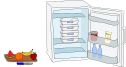

## Body

Paps, Mams, Dorie und Ron Biber packen abends für den nächsten Tag vier Frühstücksboxen, jede mit einer anderen Frucht: Apfel, Banane, Orange und Wassermelone. Die Boxen werden im Kühlschrank aufeinander gestapelt. Morgens sind die Bibers noch sehr müde und nehmen sich beim Verlassen des Baus einfach die oberste Box, ohne sie genauer anzuschauen.

Man weiss nicht genau, in welcher Reihenfolge die Bibers den Bau verlassen, aber auf jeden Fall geht Mams vor Dorie und Paps immer als Letzter.

Die Familienmitglieder mögen unterschiedliche Früchte. Die Tabelle gibt an, was jedes Familienmitglied mag.

:::center
|           | ![apple] | ![banana] | ![orange] | ![melon] |
| :-------: | :------: | :-------: | :-------: | :------: |
| **Paps**  |    —     |     —     | ![check]  |    —     |
| **Mams**  | ![check] |     —     | ![check]  | ![check] |
| **Dorie** | ![check] | ![check]  | ![check]  |    —     |
|  **Ron**  | ![check] | ![check]  |     —     | ![check] |
:::

[apple]: graphics/2021-CH-13-apple.svg "Apfel (25px)"
[banana]: graphics/2021-CH-13-banana.svg "Banane (45px)"
[check]: graphics/2021-CH-13-check.svg "Häckchen (20px)"
[melon]: graphics/2021-CH-13-melon.svg "Melone (30px)"
[orange]: graphics/2021-CH-13-orange.svg "Orange (30px)"

## Question/Challenge - for the brochures

Packe die Früchte so in die Boxen, dass alle Bibers eine Box mit Früchten nehmen, die sie mögen.

## Question/Challenge - for the online challenge

Packe die Früchte so in die Boxen, dass alle Bibers immer eine Box mit Früchten nehmen, die sie mögen.
Schiebe die Früchte in die richtigen Boxen. Klicke auf die Früchte, um sie wieder zurückzulegen.

## Answer Options/Interactivity Description

<!-- empty -->

:::comment
Interactive implementation. Illustration with an open fridge and a pile of four empty boxes inside; the four different fruits on the side. You can either drag and drop the fruits into the boxes or first click a fruit and then a box to put it fruit into the box. 
(The fruit can appear cut up when in the box.)
It is also possible to implement fruits being swapped out.
You can reset. You can submit your answer. 
:::

## Answer Explanation

Es gibt nur eine Möglichkeit, die Früchte so zu verteilen, dass alle garantiert etwas bekommen, das sie mögen: 

Paps mag nur Orangen und geht als Letzter. Also kommen Orangen in die unterste Box.
Ron geht als erster, zweiter oder dritter. Mams geht ausserdem vor Dorie, daher ist die Reihenfolge klar, wenn man weiss, wann Ron den Bau verlässt. 
Folgende drei Reihenfolgen sind möglich:

:::center
| :--: | :---: | :---: | :---: |
|  1.  | Mams  | Mams  |  Ron  |
|  2.  | Dorie |  Ron  | Mams  |
|  3.  |  Ron  | Dorie | Dorie |
|  4.  | Paps  | Paps  | Paps  |
:::

Mams, Dorie und Ron könnten also alle als zweite gehen. In die zweite Box muss daher eine Frucht hinein, die alle drei mögen, und das erfüllt nur der Apfel.
Für die oberste Box bleiben also nur Bananen und Wassermelone. Da Mams Bananen nicht mag, müssen wir hier die Wassermelone zuordnen. Damit bleiben die Bananen für die dritte Box.

## It's Informatics

Die richtige Reihenfolge ist in vielen Bereichen der Informatik sehr relevant: Viele Berechnungen erfordern Zwischenergebnisse, die zunächst ermittelt werden müssen, bevor man zum Endresultat kommt. Werden die Rechenschritte auf unterschiedlichen Computern durchgeführt, könnten ohne sorgfältige Planung sogenannte _Deadlocks_ entstehen. Das sind Situationen, in denen zwei oder mehr Computer aufeinander warten und auf diese Weise das Programm nie zum Ende kommt.
Die falsche Reihenfolge führt meistens aber einfach zu Fehlern (wie bei den Bibers zu Missmut über die erwischten Früchte). Wenn zum Beispiel etwas mit der Formel $Z \leftarrow (A+B) \cdot (A-B)$ berechnet werden soll, kann man das in folgende Schritte eines Programms aufteilen:

:::indent
Eingabe A \
Eingabe B \
Berechne $X \leftarrow A + B$ \
Berechne $Y \leftarrow A - B$ \
Berechne $Z \leftarrow X \cdot Y$
:::

Versucht man aber z. B. den Rechenschritt $Z \leftarrow X \cdot Y$ auszuführen, bevor man $X$ berechnet hat, führt dies zu einem Fehler und dem Abbruch des Programms. Oder es wird ein Standardwert für $X$ verwendet, was meistens zu einem falschen Resultat führt.  Beim Programmieren ist also die Reihenfolge, in der die Anweisungen durchgeführt werden, relevant. 

## Keywords and Websites

 - Deadlock: https://de.wikipedia.org/wiki/Deadlock_(Informatik)

## Wording and Phrases

nicht mögen - eine Frucht nicht essen wollen
Mams, Paps, Ron, Dorie - eine Familie - möglichst kurze prägnante und unterschiedliche Namen/Bezeichungen.

## Comments

(Not reported from original file)
