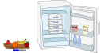

## Body

Papà, mamma, Dorie e Ron Castoro preparano la sera quattro scatole per la colazione del giorno dopo, ognuna con un frutto diverso: mela, banana, arancia e anguria. Le scatole sono impilate l'una sull'altra nel frigorifero. Al mattino, i castori sono ancora molto stanchi e quando lasciano la tana prendono semplicemente la scatola più in alto senza guardarla attentamente.

Non sappiamo esattamente in quale ordine i castori lasciano la tana, ma in ogni caso Mamma va sempre prima di Dorie e Papà sempre come l'ultimo.

Ai membri della famiglia piacciono frutti diversi. La tabella mostra cosa piace ad ogni membro della famiglia.

:::center
|           | ![apple] | ![banana] | ![orange] | ![melon]  |
| :-------: | :------: | :-------: | :-------: | :-------: |
| **Papà**  |    —     |     —     | ![check]  |     —     |
| **Mamma** | ![check] |     —     | ![check]  | ![check]  |
| **Dorie** | ![check] | ![check]  | ![check]  |     —     |
|  **Ron**  | ![check] | ![check]  |     —     | ![check]  |

:::

[apple]: graphics/2021-CH-13-apple.svg "mela (25px)"
[banana]: graphics/2021-CH-13-banana.svg "banana (45px)"
[check]: graphics/2021-CH-13-check.svg "segno di spunta (20px)"
[melon]: graphics/2021-CH-13-melon.svg "anguria (30px)"
[orange]: graphics/2021-CH-13-orange.svg "arancia (30px)"

## Question/Challenge - for the brochures

Metti le frutte nelle scatole in modo che tutti i castori prendano una scatola contenente un frutto che gli piace.

## Question/Challenge - for the online challenge

Metti le frutte nelle scatole in modo che tutti i castori prendano una scatola contenente un frutto che gli piace.
Sposta le frutte nelle scatole giuste. Clicca sulle frutte per rimetterle al loro posto iniziale.

## Answer Options/Interactivity Description

<!-- empty -->

:::comment
Interactive implementation. Illustration with an open fridge and a pile of four empty boxes inside; the four different fruits on the side. You can either drag and drop the fruits into the boxes or first click a fruit and then a box to put it fruit into the box. 
(The fruit can appear cut up when in the box.)
It is also possible to implement fruits being swapped out.
You can reset. You can submit your answer. 
:::

## Answer Explanation

C'è solo un modo per distribuire la frutta in modo che ognuno abbia la garanzia di avere qualcosa che gli piace:

A papà piacciono solo le arance ed è l'ultimo a partire. Quindi l'arancia va nella scatola in basso.
Ron va per primo, secondo o terzo. Mamma va prima di Dorie, quindi l'ordine è chiaro se si sa quando Ron lascia la tana.  
Sono possibili le seguenti tre sequenze:

:::center
| :--: | :---: | :---: | :---: |
|  1.  | Mamma | Mamma |  Ron  |
|  2.  | Dorie |  Ron  | Mamma |
|  3.  |  Ron  | Dorie | Dorie |
|  4.  | Papà  | Papà  | Papà  |
:::

Quindi mamma, Dorie e Ron potrebbero partire per secondi. La seconda scatola deve quindi contenere un frutto che piaccia a tutti e tre, e solo la mela soddisfa questo requisito.
Questo lascia solo banane e anguria per la scatola superiore. Dato che a mamma non piacciono le banane, qui dobbiamo assegnare l'anguria. Questo lascia la banana per la terza scatola.

## It's Informatics

Il corretto sequenziamento delle operazioni è molto rilevante in molte aree dell'informatica: molti calcoli richiedono risultati intermedi che devono essere determinati prima di arrivare al risultato finale. Se i passi di calcolo vengono eseguiti su diversi computer, senza un'attenta pianificazione potrebbero presentarsi le cosiddette situazioni di _stallo_. Si tratta di situazioni in cui due o più computer aspettano l'un l'altro e in questo modo il programma non arriva mai alla fine.
La sequenza sbagliata di solito porta ad errori (come il dispiacere dei castori per il frutto che hanno preso). Per esempio, se qualcosa deve essere calcolato con la formula $Z = (A+B) \times (A-B)$, questo può essere diviso nei seguenti passi di un programma:

:::indent
Ingresso A \
Ingresso B \
Calcolare $X = A + B$ \
Calcolare $Y = A - B$ \
Calcolare $Z = X \times Y$
:::

Tuttavia, se si cerca di eseguire il passo di calcolo $Z = X \times Y$, per esempio, prima di aver calcolato $X$, questo porta a un errore e il programma viene interrotto. Oppure viene usato un valore predefinito per $X$, che di solito porta a un risultato sbagliato.  Quindi, quando si programma, l'ordine in cui si eseguono le istruzioni è rilevante.

## Keywords and Websites

 - Stallo: https://it.wikipedia.org/wiki/Stallo_(informatica)

## Wording and Phrases

nicht mögen - eine Frucht nicht essen wollen
Mams, Paps, Ron, Dorie - eine Familie - möglichst kurze prägnante und unterschiedliche Namen/Bezeichungen.

## Comments

(Not reported from original file)
