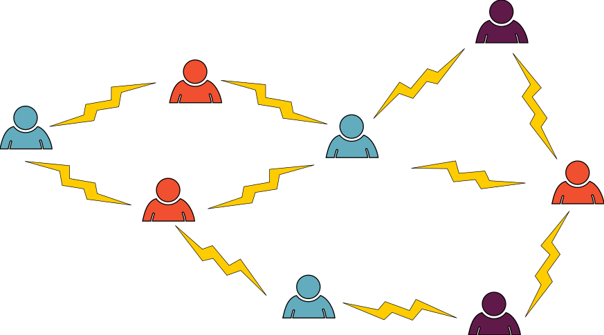
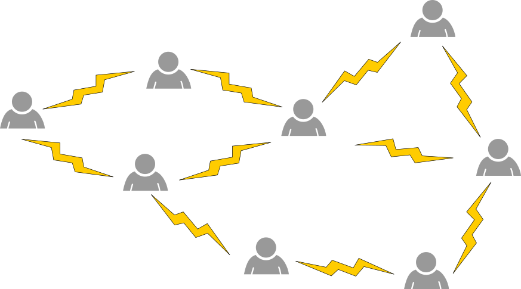
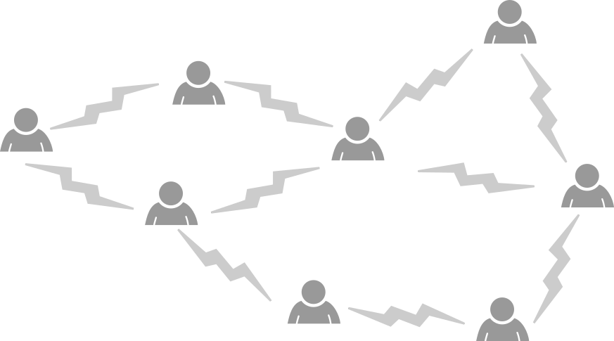
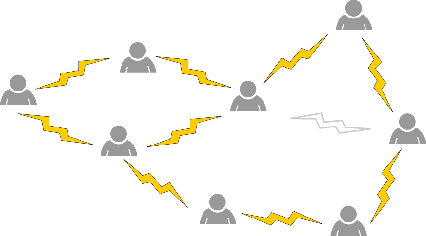

## Body

Für ein Projekt sollst du acht Personen in Gruppen aufteilen. 
Zwischen zwei Personen steht ein Blitz, wenn sie nicht zusammenarbeiten wollen. Dann möchtest du sie nicht derselben Gruppe zuordnen.

Mit den Abneigungen im Beispiel oben ist eine Aufteilung in drei Gruppen (rot, blau, violett) möglich. Zwischen zwei Personen derselben Farbe steht also nirgends ein Blitz.

Wenn du die richtigen beiden Personen zur Zusammenarbeit überzeugst (also einen Blitz entfernst), dann ist sogar eine Aufteilung in nur zwei Gruppen (nur zwei Farben) möglich.

## Question/Challenge - for the brochures

Entferne den richtigen Blitz.

## Question/Challenge - for the online challenge

Entferne den richtigen Blitz. Klicke auf einen Blitz um ihn zu entfernen. Klicke noch einmal, um ihn wieder hinzuzufügen.

## Answer Options/Interactivity Description

<!-- empty -->

:::comment
Es kann genau ein Blitz markiert werden. Der markierte Blitz soll nur noch in Umrissen angezeigt werden. 
:::

## Answer Explanation

Die richtige Lösung ist:

------+ | -------:
Wir stellen die Situation noch etwas abstrakter als sogenannten _Graphen_ dar, mit den Personen als _Knoten_ (Kreise) und den Blitzen als _Kanten_ (Linien).|![expl1]
Die einzig mögliche Option ist die orange markierte Kante.|![expl2]
Nach dem Löschen dieser Kante, können wir die Knoten mit zwei Farben einfärben.|![expl3]

Jede Farbe steht für eine Gruppe. Wir sehen, dass nirgends zwei Personen der gleichen Gruppe die Zusammenarbeit verweigern: Benachbarte Knoten haben überall verschiedene Farben.

------+ | -------:
Um zu sehen, dass das Löschen dieser Linie die einzig mögliche Option ist, betrachten wir zunächst das orange markierte Dreieck.|![expl4]

Wenn eine Linie ausserhalb dieses Dreiecks gelöscht wird, benötigen wir immer noch drei Farben allein schon für die drei Knoten des Dreiecks.

------+ | -------:
Betrachten wir nun das orange markierte Fünfeck:|![expl5]

Wenn eine Kante ausserhalb dieses Fünfecks gelöscht wird, bleibt dieses intakt und es ist unmöglich, das Fünfeck nur mit zwei Farben zu färben: Wenn wir das Fünfeck im Uhrzeigersinn durchlaufen, müssen wir zwischen den beiden Farben abwechseln. Wenn wir jedoch den letzten Knoten erreichen, hat er dieselbe Farbe wie der erste Knoten, da die Anzahl der Kreise im Fünfeck ungerade ist, wie schon beim Dreieck.

Die einzige mögliche Lösung ist es somit, die gemeinsame Kante Dreiecks und des Fünfecks zu löschen. 

[expl1]: graphics/2021-CH-19-explanation01.svg "Antworterklärung (150px)"
[expl2]: graphics/2021-CH-19-explanation02.svg "Antworterklärung (150px)"
[expl3]: graphics/2021-CH-19-explanation03.svg "Antworterklärung (150px)"
[expl4]: graphics/2021-CH-19-explanation04.svg "Antworterklärung (150px)"
[expl5]: graphics/2021-CH-19-explanation05.svg "Antworterklärung (150px)"

## It's Informatics

Viele im Alltag auftretende Probleme können als sogenannte _Graphfärbungsprobleme_  formuliert werden. 
In unserer Biberaufgabe repräsentieren die _Knoten_ eines _Graphen_ die Personen und eine _Kante_ zwischen zwei Personen zeigt, dass sie sich weigern, in einer Gruppe zusammenzuarbeiten. Wenn wir die Knoten mit _k_ Farben einfärben, kann dies als Zuordnung der Personen zu je einer von _k_ Gruppen verstanden werden. Eine solche Färbung heisst _zulässig_, wenn für jedes Paar von zwei Knoten, die direkt durch eine Kante verbunden sind, diese beiden Knoten unterschiedliche Farben haben. In unserem Fall ist eine Färbung also genau dann zulässig, wenn in jeder Gruppe alle Personen zusammenarbeiten. Eine Kante wird als _kritisch_ bezeichnet, wenn das Löschen dieser Kante eine Färbung des Graphen mit weniger Farben als zuvor ermöglicht. (Dabei dürfen alle Knoten des Graphen umgefärbt werden.) Für uns ist eine Kante also genau dann kritisch, wenn nach Überzeugung der entsprechenden beiden Personen zur Zusammenarbeit eine Aufteilung in weniger Gruppen möglich ist.

## Keywords and Websites

 - Graphentheorie: https://de.wikipedia.org/wiki/Graphentheorie
 - Färbung eines Graphen: https://de.wikipedia.org/wiki/Färbung_(Graphentheorie)
 - Kritischer Graph: https://de.wikipedia.org/wiki/Kritischer_Graph

## Wording and Phrases

(Not reported from original file)

## Comments

(Not reported from original file)
