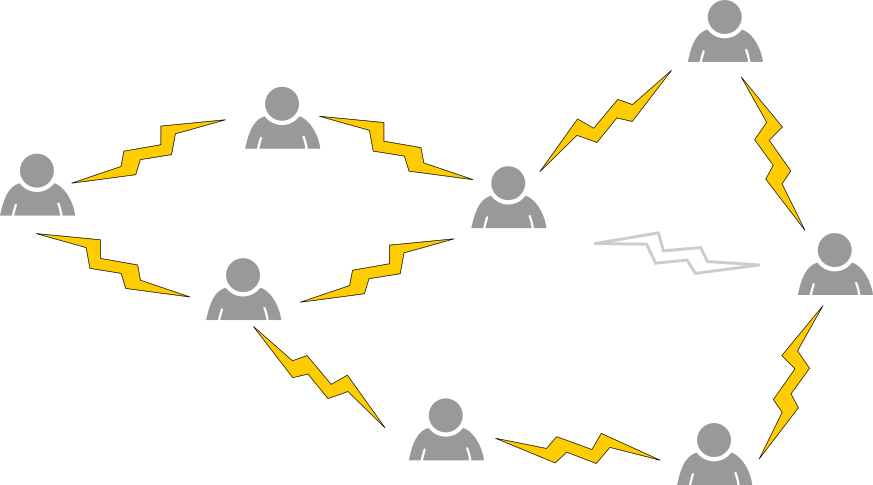

## Body

Per un progetto devi dividere otto persone in gruppi. 
C'è un fulmine tra due persone se non vogliono lavorare insieme. Quindi è meglio non metterli nello stesso gruppo.

Con le antipatie dell'esempio sopra, è possibile una divisione in tre gruppi (rosso, blu, viola). Questo perché non c'è nessun fulmine tra due persone dello stesso colore.

Se si convincono le due persone giuste a collaborare (cioè a togliere un fulmine), allora anche una divisione in due soli gruppi (solo due colori) è possibile.

## Question/Challenge - for the brochures

Rimuovi il fulmine giusto.

## Question/Challenge - for the online challenge

Rimuovi il fulmine giusto. Clicca su un fulmine per rimuoverlo. Clicca di nuovo per riaggiungerlo.

## Answer Options/Interactivity Description

<!-- empty -->

:::comment
Es kann genau ein Blitz markiert werden. Der markierte Blitz soll nur noch in Umrissen angezeigt werden. 
:::

## Answer Explanation

La soluzione corretta è:

------+ | -------:
Rappresentiamo la situazione un po' più astrattamente come un cosiddetto _grafo_, con le persone come _vertici_ (nodi) e i fulmini come _archi_ (bordi).|![expl1]
L'unica opzione possibile è l'arco marcato in arancione.|![expl2]
Dopo aver cancellato questo arco, possiamo colorare i nodi con due colori.|![expl3]

Ogni colore rappresenta un gruppo. Vediamo che da nessuna parte due persone dello stesso gruppo si rifiutano di cooperare: i vertici vicini hanno ovunque colori diversi.

------+ | -------:
Per vedere che la cancellazione di questo arco è l'unica opzione possibile, guardiamo prima il triangolo segnato in arancione.|![expl4]

Se un arco esterno a questo triangolo viene cancellato, abbiamo ancora bisogno di tre colori solo per i tre vertici del triangolo.

------+ | -------:
Guardiamo ora il pentagono segnato in arancione:|![expl5]

Se un arco esterno a questo pentagono viene cancellato, rimane intatto ed è impossibile colorare il pentagono con due soli colori: se attraversiamo il pentagono in senso orario, dobbiamo alternare i due colori. Tuttavia, quando raggiungiamo l'ultimo vertice, questo ha lo stesso colore del primo, perché il numero di vertici nel pentagono è dispari, come nel caso del triangolo.

L'unica soluzione possibile è quindi quella di eliminare l'arco comune del triangolo e del pentagono. 

[expl1]: graphics/2021-CH-19-explanation01.svg "spiegazione (150px)"
[expl2]: graphics/2021-CH-19-explanation02.svg "spiegazione (150px)"
[expl3]: graphics/2021-CH-19-explanation03.svg "spiegazione (150px)"
[expl4]: graphics/2021-CH-19-explanation04.svg "spiegazione (150px)"
[expl5]: graphics/2021-CH-19-explanation05.svg "spiegazione (150px)"

## It's Informatics

Molti problemi che si incontrano nella vita quotidiana possono essere formulati come i cosiddetti _problemi di colorazione dei grafi_. Nel nostro compito, i _vertici_ di un _grafo_ rappresentano le persone e un _arco_ tra due persone mostra che si rifiutano di lavorare insieme in un gruppo. Se coloriamo i vertici con _k_ colori, questo può essere interpretato come l'assegnazione delle persone a uno di _k_ gruppi ciascuno. Tale colorazione è detta _permissibile_ se per ogni coppia di due nodi direttamente connessi da un arco, questi due nodi hanno colori diversi. Nel nostro caso, quindi, una colorazione è _permessa_ proprio quando tutti gli individui di ogni gruppo lavorano insieme. Un arco si dice _critico_ se la sua cancellazione permette di colorare il grafico con meno colori di prima (in questo caso, tutti i vertici del grafico possono essere ricolorati). Per noi un arco è quindi critico esattamente quando, secondo la volontà delle due persone corrispondenti per la cooperazione, è possibile una divisione in meno gruppi.

## Keywords and Websites

 - Teoria dei grafi: https://it.wikipedia.org/wiki/Teoria_dei_grafi
 - Colorazione dei grafi: https://it.wikipedia.org/wiki/Colorazione_dei_grafi
 - Grafo critico: https://it.abcdef.wiki/wiki/Critical_graph

## Wording and Phrases

(Not reported from original file)

## Comments

(Not reported from original file)
