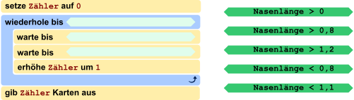
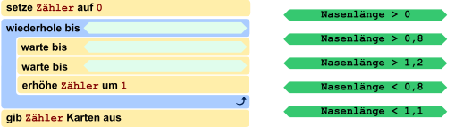
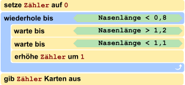

## Body

Ein neuer Eintrittskartenautomat soll so funktionieren: Ein Kunde nickt so oft mit dem Kopf – senkt also den Kopf und schaut dann wieder geradeaus – wie viele Karten er kaufen möchte. Danach hebt der Kunde den Kopf, und dann gibt der Automat die Karten aus.

Der Automat hat dazu eine Kamera eingebaut. Sie kann die Nasen der Kunden erkennen und misst ständig die Nasenlänge. Das Steuerungsprogramm des Automaten speichert das aktuelle Messergebnis unter dem Namen `Nasenlänge` und unterscheidet die Kopfhaltungen der Kunden mit Hilfe dieser Tabelle:

:::center
| Kameramessung | Wert `Nasenlänge` |           Kopfhaltung           |
| ------------- | :---------------: | :-----------------------------: |
| ![nose1]      |         1         |   Der Kunde schaut geradeaus.   |
| ![nose13]     |        1,3        | Der Kunde hat den Kopf gesenkt. |
| ![nose07]     |        0,7        | Der Kunde hat den Kopf gehoben. |
:::

[nose1]: graphics/2021-DE-05-body01.svg "Nasenlänge 1 (70px)"
[nose13]: graphics/2021-DE-05-body02.svg "Nasenlänge 1.3 (70px)"
[nose07]: graphics/2021-DE-05-body03.svg "Nasenlänge 0.7 (70px)"

Das Steuerungsprogramm ist fast fertig – siehe unten. 

## Question/Challenge - for the brochures

Vervollständige das Steuerungsprogramm!

## Question/Challenge - for the online challenge

Vervollständige das Steuerungsprogramm!
Ziehe Bedingungen so in die freien Stellen, dass der Automat wie beschrieben funktioniert. Klicke auf die Bedingungen, um sie wieder zurückzulegen.

## Answer Options/Interactivity Description

<!-- empty -->

:::comment
The student is supposed to be able to drag the five green elements onto the three dark orange fields. Whenever an element is dragged away from an orange field it should snap back to its original position (maybe marked by a light grad field?). Whenever an element is dragged onto a field where another element is already, the other element should snap back to its original position.
:::

## Answer Explanation

Die einzige richtige Antwort ist:

Die Struktur des Programms ist vorgegeben: Es gibt eine zentrale Wiederholungsanweisung; oft auch _Schleife_ genannt. Die letzte der in dieser Schleife wiederholten Anweisungen erhöht den Zähler der auszugebenden Karten. Folglich muss mit den zwei `warte bis`-Anweisungen ein Nicken des Kunden wahrgenommen werden: also dass der Kunde zuerst den Kopf gesenkt hat und dann wieder geradeaus schaut. Der unter Nasenlänge gespeicherte Wert muss also zuerst bei etwa 1,3 und dann wieder bei 1 liegen. Das entspricht den Bedingungen ![nose12] gefolgt von ![nose11].

Anweisungen in der Schleife werden wiederholt, bis der Kunde den Kopf hebt: also ein Wert gemessen wird, der deutlich kleiner als 1 ist. Die einzige dazu passende Bedingung ist ![nose08].

Vielleicht ist dir aufgefallen, dass das Programm nicht exakt die Werte aus der Tabelle verwendet. In der Praxis kann nämlich nicht kontinuierlich gemessen werden, sondern nur mit einer bestimmten Frequenz (beispielsweise 25 Mal pro Sekunde). Da kann es vorkommen, dass zum Beispiel der exakte Wert für das Geradeausschauen von 1,0 gar nicht gemessen wird, weil zuvor beispielsweise 0,95 und danach 1,03 gemessen wird.

[nose08]: graphics/deu/2021-DE-05-explanation-deu-nose08.svg "Nasenlänge > 0,8"
[nose11]: graphics/deu/2021-DE-05-explanation-deu-nose11.svg "Nasenlänge < 1,1"
[nose12]: graphics/deu/2021-DE-05-explanation-deu-nose12.svg "Nasenlänge > 1,2"

## It's Informatics

_Maschinelles Sehen_ (engl. _machine vision_, auch als _computer vision_ bezeichnet) ist ein Teilgebiet der Informatik, in dem momentan intensiv geforscht wird. Sowohl theoretische Überlegungen als auch praktische Anwendungen sind von grosser Wichtigkeit.

Eine bedeutsame Anwendung des maschinellen Sehens ist, Behinderten eine bessere Möglichkeit zu geben, autonom mit ihrer Umwelt zu interagieren. Je nach Stärke der Behinderung kann ein Mensch beispielsweise nur noch sehr wenige Muskeln kontrollieren. Der weltbekannte Physiker Stephen Hawking (1942-2018) nutzte Bewegungen seiner Wangenmuskeln, um ein Programm zur Sprachausgabe zu steuern, nachdem er die Kontrolle über seine weitere Muskulatur grösstenteils verloren hatte.

Das konkrete Beispiel jedoch könnte auch für Musiker eingesetzt werden: sie nutzen in der Regel beide Hände, um ihr Instrument zu bedienen. Handelsübliche Geräte bieten hierfür ein Fusspedal. Bestimmte Musiker wie Organisten nutzen jedoch auch die Füsse zum Spielen und könnten durch ein einfaches Nicken beispielsweise Noten automatisch umblättern.

Im Gegensatz zum Beispiel dieser Aufgabe, wo die Werte konkret und fest einprogrammiert sind, wird maschinelles Sehen oftmals mit _maschinellem Lernen_ (engl. _machine learning_) kombiniert. Dann wird das Programm auf bestimmte Gesten trainiert, indem ihm für jede Geste viele Beispiele und Gegenbeispiele gezeigt werden. So baut die Software eine statistische Einschätzung auf, was wie zu interpretieren ist.

## Keywords and Websites

 - Maschinelles Sehen, Machine Vision, Computer Vision: https://de.wikipedia.org/wiki/Computer_Vision
 - Maschinelles Lernen, Machine Learning: https://en.wikipedia.org/wiki/Machine_learning
 - https://en.wikipedia.org/wiki/Stephen_Hawking#Disability
 - https://de.wikipedia.org/wiki/Notenwender

## Wording and Phrases

(Not reported from original file)

## Comments

(Not reported from original file)
