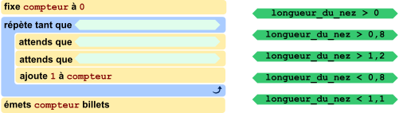
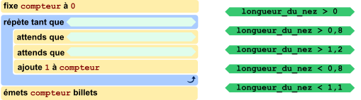
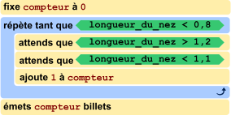

## Body

Un nouveau distributeur de billets doit fonctionner de la manière suivante:
un client hoche la tête (c'est à dire qu'il baisse la tête puis la remet droite) aussi souvent qu'il veut de billets. Le client lève ensuite la tête, et le distributeur émet les billets.
Pour cela, le distributeur a une caméra intégrée. Elle peut reconnaître le nez du client et mesure constamment sa longueur. Le programme de commande du distributeur enregistre le résultat de la mesure actuelle sous le nom `longueur_du_nez` et détermine la position de la tête du client à l'aide du tableau suivant:

:::center
| Mesure de la caméra | Valeur `longueur_du_nez` |     Position de la tête      |
| :-----------------: | :----------------------: | :--------------------------: |
|      ![nose1]       |            1             | Le client a la tête droite.  |
|      ![nose13]      |           1,3            | Le client a la tête baissée. |
|      ![nose07]      |           0,7            |  Le client a la tête levée.  |
:::

[nose1]: graphics/2021-DE-05-body01.svg "longueur du nez 1 (70px)"
[nose13]: graphics/2021-DE-05-body02.svg "longueur du nez 1.3 (70px)"
[nose07]: graphics/2021-DE-05-body03.svg "longueur du nez 0.7 (70px)"

Le programme de commande est presque fini — regarde plus bas.

## Question/Challenge - for the brochures

Complète le programme de commande.

<!--fixe compteur à 0-->
<!--répète tant que-->
<!--attends que-->
<!--attends que-->
<!--ajoute 1 à compteur--> 
<!--émets compteur billets-->
<!--longueur_du_nez ... -->

## Question/Challenge - for the online challenge

Complète le programme de commande. Glisse les conditions sur les positions libres pour que le distributeur fonctionne comme décrit ci-dessus. Clique sur une condition pour la remettre à droite.

## Answer Options/Interactivity Description

<!-- empty -->

:::comment
The student is supposed to be able to drag the five green elements onto the three dark orange fields. Whenever an element is dragged away from an orange field it should snap back to its original position (maybe marked by a light grad field?). Whenever an element is dragged onto a field where another element is already, the other element should snap back to its original position.
:::

## Answer Explanation

La seule bonne réponse est:

La structure du programme est donnée: il y a un bloc de commande principal qui se répète, souvent appelé _boucle_. La dernière instruction de cette boucle d'instructions répétées augmente le compteur du nombre de billets à émettre. Les deux instructions commençant par `attends que` doivent donc détecter un hochement de tête du client; c'est à dire détecter que le client a d'abord baissé la tête puis l'a remise droite. La valeur enregistrée dans longueur_du_nez doit donc d'abord être environ 1,3 puis à nouveau 1. Cela correspond à l'instruction ![nose12] suivie de ![nose11].

Les instructions de la boucle sont répétées jusqu'à ce que le client lève la tête; donc jusqu'à ce qu'une valeur clairement inférieure à 1 soit mesurée. La seule condition correspondant à cela est ![nose08].

Tu as peut-être remarqué que le programme n'utilise pas exactement les valeurs du tableau. En pratique, on ne peut en effet pas mesurer de manière continue, mais seulement à une certaine fréquence (par exemple 25 fois par seconde). Il peut donc arriver, par exemple, que la valeur 1 qui correspond à la tête droite ne soit jamais mesurée, parce que la valeur 1,03 a été mesurée juste après 0,95.

[nose08]: graphics/fra/2021-DE-05-explanation-fra-nose08.svg "longueur_du_nez > 0,8"
[nose11]: graphics/fra/2021-DE-05-explanation-fra-nose11.svg "longueur_du_nez < 1,1"
[nose12]: graphics/fra/2021-DE-05-explanation-fra-nose12.svg "longueur_du_nez > 1,2"

## It's Informatics

La _vision par ordinateur_ (_machine vision_ ou _computer vision_ en anglais) est un domaine de l'informatique très étudié actuellement. Les considérations théoriques et les applications pratiques sont les deux d'une grande importance.

Une application notable de la vision par ordinateur est de permettre aux personnes handicapées de mieux intéragir avec leur environement de manière autonome. Suivant le degré du handicap, il peut arriver qu'une personne ne puisse plus contrôler que très peu de ses muscles, par exemple. Stephen Hawking (1942-2018), physicien mondialement connu, utilisait les mouvements des muscles de ses joues pour contrôler un programme de synthèse vocal après qu'il avait perdu le contrôle de la majeure partie du reste de sa musculature.

Cet exemple concret pourrait aussi être utilisé par les musiciens: ils utilisent en général leurs deux mains pour jouer de leur instrument et ne peuvent donc pas tourner les pages d'une partition. Les appareils usuels disposent pour cette raison d'une pédale. Certains musiciens, comme les organistes, doivent cependant aussi utiliser leurs pieds pour jouer et pourraient utiliser un simple hochement de tête pour tourner les pages d'une partition automatiquement, par exemple.

Contrairement à l'exemple de cet exercice, dans lequel les valeurs sont concrètes et préprogrammées, la vision par ordinateur est souvent combinée à l'_apprentissage automatique_ (_machine learning_ en anglais). Le programme s'entraîne alors à reconnaître certains gestes lorsque de nombreux exemples et contre-exemples de chaque geste lui sont présentés. Le programme peut ainsi élaborer un modèle statistique de comment les exemples peuvent être interprétés.

## Keywords and Websites

 - Vision par ordinateur, machine vision, computer vision: https://fr.wikipedia.org/wiki/Vision_par_ordinateur
 - Apprentissage automatique, machine learning: https://fr.wikipedia.org/wiki/Apprentissage_automatique
 - https://fr.wikipedia.org/wiki/Stephen_Hawking#Maladie_et_poursuite_de_ses_travaux
 - https://fr.wikipedia.org/wiki/Tourneur_de_pages

## Wording and Phrases

(Not reported from original file)

## Comments

(Not reported from original file)
