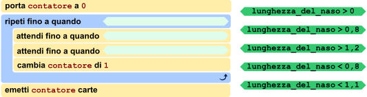
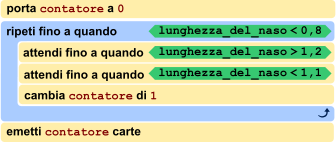

## Body

Un nuovo distributore automatico di biglietti dovrebbe funzionare così: Un cliente fa un cenno con la testa - cioè abbassa la testa e poi guarda di nuovo dritto - tante volte quanto il numero di biglietti che vuole comprare. Dopodiché, il cliente alza la testa e il distributore automatico distribuisce i biglietti. 
La macchina ha una telecamera incorporata per questo scopo. Può riconoscere i nasi dei clienti e misurare costantemente la lunghezza dei loro nasi. Il programma di controllo del distributore automatico salva il risultato della misurazione attuale sotto il nome di "lunghezza del naso" e distingue le posizioni della testa dei clienti con l'aiuto di questa tabella:

:::center
| Misura della |   Valore            |   Postura della                               \
|  telecamera  | `lunghezza di naso` |   testa                                       |
| :----------: | :-----------------: | :-------------------------------------------: |
|   ![nose1]   |   1                 | Il cliente sta guardando dritto davanti a sé. |
|  ![nose13]   |   1,3               |   Il cliente ha abbassato la testa.           |
|  ![nose07]   |   0,7               |   Il cliente ha alzato la testa.              |
:::

[nose1]: graphics/2021-DE-05-body01.svg "lunghezza di naso 1 (70px)"
[nose13]: graphics/2021-DE-05-body02.svg "lunghezza di naso 1.3 (70px)"
[nose07]: graphics/2021-DE-05-body03.svg "lunghezza di naso 0.7 (70px)"

Il programma di controllo è quasi pronto - vedi sotto. 

## Question/Challenge - for the brochures

Completa il programma di controllo!

## Question/Challenge - for the online challenge

Completa il programma di controllo!
Trascina le condizioni negli spazi liberi in modo che il distributore funzioni come descritto. Clicca sulle condizioni per rimetterle al loro posto iniziale.

## Answer Options/Interactivity Description

<!-- empty -->

:::comment
The student is supposed to be able to drag the five green elements onto the three dark orange fields. Whenever an element is dragged away from an orange field it should snap back to its original position (maybe marked by a light grad field?). Whenever an element is dragged onto a field where another element is already, the other element should snap back to its original position.
:::

## Answer Explanation

L'unica risposta corretta è:

<!-- TODO fill in compatible version -->

La struttura del programma è predeterminata: C'è un'istruzione centrale che si ripete, spesso chiamata _ciclo_. L'ultima delle istruzioni ripetute in questo ciclo incrementa il contatore delle carte da emettere. Di conseguenza, le due istruzioni `attendi fino a quando` devono percepire un cenno del cliente: cioè, che il cliente prima abbassa la testa e poi guarda di nuovo dritto davanti a sé. Il valore memorizzato sotto la lunghezza del naso deve quindi essere prima circa 1,3 e poi di nuovo 1. Questo corrisponde alle condizioni ![nose12] seguito da ![nose11].

Le istruzioni nel ciclo vengono ripetute finché il cliente non alza la testa: cioè viene misurato un valore significativamente più piccolo di 1. L'unica condizione corrispondente è ![nose08].

Forse hai notato che il programma non usa esattamente i valori della tabella. In pratica, non è possibile misurare continuamente, ma solo con una certa frequenza (per esempio 25 volte al secondo). Può succedere, per esempio, che il valore esatto di 1,0 per guardare dritto non sia misurato affatto, perché si misura 0,95 prima e 1,03 dopo.

[nose08]: graphics/ita/2021-DE-05-explanation-ita-nose08.svg "lunghezza di naso > 0,8"
[nose11]: graphics/ita/2021-DE-05-explanation-ita-nose11.svg "lunghezza di naso < 1,1"
[nose12]: graphics/ita/2021-DE-05-explanation-ita-nose12.svg "lunghezza di naso > 1,2"

## It's Informatics

La _visione artificiale_ (chiamata anche _machine vision_ o _computer vision_ in inglese) è un sottocampo dell'informatica in cui si sta svolgendo un'intensa ricerca. Sia le considerazioni teoriche che le applicazioni pratiche sono di grande importanza.

Un'applicazione significativa della visione artificiale è quella di dare alle persone disabili una migliore opportunità di interagire autonomamente con il loro ambiente. Per esempio, a seconda della gravità della disabilità, una persona può essere in grado di controllare solo pochi muscoli. Il fisico di fama mondiale Stephen Hawking (1942-2018) ha usato i movimenti dei suoi muscoli delle guance per controllare un programma di output vocale dopo che aveva perso il controllo della maggior parte dei suoi altri muscoli.

L'esempio concreto, tuttavia, potrebbe essere utilizzato anche per i musicisti: di solito usano entrambe le mani per azionare il loro strumento. Gli strumenti disponibili in commercio offrono un pedale per questo scopo. Tuttavia, alcuni musicisti, come gli organisti, usano anche i loro piedi per suonare e potrebbero, per esempio, girare automaticamente le note con un semplice cenno.

In contrasto con l'esempio di questo compito, dove i valori sono concreti e predeterminati, la visione artificiale è spesso combinata con il _machine learning_. Poi il programma viene addestrato su certi gesti mostrandogli molti esempi e controesempi per ogni gesto. In questo modo, il software costruisce una stima statistica di ciò che deve essere interpretato e come.

## Keywords and Websites

 - Visione artificiale, Machine Vision, Computer Vision: https://it.wikipedia.org/wiki/Visione_artificiale
 - Apprendimento automatico, Machine Learning: https://it.wikipedia.org/wiki/Apprendimento_automatico
 - https://it.wikipedia.org/wiki/Stephen_Hawking
 - https://it.wikipedia.org/wiki/Voltapagine

## Wording and Phrases

(Not reported from original file)

## Comments

(Not reported from original file)
