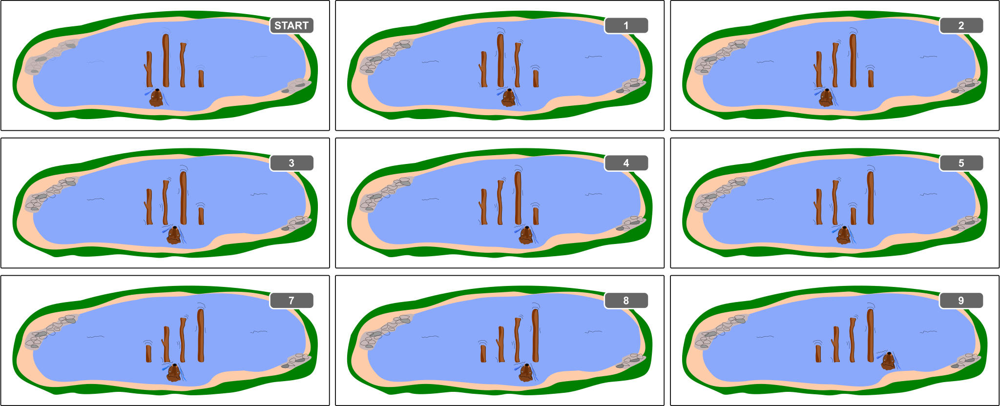

## Body

Biber Hamid sortiert die Baumstämme im See. Von links nach rechts sollen sie immer länger werden.
- Hamids Startposition ist zwischen den beiden Stämmen ganz links.
- Wenn er zwischen zwei benachbarten Stämmen ist, vergleicht er diese:
	- Wenn der rechte Stamm länger ist als der linke, schwimmt er eins nach rechts.
  - Wenn hingegen der linke Stamm länger ist, dann vertauscht er die beiden Stämme. Nach dem Vertauschen schwimmt er eins nach rechts, wenn er in der Startposition ist, und sonst eins nach links. 
- So macht Hamid weiter, bis er rechts von allen Stämmen angekommen ist. Dann weiss er, dass alle Stämme korrekt sortiert sind. 

Das Beispiel zeigt, wie Hamid 4 Baumstämme sortiert. Er macht dabei insgesamt 9 Vergleiche.

Die Anzahl der Vergleiche hängt davon ab, wie die Stämme am Anfang liegen. Für 4 Stämme muss Hamid mindestens 3 Vergleiche machen (wenn die Stämme bereits richtig sortiert sind) und höchstens 9 Vergleiche (wenn die Stämme alle genau verkehrt sortiert sind). Bei 4 Baumstämmen muss Hamid also mit 3 bis 9 Vergleichen rechnen.

## Question/Challenge - for the brochures

  Hamid muss nun 40 verschieden lange Baumstämme sortieren. Mit wie vielen Vergleichen muss er rechnen?

## Question/Challenge - for the online challenge

Hamid muss nun 40 verschieden lange Baumstämme sortieren. Mit wie vielen Vergleichen muss er rechnen?

## Answer Options/Interactivity Description

--: | --
 A) | Mit 0 bis 20 Vergleichen
 B) | Mit 3 bis 40 Vergleichen
 C) | Mit 39 bis 120 Vergleichen
 D) | Mit 39 bis 1521 Vergleichen

## Answer Explanation

Für 40 Stämme benötigt Hamid im besten Fall bereits 39 Vergleiche, nämlich dann, wenn alle Baumstämme bereits sortiert sind und er somit immer nach rechts schwimmt, bis er fertig ist. Damit können die Antworten A) und B) nicht richtig sein.

Im ungünstigsten Fall sind die Baumstämme am Anfang genau verkehrt herum sortiert. Hier ist die Anzahl der Vergleiche schwieriger zu bestimmen. Wir beobachten zuerst Folgendes: 
Die Baumstämme links von Hamid sind unter sich immer richtig sortiert. Wenn Hamid zu einem Baumstamm kommt, der kürzer ist als die $k$ links von ihm, dann tauscht er ihn zuerst ganz nach links durch, wobei er $k$ Vergleiche macht. Dann kommt er zurück und schwimmt sogar noch eins weiter nach rechts, wobei er $k-1$ weitere Vergleiche macht, aber nichts mehr vertauscht. Insgesamt sind das $k + (k-1) = 2k - 1$ Vergleiche. Dies passiert bei jeder der $n-1$ Positionen zwischen zwei Baumstämmen und die Anzahl Baumstämme links von Hamid ist dabei im Durchschnitt $\frac{n}{2}$. Somit macht er insgesamt $(n-1)\cdot(2\cdot\frac{n}{2}-1)=(n-1)^2$, also $39^2= 1521$ Vergleiche. Also ist Antwort C) mit höchstens 120 Vergleichen falsch und Antwort D) ist korrekt.

## It's Informatics

Das Sortieren von Elementen ist eine klassische Aufgabenstellung der Informatik. Effizientes Sortieren spart dabei viel Zeit.
Der hier präsentierte Sortieralgorithmus heisst _Gnome Sort_ und wurde ursprünglich von dem iranischen Informatiker Hamid Sarbazi-Azad als _Stupid Sort_ vorgestellt.  Später hat der niederländische Informatiker Dick Grune dieses Sortierverfahren als Gnome Sort bezeichnet, mit der Vorstellung, dass ein Gartenzwerg (engl. _garden gnome_) so Blumentöpfe sortieren könnte.

Die Analyse der Laufzeit von Algorithmen (also das Herausfinden davon, wie lange ein Algorithmus brauchen kann, bis er fertig ist) ist in der Informatik sehr wichtig. Oft fragt man, was die Laufzeit im besten Fall, im durchschnittlichen Fall und im schlechtesten Fall ist, und zwar in Abhängigkeit von der Eingabegrösse $n$. (In unserem Fall nehmen wir dafür die Anzahl Baumstämme.) Um den Vergleich zwischen verschiedenen Laufzeiten möglichst einfach zu halten, begnügt man sich meistens damit, sie nur grob anzugeben. Gnome Sort braucht im besten Fall nur lineare Laufzeit - man schreibt dafür $\mathcal{O}(n)$ -, im durchschnittlichen Fall quadratische Laufzeit - man schreibt dafür $\mathcal{O}(n^2)$ - und im schlimmsten Fall ebenfalls quadratische Laufzeit - man schreibt also wieder $\mathcal{O}(n^2)$.

## Keywords and Websites

 - Gnome Sort: https://de.wikipedia.org/wiki/Gnomesort
 - Sortierverfahren: https://de.wikipedia.org/wiki/Sortierverfahren
 - Laufzeitanalyse
 - O-Notation, Landau-Symbole: https://de.wikipedia.org/wiki/Landau-Symbole

## Wording and Phrases

(Not reported from original file)

## Comments

(Not reported from original file)
