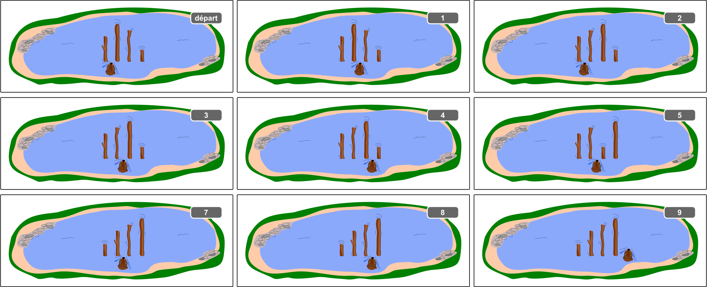

## Body

Hamid le castor trie les troncs d'arbre dans le lac. Ils doivent aller du plus petit au plus grand de gauche à droite.
- Hamid commence avec les deux troncs tout à gauche.
- Il compare toujours deux troncs voisins:
  - Si le tronc de droite est plus long que le tronc de gauche, il nage d'un tronc vers la droite.
  - Par contre, si le tronc de gauche est le plus long, il échange les deux troncs. Ensuite, il nage d'un tronc vers la droite s'il se trouve à sa position de départ et d'un tronc vers la gauche sinon.
- Hamid continue comme cela jusqu'à ce qu'il se trouve à la droite des troncs. Les troncs sont alors triés correctement.

L'exemple montre comment Hamid trie 4 troncs. Pour cela, il fait 9 comparaisons en tout.

Le nombre de comparaisons dépend de la configuation de départ des troncs. Pour trier 4 troncs, Hamid doit faire au moins 3 comparaisons (dans le cas où les troncs sont déjà triés correctement) et au maximum 9 comparaisons (dans le cas où les troncs sont dans l'ordre inverse). Hamid doit donc prévoir de faire entre 3 et 9 comparaisons pour trier 4 troncs.

## Question/Challenge - for the brochures

Hamid doit maintenant trier 40 troncs de longueurs différentes. Combien de comparaisons doit-il faire dans le meilleur et le pire des cas?

## Question/Challenge - for the online challenge

Hamid doit maintenant trier 40 troncs de longueurs différentes. Combien de comparaisons doit-il faire dans le meilleur et le pire des cas?

## Answer Options/Interactivity Description

--: | --
 A) | de 0 à 20 comparaisons
 B) | de 3 à 40 comparaisons
 C) | de 39 à 120 comparaisons
 D) | de 39 à 1521 comparaisons

## Answer Explanation

Dans le meilleur des cas, celui où tous les troncs sont déjà triés et où Hamid nage toujours vers la droite, Hamid ne doit faire que 39 comparaisons pour trier 40 troncs. Les réponses A) et B) ne peuvent donc pas être justes.

Dans le pire des cas, les troncs sont exactement dans l'ordre inverse. C'est plus difficile de déterminer le nombre de comparaisons nécessaires ici. On constate d'abord que les troncs à la gauche de Hamid sont toujours bien triés. Si Hamid arrive à un tronc qui est plus petit que les $k$ troncs à sa gauche, il l'échange jusqu'à arriver tout à gauche, faisant ainsi déjà $k$ comparaisons. Il revient et nage encore d'un tronc vers la droite, faisant $k-1$ comparaisons mais aucun échange. Il fait donc $k + (k-1) = 2k - 1$ comparaisons. Ceci a lieu pour chacune des $n-1$ positions entre deux troncs et Hamid a en moyenne $\frac{n}{2}$ troncs à sa gauche. Hamid fait donc $(n-1)\cdot(2\cdot\frac{n}{2}-1)=(n-1)^2$, dans notre cas $39^2= 1521$, comparaisons. Cela signifie que la réponse C) avec 120 comparaisons au maximum est fausse, et la bonne réponse est D).

## It's Informatics

Le tri d'élements est une tâche classique en informatique. Une méthode de tri efficace peut permettre de gagner beaucoup de temps.

L'algorithme de tri présenté ici s'appelle _Gnome Sort_ et a été introduit par l'informaticien iranien Hamid Sarbazi-Azad sous le nom de _Stupid Sort_. Plus tard, l'informaticien néerlandais Dick Grune a nommé cette méthode de tri Gnome Sort en imaginant qu'un nain de jardin (_garden gnome_ en anglais) pouvait trier des pots de fleurs de cette façon.

L'analyse de la durée d'exécution d'un algorithme (c'est à dire du temps dont l'algorithme peut avoir besoin réaliser sa tâche) est très importante en informatique. On veut souvent savoir quelle est la durée dans le meilleur des cas, en moyenne et dans le pire des cas, et cela en fonction de la taille $n$ de l'entrée (dans notre cas du nombre de troncs). Pour faciliter la comparaison de différentes durées d'exécution, on se contente la plupart du temps de donner un ordre de grandeur. La durée du Gnome Sort dans le meilleur des cas en fonction de $n$ est linéaire — on écrit cela $\mathcal{O}(n)$ —, la durée moyenne est de degré deux — on écrit cela $\mathcal{O}(n^2)$, et la durée dans le pire des cas est également de degré 2 — donc également $\mathcal{O}(n^2)$.

## Keywords and Websites

 - Gnome Sort: https://de.wikipedia.org/wiki/Gnomesort
 - Algorithme de tri: https://fr.wikipedia.org/wiki/Algorithme_de_tri
 - Théorie de la complexité: https://fr.wikipedia.org/wiki/Théorie_de_la_complexité_(informatique_théorique)#Relation_au_coût_énergétique
 - O-Notation, Landau-Symbole: https://fr.wikipedia.org/wiki/Comparaison_asymptotique

## Wording and Phrases

(Not reported from original file)

## Comments

(Not reported from original file)
