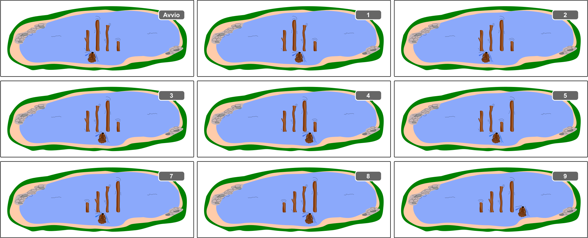

## Body

Il castoro Hamid ordina i tronchi nel lago. Da sinistra a destra, dovrebbero diventare sempre più lunghi.
- Hamid inizia tra i due tronchi all'estrema sinistra.
- Confronta sempre due tronchi vicini:
  - Se il tronco di destra è più lungo di quello di sinistra, Hamid si sposta di uno spazio a destra.
  - Se invece il tronco sinistro è più lungo, allora scambia i due tronchi. Dopo lo scambio, Hamid si sposta di uno spazio a destra se è nella posizione di partenza e uno a sinistra altrimenti.
- Hamid continua in questo modo finché non ha raggiunto la destra di tutti i tronchi. Poi tutti i tronchi sono ordinati correttamente.

L'esempio mostra come Hamid ordina 4 tronchi. Fa un totale di 9 confronti.

Il numero di confronti dipende da come sono disposti i tronchi all'inizio. Per 4 tronchi, Hamid deve fare almeno 3 confronti (se i tronchi sono già ordinati correttamente) e un massimo di 9 confronti (se i tronchi sono tutti ordinati esattamente nel senso contrario). Quindi, per 4 tronchi, Hamid deve fare i conti con 3 a 9 confronti.

## Question/Challenge - for the brochures

Hamid ora deve ordinare 40 tronchi di diverse lunghezze. Quanti confronti deve aspettarsi? 

## Question/Challenge - for the online challenge

Hamid ora deve ordinare 40 tronchi di diverse lunghezze. Quanti confronti deve aspettarsi? 

## Answer Options/Interactivity Description

--: | --
 A) | 0 a 20 confronti
 B) | 3 a 40 confronti
 C) | 39 a 120 confronti
 D) | 39 a 1560 confronti

## Answer Explanation

Per 40 tronchi, Hamid ha già bisogno di 39 confronti nel caso migliore, cioè quando tutti i tronchi sono già ordinati e quindi nuota sempre verso destra finché ha finito. Questo significa che le risposte A) e B) non possono essere corrette.

Nel peggiore dei casi, i tronchi sono ordinati esattamente al contrario all'inizio. Qui, il numero di molti confronti è più difficile da determinare. Osserviamo innanzitutto quanto segue: 
I tronchi d'albero a sinistra di Hamid sono sempre ordinati correttamente. Così, quando Hamid arriva a un tronco che è più corto di quelli $k$ alla sua sinistra, prima lo scambia all'estrema sinistra, facendo $k$ confronti. Poi torna indietro e nuota ancora una volta verso destra, facendo altri $k-1$ confronti ma senza scambiare nulla. In totale, sono $k + (k-1) = 2k - 1$ confronti. Questo accade in ognuna delle $n-1$ posizioni tra due tronchi, e il numero di tronchi alla sinistra di Hamid è $\frac{n}{2}$ in media. Così Hamid fa un totale di $(n-1)\cdot(2\cdot\frac{n}{2}-1)=(n-1)^2$, cioè $39^2= 1521$ confronti. Quindi la risposta C) con al massimo 120 confronti è sbagliata e la risposta D) è corretta.

## It's Informatics

L'ordinamento degli elementi è un compito classico dell'informatica. Un ordinamento efficiente fa risparmiare molto tempo.
L'algoritmo di ordinamento qui presentato si chiama _Gnome Sort_ ed è stato originariamente presentato dall'informatico iraniano Hamid Sarbazi-Azad come _Stupid Sort_.  Più tardi, l'informatico olandese Dick Grune ha chiamato questo metodo di ordinamento Gnome Sort, con l'idea che uno gnomo da giardino (ingl. _garden gnome_) potesse ordinare i vasi di fiori in questo modo.

L'analisi del tempo di esecuzione degli algoritmi (cioè scoprire quanto tempo un algoritmo può impiegare fino al suo completamento) è molto importante nell' informatica. Ci si chiede spesso quale sia il tempo di esecuzione nel caso migliore, nel caso medio e nel caso peggiore, a seconda della variabile di ingresso $n$. (Nel nostro caso, prendiamo il numero di tronchi d'albero per questo.) Per mantenere il confronto tra diversi tempi di esecuzione il più semplice possibile, di solito ci si accontenta di specificarli solo approssimativamente. Nel caso migliore, Gnome Sort ha bisogno solo di un tempo di esecuzione lineare - si scrive $\mathcal{O}(n)$ -, nel caso medio un tempo di esecuzione quadratico - si scrive $\mathcal{O}(n^2)$ - e nel caso peggiore anche un tempo di esecuzione quadratico - si scrive ancora $\mathcal{O}(n^2)$.

## Keywords and Websites

 - Gnome Sort: https://it.wikipedia.org/wiki/Gnome_sort
 - Algoritmo di ordinamento: https://it.wikipedia.org/wiki/Algoritmo_di_ordinamento
 - Analisi di tempo di esecuzione
 - O-grande: https://it.wikipedia.org/wiki/O-grande

## Wording and Phrases

(Not reported from original file)

## Comments

(Not reported from original file)
