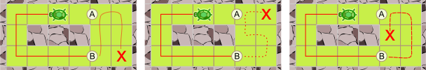
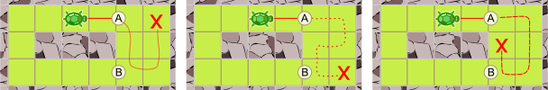

## Body

")
Eine Schildkröte soll verschiedene Gärten abgrasen.
Jeder Garten ist in Quadrate unterteilt, die entweder mit Gras oder Steinen bedeckt sind.
Die Schildkröte kann keine Steine überqueren. Sie kann sich aber von einem Grasfeld zu einem anderen Grasfeld direkt daneben bewegen.

Die Schildkröte soll die Gärten vollständig abgrasen. Sie startet auf dem Feld, auf dem sie im Bild steht. 
Am Ende soll sie in jedem Grasfeld genau einmal gewesen sein.

Leider kann die Schildkröte so einen der Gärten nicht vollständig abgrasen.

## Question/Challenge - for the brochures

Welcher ist es?

## Question/Challenge - for the online challenge

Welcher ist es?

## Answer Options/Interactivity Description

| --: | :-----+ | --: | :-----+ |
|  A) | ![ansA] |  B) | ![ansB] |
|  C) | ![ansC] |  D) | ![ansD] |

[ansA]: graphics/2021-DE-07-turtlepathA.svg "Antwort A"
[ansB]: graphics/2021-DE-07-turtlepathB.svg "Antwort B"
[ansC]: graphics/2021-DE-07-turtlepathC.svg "Antwort C"
[ansD]: graphics/2021-DE-07-turtlepathD.svg "Antwort D"

## Answer Explanation

| --: | :------+ | --: | :------+ |
|  A) | ![explA] |  B) | ![explB] |
|  C) | ![explC] |  D) | ![explD] |

[explA]: graphics/2021-DE-07-turtlepathA-solution.svg "Erklärung Antwort A"
[explB]: graphics/2021-DE-07-turtlepathB-solution.svg "Erklärung Antwort B"
[explC]: graphics/2021-DE-07-turtlepathC-solution.svg "Erklärung Antwort C"
[explD]: graphics/2021-DE-07-turtlepathD-solution.svg "Erklärung Antwort D"

Die Gärten A, B und D kann die Schildkröte vollständig abgrasen.

Den Garten C kann die Schildkröte so nicht abgrasen. Die Schildkröte hat von ihrem Startpunkt aus nur 2 Möglichkeiten:
 - Geht sie zuerst nach links, kommt sie zu Punkt B. Von dort müsste sie die 6 Felder rechts so abgrasen, dass sie am Ende Punkt A erreicht. 
Aber keiner der von B aus möglichen Pfade endet bei A.

 - Geht die Schildkröte zuerst nach rechts, kommt sie zu A und müsste die 6 Felder so abgrasen, dass sie am Ende Punkt B erreicht. Jetzt kann man gleich argumentieren wie vorher, man muss nur oben und unten vertauschen. Es gibt also auch so keinen geeigneten Pfad.

 

## It's Informatics

Die Schildkröte soll einen Weg durch ihren Garten finden und dabei jedes Grasfeld genau einmal besuchen. Das Problem hinter dieser Aufgabe ist ein sogenanntes _Hamiltonpfadproblem_.

Ein Schildkrötengarten (also die Grasquadrate) kann so betrachtet werden:
Jedes Grasquadrat ist ein _Knoten_ (dargestellt als Punkt). Der Garten D sieht dann so aus:

")

Für derartige Strukturen (von Informatikern, aber auch von Mathematikern _Graphen_ genannt) stellte sich im 19. Jahrhundert Sir William Rowan Hamilton die Frage, ob es einen Pfad entlang der Kanten gibt, der jeden Knoten genau einmal besucht. Einen solchen Pfad nennt man deshalb auch _Hamilton-Pfad_. Die Frage, ob es überhaupt einen Hamilton-Pfad gibt, ist im Allgemeinen sehr schwer zu lösen. Niemand kennt einen _Algorithmus_, der für beliebige Graphen effizient (in mehr oder weniger nützlicher Frist) entscheiden könnte, ob es im vorgegebenen Graphen einen Hamilton-Pfad gibt oder nicht. Wir wissen auch nicht, ob es einen solchen effizienten Algorithmus überhaupt geben kann. Dies gilt für alle sogenannten _NP-vollständigen Probleme_, wovon das Hamilton-Pfad-Problem eines der berühmtesten ist.

## Keywords and Websites

 - Graph, Hamiltonpfad: https://de.wikipedia.org/wiki/Hamiltonkreisproblem
 

## Wording and Phrases

(Not reported from original file)

## Comments

(Not reported from original file)
