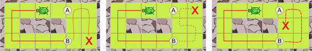
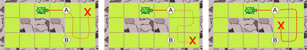

## Body

")
Una tartaruga vuole passeggiare in diversi giardini.
Ogni giardino è suddiviso in zone (quadrati) che sono coperte di erba o di pietre.
La tartaruga non può passeggiare dove ci sono le pietre. Tuttavia, può spostarsi da un quadrato d'erba a un altro quadrato d'erba proprio accanto.

La tartaruga vuole passare per tutte le zone d'erba di ogni giardino. In ogni giardino comincia la sua passeggiata sulla zona dove si trova nel disegno. 
Alla fine del suo giro, la tartaruga vuole aver visitato tutte le zone del giardino esattamente una volta.

Sfortunatamente, la tartaruga non può visitare tutte le zone d'erba esattamente una volta su uno dei giardini.

## Question/Challenge - for the brochures

Di quale giardino si tratta?

## Question/Challenge - for the online challenge

Di quale giardino si tratta?

## Answer Options/Interactivity Description

| --: | :-----+ | --: | :-----+ |
|  A) | ![ansA] |  B) | ![ansB] |
|  C) | ![ansC] |  D) | ![ansD] |

[ansA]: graphics/2021-DE-07-turtlepathA.svg "risposta A"
[ansB]: graphics/2021-DE-07-turtlepathB.svg "risposta B"
[ansC]: graphics/2021-DE-07-turtlepathC.svg "risposta C"
[ansD]: graphics/2021-DE-07-turtlepathD.svg "risposta D"

## Answer Explanation

| --: | :------+ | --: | :------+ |
|  A) | ![explA] |  B) | ![explB] |
|  C) | ![explC] |  D) | ![explD] |

[explA]: graphics/2021-DE-07-turtlepathA-solution.svg "Spiegazione risposta A"
[explB]: graphics/2021-DE-07-turtlepathB-solution.svg "Spiegazione risposta  B"
[explC]: graphics/2021-DE-07-turtlepathC-solution.svg "Spiegazione risposta  C"
[explD]: graphics/2021-DE-07-turtlepathD-solution.svg "Spiegazione risposta  D"

La tartaruga può visitare tutte le zone d'erba dei giardini A, B e D.

La tartaruga non può invece visitare tutte le zone d'erba del giardino C. La tartaruga ha solo 2 opzioni dal suo punto di partenza:
 - Se va prima a sinistra, arriverà al punto B. Da lì dovrebbe visitare i 6 campi sulla destra in modo da raggiungere il punto A alla fine. 
Ma nessuno dei possibili percorsi da B finisce ad A.

 - Se la tartaruga va prima a destra, arriva ad A e dovrebbe visitare i 6 campi in modo da raggiungere il punto B alla fine. Ora si può argomentare come prima, bisogna solo scambiare la parte superiore e inferiore. Quindi non c'è nessun cammino adatto neanche in questo modo.

 

## It's Informatics

La tartaruga deve trovare un cammino attraverso il suo giardino, visitando ogni campo erboso esattamente una volta. Il problema alla base di questo compito è il cosiddetto _problema del cammino hamiltoniano_.

Il giardino della tartaruga (cioè i quadrati di erba) può essere visto così:
Ogni quadrato d'erba è un _vertice_ (rappresentato come un nodo). Il giardino D si presenta quindi così:

")

Per tali strutture (chiamate _grafi_ dagli informatici e matematici), Sir William Rowan Hamilton si chiedeva nel XIX secolo se esistesse un cammino lungo i bordi che visita ogni nodo esattamente una volta. Un tale percorso è quindi chiamato un _cammino hamiltoniano_. La questione dell'esistenza o meno di un percorso hamiltoniano è generalmente molto difficile da risolvere. Nessuno conosce un _algoritmo_ che possa decidere in modo efficiente (in tempo più o meno utile) per grafi arbitrari se c'è o meno un cammino hamiltoniano nel grafo dato. Non sappiamo nemmeno se un tale algoritmo efficiente possa esistere. Questo è vero per tutti i cosiddetti problemi _NP-completi_, di cui il problema del cammino hamiltoniano è uno dei più famosi.

## Keywords and Websites

 - Cammino hamitoniano: https://it.wikipedia.org/wiki/Cammino_hamiltoniano
 

## Wording and Phrases

(Not reported from original file)

## Comments

(Not reported from original file)
