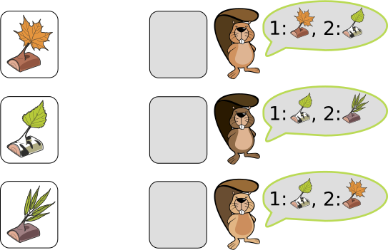
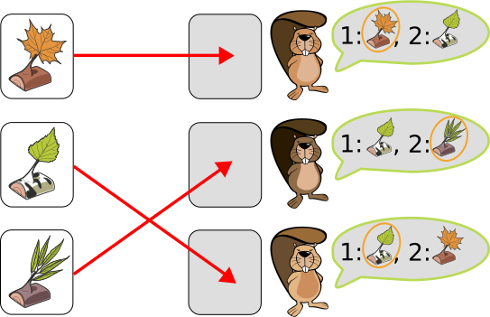

## Body

Die Biberfamilie hat drei Geschenke für ihre drei Kinder. Jedes Kind nennt zuerst sein Lieblingsgeschenk und dann das zweitliebste. Die Geschenke sollen richtig zugeteilt werden:

1. Möglichst viele Kinder sollen ihr Lieblingsgeschenk bekommen.
2. Die übrigen sollen das zweitliebste bekommen.

## Question/Challenge - for the brochures

Gib den Kindern die richtigen Geschenke.

## Question/Challenge - for the online challenge

Ziehe die richtigen Geschenke zu den Kindern. Klicke auf die Geschenke, um sie wieder zurückzulegen.

## Answer Options/Interactivity Description

<!-- empty -->

:::comment
Die Objekte links können per Drag & Drop in die Felder neben den Biberkindern gezogen werden. Jedem Kind darf nur ein Objekt zugeordnet werden. Es gibt ein Knopf zum Zurücksetzen.
:::

## Answer Explanation

Hier ist die einzige Zuordnung der Geschenke, die beide Bedingungen erfüllt.

Das dritte Geschenk wünscht sich nur der zweite Biber, deshalb muss er es bekommen. Ansonsten würde ein anderer etwas bekommen, das weder das Lieblingsgeschenk noch das zweitliebste ist. Für die anderen beiden Geschenke ist die Aufteilung dann klar: Jeder kann sein Lieblingsgeschenk bekommen.

## It's Informatics

Bei dieser Aufgabe handelt sich um ein eindeutiges _Zuordnungsproblem_: Wir möchten die Geschenke so zuordnen, dass alle Kinder ein Geschenk bekommen und es kein Kind ohne Geschenk gibt. Dabei haben die Kinder nicht nur einen einzelnen Wunsch, sondern geben eine Reihenfolge von Vorlieben an. Solche Zuordnungsprobleme mit Reihenfolgen von Vorlieben können sehr kompliziert werden. Die Informatik hilft uns dabei, solche Problem möglichst rasch zu lösen.

Eine Möglichkeit ist den Zuordnungen einen Wert zu geben: Das Lieblingsgeschenk hat Wert 1 und das zweitliebste Geschenk den Wert 2. Wir möchten den Gesamtwert minimieren. Eine _Zuordnung_ (engl. _Matching_) ist _optimal_, wenn es keine andere Zuordnung mit mehr erfüllten Erstplatzierungen gibt. In der Informatik wird so eine Zuordnung als _Rang-Maximal-Matching_ bezeichnet.  Es gibt viele Matching-Probleme.  Eines davon wird als _Problem der stabilen Paarung_ (engl. _Stable Marriage Problem_) bezeichnet. Klingt interessant? Informatik ist eben ein ganz vielseitiges Fach.

## Keywords and Websites

 - Zuordnungsproblem: https://de.wikipedia.org/wiki/Zuordnungsproblem
 - Rang-Wahl: https://de.wikipedia.org/wiki/Rang-Wahl

## Wording and Phrases

- Geschenke: erstes Set Objekte (Äste mit Blättern)
- Biberkinder: zweites Set Objekte
- Lieblingsgeschenk: das Geschenk (Objekt aus dem ersten Set) erster Wahl 
- zweitliebste(s): das Geschenk (Objekt aus dem ersten Set) zweiter Wahl
- richtiges Geschenk: ein Geschenk, das den Vorlieben der Biberkinder (Objekte aus dem zweiten Set) entspricht

## Comments

(Not reported from original file)
