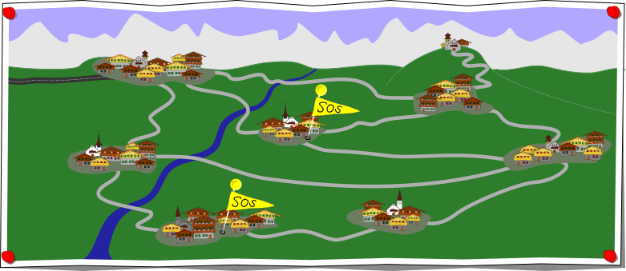
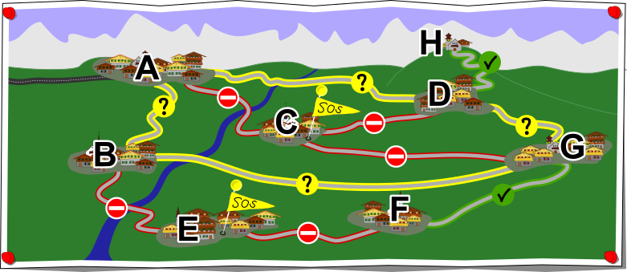

## Body

Einige Bergdörfer werden aus der grossen Stadt über folgendes Strassennnetz versorgt:

Nach einem Unwetter melden mehrere Dörfer, dass diese nicht mehr erreichbar sind, nämlich jene mit den SOS-Markierungen. Wir können daraus schliessen, dass einige Strassen blockiert sind.

## Question/Challenge - for the brochures

Gib für jede Strasse zwischen den Dörfern in diesem Strassennetz an, ob diese (1) blockiert ist ![blocked], (2) befahrbar ist ![good], oder (3) ob wir nicht ohne weitere Informationen sagen können, ob die Straße befahrbar oder blockiert ist ![unsure].

## Question/Challenge - for the online challenge

Gib für jede Strasse zwischen den Dörfern in diesem Strassennetz an, ob diese (1) blockiert ist ![blocked], (2) befahrbar ist ![good], oder (3) ob wir nicht ohne weitere Informationen sagen können, ob die Straße befahrbar oder blockiert ist ![unsure].
Klicke mehrmals auf die Strassen, um die Angaben zu ändern.

[good]:    graphics/2021-HU-02-good.svg   "blockiert (18px)"
[blocked]: graphics/2021-HU-02-bad.svg    "befahrbar (18px)"
[unsure]:  graphics/2021-HU-02-unsure.svg "unsicher  (18px)"

## Answer Options/Interactivity Description

<!-- empty -->

:::comment
Display a picture with the map above in a version that has a changeable and clickable picture label attached to each of its links. Initially, all are shown in some undetermined state. Clicking them then makes them loop through the three states that can be chosen for the answer: (1) showing as faulty (![blocked]), (2) showing as working (![good]), (3) showing as "we don’t know" (![unsure]).
:::

## Answer Explanation

Die Karte zeigt, was wir über die Verbindungen im Strassennetz wissen:

Wir beginnen mit dem Aufspüren der blockierten Strassen. Die zwei Strassen, die zu Dorf E führen, können blockiert sein, da ansonsten Dorf E noch erreichbar wäre. Ebenso sind die drei Strassen zu Dorf C blockiert, da sonst Dorf C noch erreichbar wäre.

Als nächstes suchen wir die Strassen, die befahrbar sein müssen. Die Strasse zwischen Dorf G und F muss befahrbar sein, da ansonsten, aufgrund der blockierten Strasse zwischen Dorf F und E, das Dorf F nicht erreichbar wäre. Auch die Strasse zwischen der Kirche H und dem Dorf D muss befahrbar sein, da H erreichbar ist und nur über D erreicht werden kann. 

Nun bleiben die nur möglicherweise befahrbaren Strassen übrig. Da die Dörfer B, G und D mehrfach mit dem Dorf A verbunden sind, können wir nicht sagen können, welche der verbleibenden Strassen befahrbar sind. So könnte das Dorf B beispielsweise über Dorf A, aber auch Dorf G erreicht werden. Dasselbe gilt auch für Dorf D. Das Dorf G kann entweder über Dorf B oder D versorgt werden. Irgendeine der Strassen im Kreislauf A – B – G – D – A könnte also blockiert sein und diese 4 Dörfer könnten trotzdem alle erreichbar bleiben.

## It's Informatics

So wie in Strassennetzen können auch bei Computernetzwerken Verbindungen fehlerhaft, überlastet oder ganz defekt sein. Um Ausfälle zu verhindern, werden oft Sicherheitsmassnahmen, wie z. B. mehrere Verbindungen zu einem Ort, eingeplant. Dies nennt man _Redundanz_.

Das Beheben von Fehlern in einem System ist eine Aufgabe, die Informatiker sehr oft erledigen müssen, nicht nur in Computernetzwerken, sondern auch in der Softwareentwicklung. Um einen Fehler zu beheben, muss man seine genaue Quelle identifizieren, und dieser Prozess erfolgt meist schrittweise in mehreren Schritten. Einige Programmierer glauben, dass man nie alle Fehler und Bugs in einem Programm finden kann.

## Keywords and Websites

 - Redundanz: https://de.wikipedia.org/wiki/Redundanz_(Technik)
 - Debuggen: https://de.wikipedia.org/wiki/Debuggen

## Wording and Phrases

(Not reported from original file)

## Comments

(Not reported from original file)
