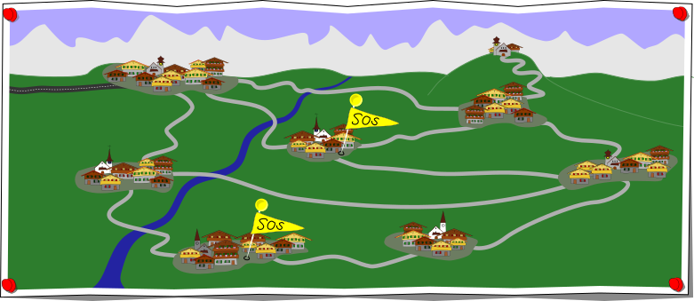

## Body

Alcuni villaggi di montagna sono collegati alla grande città attraverso la seguente rete stradale.

Dopo una tempesta, diversi villaggi segnalano che non sono più accessibili, in particolare quelli con i segnali di SOS. Possiamo concludere che alcune strade sono bloccate.

## Question/Challenge - for the brochures

Per ogni strada tra villaggi in questa rete stradale, segnala se è (1) bloccata ![blocked], (2) aperta ![good], o (3) non possiamo essere sicuri senza ulteriori informazioni che la strada sia aperta o bloccata ![unsure].

## Question/Challenge - for the online challenge

Per ogni strada tra villaggi in questa rete stradale, segnala se è (1) bloccata ![blocked], (2) aperta ![good], o (3) non possiamo essere sicuri senza ulteriori informazioni che la strada sia aperta o bloccata ![unsure].
Clicca più volte sulle strade per cambiarne lo stato.

[good]:    graphics/2021-HU-02-good.svg   "bloccata   (18px)"
[blocked]: graphics/2021-HU-02-bad.svg    "aperta     (18px)"
[unsure]:  graphics/2021-HU-02-unsure.svg "non chiaro (18px)"

## Answer Options/Interactivity Description

<!-- empty -->

:::comment
Display a picture with the map above in a version that has a changeable and clickable picture label attached to each of its links. Initially, all are shown in some undetermined state. Clicking them then makes them loop through the three states that can be chosen for the answer: (1) showing as faulty (![blocked]), (2) showing as working (![good]), (3) showing as "we don’t know" (![unsure]).
:::

## Answer Explanation

La mappa mostra quello che sappiamo sulle connessioni della rete stradale:

Iniziamo a riconoscere le strade bloccate. Le due strade che portano al villaggio E possono essere bloccate, perché altrimenti il villaggio E sarebbe ancora raggiungibile. Allo stesso modo, le tre strade che portano al villaggio C sono bloccate, perché altrimenti il villaggio C sarebbe ancora raggiungibile.

Poi, cerchiamo le strade che devono essere aperte. La strada tra il villaggio G e F deve essere aperta, altrimenti, a causa della strada bloccata tra il villaggio F ed E, il villaggio F non sarebbe raggiungibile. Anche la strada tra la chiesa H e il villaggio D deve essere aperta, poiché H è accessibile e può essere raggiunta solo attraverso D. 

Ora rimangono le strade che potrebbero essere aperte. Poiché i villaggi B, G e D sono collegati più volte al villaggio A, non possiamo dire quali delle strade rimanenti sono aperte. Per esempio, il villaggio B potrebbe essere raggiunto attraverso il villaggio A, ma anche attraverso il villaggio G. Lo stesso vale per il villaggio D. Il villaggio G può essere servito attraverso il villaggio B o D. Quindi una qualsiasi delle strade del circuito A - B - G - D - A potrebbe essere bloccata e questi 4 villaggi potrebbero ancora rimanere tutti accessibili.

## It's Informatics

Proprio come nelle reti stradali, le connessioni nelle reti di computer possono essere problematiche, sovraccaricate o completamente difettose. Per prevenire i guasti, sono spesso previste misure di sicurezza, come connessioni multiple ad un luogo. Questo si chiama _ridondanza_.

Sistemare i difetti in un sistema è un compito che gli informatici devono fare molto spesso, non solo nelle reti di computer ma anche nello sviluppo di software. Per correggere un errore è necessario identificare la sua fonte esatta, e questo processo è di solito fatto passo dopo passo in diverse fasi. Alcuni programmatori credono che non sia possibile trovare tutti gli errori e bug di un programma.

## Keywords and Websites

 - Ridondanza: https://it.wikipedia.org/wiki/Ridondanza_(ingegneria)
 - Debugging: https://it.wikipedia.org/wiki/Debugging

## Wording and Phrases

(Not reported from original file)

## Comments

(Not reported from original file)
