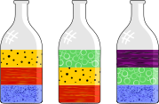

## Body

Mark hat Flaschen mit jeweils drei farbigen Flüssigkeiten, die übereinander geschichtet sind. Er weiss, dass sich die Flüssigkeiten mit geringerer Dichte immer über Flüssigkeiten mit grösserer Dichte bewegen. Nun möchte er sehen, wie es aussieht, wenn man alle farbigen Flüssigkeiten in eine Flasche gibt.

## Question/Challenge - for the brochures

Ordne die fünf farbigen Flüssigkeiten in der Flasche, so wie sie am Ende angeordnet sind!

## Question/Challenge - for the online challenge

Ziehe die fünf farbigen Flüssigkeiten in die Flasche, so wie sie am Ende angeordnet sind! Klicke auf die Flüssigkeiten, um sie zurückzulegen.

## Answer Options/Interactivity Description

<!-- empty -->

:::comment
Man sieht fünf farbige Rechtecke und eine leere Flasche evtl. mit fünf angedeuteten Bereichen. Mit der Maus können die farbigen Rechtecke in die Flasche auf die angedeuteten Bereiche gezogen werden.
:::

## Answer Explanation

Das Bild zeigt die richtige Anordnung der fünf farbigen Flüssigkeiten in der grossen Flasche.

Du findest die Reihenfolge nach folgendem Verfahren: Schritt für Schritt entfernst du in Gedanken aus den drei gegebenen Flaschen die Flüssigkeiten, die nicht auf einer anderen Flüssigkeit liegen, und gibst sie in die grosse Flasche. 

Zu Beginn hat nur in den beiden Flaschen 1 und 3 blaue Flüssigkeit und dort ist sie ganz unten, sie liegt also nirgendwo auf einer anderen Flüssigkeitsschicht. Die rote Flüssigkeit ist zwar in Flasche 2 ganz unten. Aber in Flasche 1 liegt sie auf der blauen Flüssigkeit und muss deshalb eine geringere Dichte als die blaue haben. Also wird als erstes die blaue Flüssigkeit aus den Flaschen entfernt und in die grosse Flasche gegeben. 

Jetzt ist die rote Flüssigkeit die einzige, die nicht auf einer anderen Flüssigkeit liegt. Sie wird aus den Flaschen 1 und 2 entfernt und in die grosse Flasche gegeben. Danach kommt die gelbe, dann die grüne und zum Schluss die violette Flüssigkeit, die die geringste Dichte hat und über der keine andere Flüssigkeit liegt.

## It's Informatics

Bei der Lösung dieser Aufgabe hast du die Anordnung der Flüssigkeiten in den drei Flaschen der Aufgabenstellung ausgewertet und die Flüssigkeiten nach ihrer Dichte sortiert. 

Ein Stoff hat viele messbare Eigenschaften: Siedetemperatur, Schmelztemperatur, elektrische Leitfähigkeit und eben die Dichte. In diesem Fall wurde die Dichte als Kriterium verwendet, Stoffe zu sortieren. 

In vielen Computerprogrammen spielt das Sortieren von Daten eine wichtige Rolle. 
Das Verfahren, das bei dieser Aufgabe zur Ermittlung der Reihenfolge der Flüssigkeitsschichten verwendet wurde, nennt man _topologisches Sortieren_. Es wird zum Sortieren von Objekten angewendet, für die Beziehungen der Art Vorgänger/Nachfolger bekannt sind.

## Keywords and Websites

 - Sortieren, Ordnung: https://de.wikipedia.org/wiki/Sortierung
 - Topologisches Sortieren: https://de.wikipedia.org/wiki/Topologische_Sortierung, https://www.ac.tuwien.ac.at/files/teaching/ss12/AD1/top_sortieren.pdf

## Wording and Phrases

Dichte: Die Dichte ist der Quotient aus der Masse $m$ eines Körpers und seinem Volumen $V$.
liegen auf: Eine Flüssigkeit liegt oberhalb einer anderen, wenn sie eine kleinere Dichte hat.
Flüssigkeit, Schicht, Glasflasche, Flasche

## Comments

(Not reported from original file)
