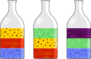
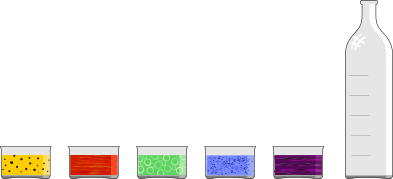
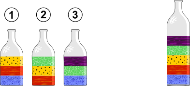

## Body

Marc a des des bouteilles qui contiennent chacune trois liquides formant des couches superposées. Il sait que les liquides à densité plus faible se mettent toujours au dessus des liquides à densité plus forte. Il aimerait maintenant voir à quoi une grande bouteille dans laquelle on met tous les liquides colorés ressemble.

## Question/Challenge - for the brochures

Arrange les cinq couches de liquides colorés dans la bouteille dans leur ordre final. 

## Question/Challenge - for the online challenge

Glisse les cinq couches de liquides colorés dans la bouteille dans leur ordre final. Clique sur un liquide dans la bouteille pour l'en ressortir.

## Answer Options/Interactivity Description

<!-- empty -->

:::comment
Man sieht fünf farbige Rechtecke und eine leere Flasche evtl. mit fünf angedeuteten Bereichen. Mit der Maus können die farbigen Rechtecke in die Flasche auf die angedeuteten Bereiche gezogen werden.
:::

## Answer Explanation

L'image montre le bon arrangement des couches de liquide dans la grande bouteille.

Tu trouves dans quel ordre se trouvent les couches de liquide de la façon suivante: étape par étape, tu enlèves dans ta tête les liquides qui ne sont pas au dessus d'autres liquides dans aucune des trois bouteilles données, et les verses dans la grande bouteille.

Au départ, le liquide bleu est tout au fond des bouteilles 1 et 3 et jamais au dessus d'une autre couche de liquide. Le liquide rouge est tout au fond de la bouteille 2, mais au-dessus du liquide bleu dans la bouteille 1 et doit donc avoir une densité plus faible que le liquide bleu. On enlève donc le liquide bleu des bouteilles et le verse dans la grande bouteille.

La liquide rouge est maintenant le seul qui n'est pas au dessus d'un autre liquide. On l'enlève des bouteilles 1 et 2 et le met dans la grande bouteille. Ensuite viennent le liquide jaune, puis le vert et finalement le violet, qui a la plus faible densité et au dessus duquel ne se trouve aucun autre liquide.

## It's Informatics

Dans cet exercice, tu as évalué l'arrangement des liquides dans les trois bouteilles et trié les liquides par densité.

Une substance a beaucoup de propriétés mesurables, par exemple la température d'ébulition, la température de fusion, la conductivité et la densité. Dans le cas présent, la densité a été utilisée comme critère pour trier des substances.

Le tri de données joue un rôle important dans beaucoup de programmes informatiques. La méthode utilisée dans cet exercice pour déterminer l'ordre des couches de liquide s'appelle _tri topologique_. Elle est utilisée pour trier des objets lorsque l'on connait la _relation d'ordre_ entre certains des objets (si l'on sait déjà que certains objets en précèdent ou suivent d'autres).

## Keywords and Websites

 - Relation d'ordre: https://fr.wikipedia.org/wiki/Relation_d%27ordre
 - Tri topologique: https://fr.wikipedia.org/wiki/Tri_topologique

## Wording and Phrases

Dichte: Die Dichte ist der Quotient aus der Masse $m$ eines Körpers und seinem Volumen $V$.
liegen auf: Eine Flüssigkeit liegt oberhalb einer anderen, wenn sie eine kleinere Dichte hat.
Flüssigkeit, Schicht, Glasflasche, Flasche

## Comments

(Not reported from original file)
