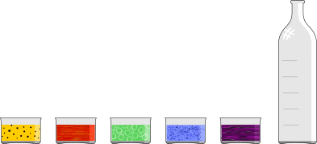

## Body

Mark ha delle bottiglie contenenti tre liquidi colorati ciascuna, stratificati l'uno sull'altro. Sa che i liquidi con densità minore si muovono sempre sopra i liquidi con densità maggiore. Ora vuole vedere cosa succede quando si mettono tutti i liquidi colorati in una bottiglia.

## Question/Challenge - for the brochures

Disponi i cinque liquidi colorati nella bottiglia come apparirebbero dopo averli mischiati tutti!

## Question/Challenge - for the online challenge

Disponi i cinque liquidi colorati nella bottiglia come apparirebbero dopo averli mischiati tutti! Clicca sui liquidi per rimetterli al loro posto iniziale.

## Answer Options/Interactivity Description

<!-- empty -->

:::comment
Man sieht fünf farbige Rechtecke und eine leere Flasche evtl. mit fünf angedeuteten Bereichen. Mit der Maus können die farbigen Rechtecke in die Flasche auf die angedeuteten Bereiche gezogen werden.
:::

## Answer Explanation

L'immagine mostra la corretta disposizione dei cinque liquidi colorati nella bottiglia grande.

L'ordine si trova seguendo la seguente procedura: passo dopo passo, rimuovi dalle tre bottiglie date i liquidi che non sono sopra un altro liquido e mettili nella bottiglia grande. 

All'inizio, solo le bottiglie 1 e 3 hanno un liquido blu e si trova sul fondo, quindi non si trova da nessuna parte su un altro strato di liquido. Il liquido rosso è sul fondo della bottiglia 2. Ma nella bottiglia 1 è sopra il liquido blu e deve quindi avere una densità inferiore al liquido blu. Quindi la prima cosa da fare è togliere il liquido blu dalle bottiglie e metterlo nella bottiglia grande. 

Ora il liquido rosso è l'unico che non si trova sopra un altro liquido. Viene tolto dalle bottiglie 1 e 2 e messo nella bottiglia grande. Poi viene il liquido giallo, poi il liquido verde e infine il liquido viola, che ha la densità più bassa e sopra il quale non si trova nessun altro liquido.

## It's Informatics

Nel risolvere questo compito, hai valutato la disposizione dei liquidi nelle tre bottiglie del compito e hai ordinato i liquidi in base alla loro densità.

Una sostanza ha molte proprietà misurabili: temperatura di ebollizione, temperatura di fusione, conducibilità elettrica e densità. In questo caso, la densità è stata utilizzata come criterio di selezione delle sostanze. 

L'ordinamento dei dati gioca un ruolo importante in molti programmi informatici. 
Il metodo usato in questo compito per determinare l'ordine degli strati liquidi è chiamato _ordinamento topologico_. Si usa per ordinare gli oggetti per i quali sono conosciute relazioni del tipo predecessore/successore.

## Keywords and Websites

 - Algortimo di ordinamento: https://it.wikipedia.org/wiki/Algoritmo_di_ordinamento
 - Ordinamento topologica: https://it.wikipedia.org/wiki/Ordinamento_topologico

## Wording and Phrases

Dichte: Die Dichte ist der Quotient aus der Masse $m$ eines Körpers und seinem Volumen $V$.
liegen auf: Eine Flüssigkeit liegt oberhalb einer anderen, wenn sie eine kleinere Dichte hat.
Flüssigkeit, Schicht, Glasflasche, Flasche

## Comments

(Not reported from original file)
