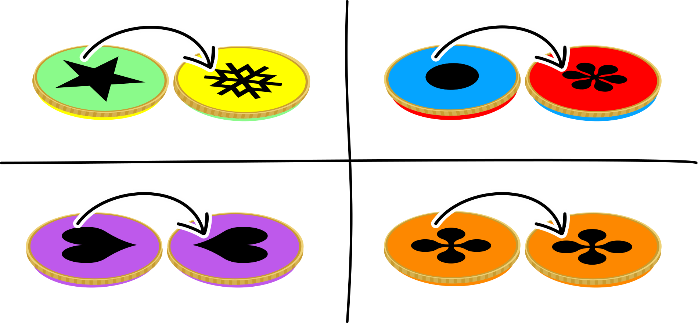
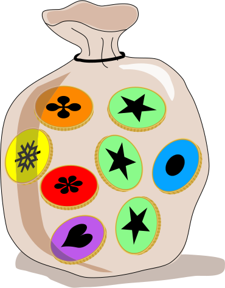

## Body

In Emils Land gibt es 4 verschiedene Arten von Münzen. Du siehst hier die beiden Seiten jeder Münzenart und auch Emils Sack mit seinen Münzen.

:::center
:--: | :---:
 | 
:::

Sein Sack mit Münzen wurde nun geschüttelt. 

## Question/Challenge - for the brochures

Welcher ist Emils Sack?

## Question/Challenge - for the online challenge

Welcher ist Emils Sack?

## Answer Options/Interactivity Description

| --: | :-----+ | --: | :-----+ |
|  A) | ![ansA] |  B) | ![ansB] |
|  C) | ![ansC] |  D) | ![ansD] |

[ansA]: graphics/2021-IE-02-answerA.svg "Antwort A"
[ansB]: graphics/2021-IE-02-answerB.svg "Antwort B"
[ansC]: graphics/2021-IE-02-answerC.svg "Antwort C"
[ansD]: graphics/2021-IE-02-answerD.svg "Antwort D"

## Answer Explanation

Die richtige Antwort ist C:

![ansC]

In Emils Sack sind  
 * 4 Münzen von der Art ![greenyellow],  
 * 2 von der Art ![bluered],  
 * 1 von der Art ![orange] und  
 * 1 von der Art ![purple].

:::center
|                | Emils Sack | **Sack A** | **Sack B** | Sack C | **Sack D** |
| :------------- | :--------: | :--------: | :--------: | :----: | :--------: |
| ![greenyellow] |   **4**    |   3        |   4        | **4**  |   2        |
| ![bluered]     |   **2**    |   3        |   1        | **2**  |   4        |
| ![orange]      |   **1**    |   1        |   2        | **1**  |   1        |
| ![purple]      |   **1**    |   1        |   1        | **1**  |   1        |
:::

Nur Sack C hat für jede Münzenart die gleiche Anzahl Münzen wie Emils Sack. Daher ist C die einzige richtige Lösung.

[greenyellow]: graphics/2021-IE-02-coin-greenyellow.svg "Grüne und gelbe Münze (100px)"
[bluered]: graphics/2021-IE-02-coin-bluered.svg "blaue und rote Münze (100px)"
[orange]: graphics/2021-IE-02-coin-orange.svg "orange Münze (100px)"
[purple]: graphics/2021-IE-02-coin-purple.svg "violette Münze (100px)"

## It's Informatics

In dieser Aufgabe muss man die Münzarten erkennen, ohne dass man beide Seiten der Münzen sieht. Man hat nur eine unvollständige Information. Objekte der realen Welt werden in einem Computersystem mit ihren wesentlichen Merkmalen gespeichert. Oft genügt es, nur einen Teil dieser Merkmale zu kennen, um ein Objekt erkennen zu können. Eine Kamera in einem autonomen Fahrzeug sieht stets nur Teile der Realität und das Computersystem muss trotzdem in der Lage sein, Fahrzeuge und Verkehrsteilnehmer zu erkennen und auf die jeweilige Verkehrssituation richtig zu reagieren. Die künstliche Intelligenz in Computersystemen lernt allmählich und immer besser aus Fragmenten ganze Objekte zu erkennen, ähnlich wie Menschen.

## Keywords and Websites

 - Multimenge: https://de.wikipedia.org/wiki/Multimenge
 - Unstrukturierte Daten: https://de.wikipedia.org/wiki/Unstrukturierte_Daten

## Wording and Phrases

Emil: Ein Name, der deutlich leichter auszusprechen ist als der gälische Originalname  Saoirse

Sack von Münzen: ich verwende das Wort Sack, weil das am ehesten der Grafik entspricht. Beutel wäre auch eine mögliche Bezeichnung.

Arten von Münzen // Münzarten

die 2 (beiden) Seiten von Münzen

## Comments

(Not reported from original file)
