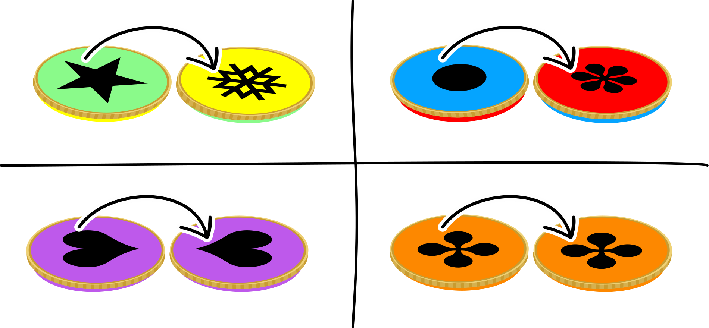
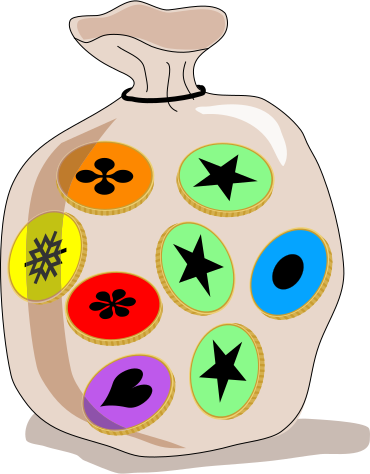

## Body

Nel paese di Emil ci sono 4 tipi diversi di monete. Qui puoi vedere i due lati di queste monete e anche il sacco di Emil con le sue monete.

:::center
:--: | :--:
 | 
:::

Il suo sacco viene in seguito agitato.

## Question/Challenge - for the brochures

Qual è il sacco di Emil?

## Question/Challenge - for the online challenge

Qual è il sacco di Emil?

## Answer Options/Interactivity Description

| --: | :-----+ | --: | :-----+ |
|  A) | ![ansA] |  B) | ![ansB] |
|  C) | ![ansC] |  D) | ![ansD] |

[ansA]: graphics/2021-IE-02-answerA.svg "risposta A"
[ansB]: graphics/2021-IE-02-answerB.svg "risposta B"
[ansC]: graphics/2021-IE-02-answerC.svg "risposta C"
[ansD]: graphics/2021-IE-02-answerD.svg "risposta D"

## Answer Explanation

La risposta corretta è C:

![ansC]

Il sacco di Emil ha:
 - 4 monete ![greenyellow],
 - 2 monete ![bluered],
 - 1 moneta ![orange]
 - e 1 moneta ![purple].

:::center
|                | Sacco di Emil | **Sacco A** | **Sacco B** | Sacco C | **Sacco D** |
| :------------- | :-----------: | :---------: | :---------: | :-----: | :---------: |
| ![greenyellow] |   **4**       |   3         |   4         |  **4**  |   2         |
| ![bluered]     |   **2**       |   3         |   1         |  **2**  |   4         |
| ![orange]      |   **1**       |   1         |   2         |  **1**  |   1         |
| ![purple]      |   **1**       |   1         |   1         |  **1**  |   1         |
:::

Solo il sacco C ha lo stesso numero di monete per ogni tipo di moneta del sacco di Emil. Pertanto, è la soluzione.

[greenyellow]: graphics/2021-IE-02-coin-greenyellow.svg "moneta gialla e verde (100px)"
[bluered]: graphics/2021-IE-02-coin-bluered.svg "moneta blu e rossa (100px)"
[orange]: graphics/2021-IE-02-coin-orange.svg "moneta arancia (100px)"
[purple]: graphics/2021-IE-02-coin-purple.svg "moneta viola (100px)"

## It's Informatics

In questo compito devi riconoscere i tipi di monete senza vedere entrambi i lati. Hai dunque solo informazioni incomplete. Gli oggetti del mondo reale sono immagazzinati in un sistema informatico con le loro caratteristiche essenziali. Spesso è sufficiente conoscere solo una parte di queste caratteristiche per poter riconoscere un oggetto. Una telecamera in un veicolo autonomo (per esempio un'automobile) vede sempre solo parti della realtà e il sistema informatico deve comunque essere in grado di riconoscere i veicoli e le persone sulla strada e reagire correttamente alla rispettiva situazione del traffico. Come gli esseri umani, l'intelligenza artificiale dei sistemi informatici impara gradualmente a riconoscere correttamente gli oggetti a partire dai frammenti.

## Keywords and Websites

 - Multiinsieme: https://it.wikipedia.org/wiki/Multiinsieme
 

## Wording and Phrases

Emil: Ein Name, der deutlich leichter auszusprechen ist als der gälische Originalname  Saoirse

Sack von Münzen: ich verwende das Wort Sack, weil das am ehesten der Grafik entspricht. Beutel wäre auch eine mögliche Bezeichnung.

Arten von Münzen // Münzarten

die 2 (beiden) Seiten von Münzen

## Comments

(Not reported from original file)
