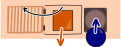
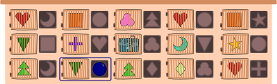

## Body

Bastian bekommt zum Geburtstag eine Kiste mit 15 Türen. Hinter der mittleren Tür ist ein weiteres Geschenk. Hinter den anderen Türen sind Bausteine. 
Zu jeder Tür gehört ein Loch, rechts neben der Tür. Bastian kann eine Tür öffnen, indem er in das Loch einen Baustein gleicher Form einwirft – wie einen Schlüssel.

Zu Beginn hat Bastian diesen runden Baustein: 

Er will höchstens fünf Türen öffnen, um das Geschenk zu erreichen.

## Question/Challenge - for the brochures

Welche Tür muss Bastian dafür zuerst öffnen?

## Question/Challenge - for the online challenge

Welche Tür muss Bastian dafür zuerst öffnen? Klicke auf die Tür. Klicke noch einmal, um sie wieder abzuwählen.

## Answer Options/Interactivity Description

<!-- empty -->

:::comment
Every door is clickable and will be highlighted with a blue square around it. Clicking again, to take away the highlighting.
:::

## Answer Explanation

Bastian muss zuerst die blau markierte Tür öffnen: 

Im folgenden Bild sind die Türen mit Buchstaben versehen und die Pfeile zeigen, wie Bastian mit insgesamt 5 Türöffnungen das Geschenk erreicht.  

Wir können die Reihenfolge, in der er die fünf Türen öffnet, auch wie folgt darstellen. 

Es gäbe auch andere Wege zum Geschenk, zum Beispiel folgenden.

Doch diese Wege sind alle zu lang, es müssten mehr als fünf Türen geöffnet werden. Alle Möglichkeiten durchzuprobieren, ist ziemlich aufwendig.

Im vorliegenden Fall findet man den kürzesten Weg und damit die richtige Lösung am schnellsten mit einer sogenannten _Rückwärtssuche_: Man beginnt bei der Tür mit dem Geschenk und schaut dann jeweils, welchen Baustein man benötigt. 

## It's Informatics

Mit mehr Zeit und Aufwand können wir die Situation in der Aufgabe auch als _Graph_ darstellen:

Ein Graph besteht allgemein aus _Knoten_ (Kreisen) und _Kanten_ (Linien) zwischen den Knoten. In unserem Fall haben wir einen Knoten für jede Form und das Geschenk. Die Kanten sind hier Pfeile (auch _gerichtete_ Kanten genannt) und entsprechen den Türen. Jeder Pfeil führt von der Form zum Öffnen der Tür zu der Form hinter der Tür.

Die Informatik arbeitet sehr gerne mit Graphen. Einerseits bieten sie oft anschauliche Darstellungen von abstrakten Zusammenhängen.

Andererseits existieren fertige Algorithmen, die uns Fragen zu Graphen sehr effizient beantworten. Bei komplizierteren Aufgaben kann sich der Aufwand für das Aufstellen des Graphen deshalb schnell lohnen.

In der vorliegenden Aufgabe suchen wir einen Weg der Länge höchstens 5 vom erhaltenen Baustein )") zum Geschenk )"). Ein guter Algorithmus dafür ist die sogenannte _Breitensuche_. Dieser funktioniert sowohl für Graphen mit gerichteten Kanten, wie in der Aufgabe, also auch für Graphen mit ungerichteten Kanten.

## Keywords and Websites

 - Gerichteter Graph: https://de.wikipedia.org/wiki/Gerichteter_Graph
 - Breitensuche: https://de.wikipedia.org/wiki/Breitensuche

## Wording and Phrases

Form
Tür
Pfeil
gerichtete Kante
gerichteter Graph

## Comments

(Not reported from original file)
