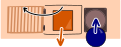
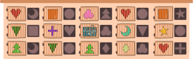
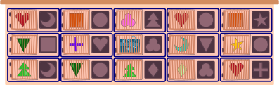
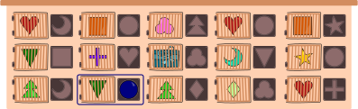
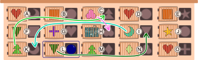
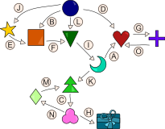

## Body

Pour son anniversaire, Bastien reçoit une boîte avec 15 portes. Il y a un autre cadeau derrière la porte du milieu et des plots de différentes formes derrière les autres portes. Chaque porte est associée à un trou qui se trouve à sa droite. Bastien peut ouvrir une porte en mettant un plot de la même forme dans le trou — comme une clé dans une serrure.

Au début, Bastien a ce plot rond: 

Il veut ouvrir au maximum cinq portes pour obtenir le cadeau.

## Question/Challenge - for the brochures

Quelle porte Bastien doit-il ouvrir en premier?

## Question/Challenge - for the online challenge

Quelle porte Bastien doit-il ouvrir en premier? Clique sur la porte pour la sélectionner; clique à nouveau pour la désélectionner.

## Answer Options/Interactivity Description

<!-- empty -->

:::comment
Every door is clickable and will be highlighted with a blue square around it. Clicking again, to take away the highlighting.
:::

## Answer Explanation

Bastien doit commencer par ouvrir la porte encadrée en bleu:

Dans l'illustration ci-dessous, chaque porte correspond a une lettre et les flèches montrent comment Bastien obtient le cadeau en n'ouvrant que cinq portes au maximum.

On peut également représenter l'ordre dans lequel Bastien ouvre les cinq portes de la façon suivante:

Il y a aussi d'autres chemins menant au cadeau, par exemple celui-ci:

Mais ces chemins sont tous trop longs: il faut ouvrir plus de cinq portes. C'est un gros travail que d'essayer toutes les possibilités.

Dans notre cas, on trouve le chemin le plus court et donc la bonne solution en faisant ce que l'on appelle une _recherche inversée_: on commence par la porte derrière laquelle se trouve le cadeau et on regarde ensuite de quel plot on a besoin.

## It's Informatics

Avec un peu plus de temps et de travail, on peut également représenter la situation de cet exercice sous forme de _graphe_:

Un graphe est composé de _nœuds_ (cercles) et _arêtes_ (lignes) entre les nœuds. Ici, nous avons un nœud pour chaque forme et pour le cadeau. Les arêtes sont dans notre cas des flèches (aussi appelées arêtes _orientées_) qui correspondent aux portes. Chaque arête mêne de la forme qui ouvre une porte à la forme se trouvant derrière la porte.

En informatique, on travaille volontiers avec des graphes. D'un côté, ils permettent souvent de représenter des relations abstraites de manière claire. D'un autre côté, il existe des algorithmes pour répondre à des questions liées aux graphes de manière efficace. Le travail nécessaire à l'élaboration du graphe en vaut vite la peine pour des problèmes compliqués.

Dans cet exercice, nous cherchons un chemin de longueur 5 au maximum entre le plot reçu )") et le cadeau )"). Un bon algorithme pour cela est le _parcours en largeur_. Il fonctionne aussi bien pour les graphes avec des arêtes orientées comme dans l'exercice que pour les graphes non orientés.

## Keywords and Websites

 - Graphe orienté: https://fr.wikipedia.org/wiki/Graphe_orienté
 - Algorithme de parcours en largeur: https://fr.wikipedia.org/wiki/Algorithme_de_parcours_en_largeur

## Wording and Phrases

Form
Tür
Pfeil
gerichtete Kante
gerichteter Graph

## Comments

(Not reported from original file)
