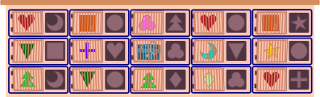
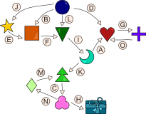

## Body

Bastian riceve una scatola con 15 porte per il suo compleanno. Dietro la porta centrale c'è il vero regalo. Dietro le altre porte ci sono blocchetti di varie forme. 
Ogni porta ha un foro a destra della porta. Bastian può aprire una porta inserendo un blocco della stessa forma nel foro - come una chiave.

All'inizio, Bastian ha questo blocco di costruzione rotondo: 

Vuole aprire un massimo di cinque porte per raggiungere il regalo.

## Question/Challenge - for the brochures

Quale porta deve aprire per prima Bastian?

## Question/Challenge - for the online challenge

Quale porta deve aprire per prima Bastian? Clicca sulla porta. Clicca di nuovo per deselezionarla.

## Answer Options/Interactivity Description

<!-- empty -->

:::comment
Every door is clickable and will be highlighted with a blue square around it. Clicking again, to take away the highlighting.
:::

## Answer Explanation

Bastian deve prima aprire la porta segnata in blu: 

Nell'immagine seguente, le porte sono contrassegnate da lettere e le frecce mostrano come Bastian raggiunge il regalo con un totale di 5 aperture di porte.  

Possiamo anche rappresentare l'ordine in cui apre le cinque porte come segue. 

Ci sarebbero anche altri modi per il regalo, per esempio il seguente.

Ma questi modi sono troppo lunghi, bisognerebbe aprire più di cinque porte. Provare tutte le possibilità richiede molto tempo.

In questo caso, il modo più veloce per trovare il percorso più breve e quindi la soluzione corretta è quello di utilizzare una cosiddetta ricerca a ritroso: inizia dalla porta con il regalo e poi guarda quale blocco di costruzione ti serve.

## It's Informatics

Con un po' di impego e tempo, la situazione del compito può anche essere rappresentata come un _grafo_:

Un grafo è generalmente composto da _vertici_ (nodi) e da _archi_ (bordi) tra i vertici. Nel nostro caso abbiamo un vertice per ogni forma e il regalo. Gli archi qui sono frecce (chiamate anche archi _diretti_) e corrispondono alle porte. Ogni freccia punta dalla forma per aprire la porta alla forma dietro la porta.

L'informatica ama molto lavorare con i grafi. Da un lato, forniscono spesso vivide rappresentazioni di relazioni astratte.

D'altra parte, esistono algoritmi già pronti che rispondono alle nostre domande sui grafi in modo molto efficiente. Per i compiti più complicati, lo sforzo di redigere il grafo può quindi ripagare rapidamente.

Nel compito in questione, stiamo cercando un percorso di lunghezza al massimo 5 dal blocco ricevuto )") al regalo )"). Un buon algoritmo per questo è la cosiddetta _ricerca in ampiezza_. Questo funziona sia per grafi con archi diretti, come nel compito, sia per grafi con archi non diretti.

## Keywords and Websites

 - Grafo diretto, digrafo: https://it.wikipedia.org/wiki/Digrafo_(matematica)
 - Ricerca in ampiezza: https://it.wikipedia.org/wiki/Ricerca_in_ampiezza

## Wording and Phrases

Form
Tür
Pfeil
gerichtete Kante
gerichteter Graph

## Comments

(Not reported from original file)
