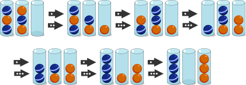

## Body

Die Biber möchten Kugeln nach ihrer Farbe ordnen. Am Ende sollen sich alle Kugeln in zwei Gläsern befinden. In einem Glas sollen die Kugeln dieselbe Farbe haben. Dabei sind diese drei Regeln zu befolgen:

)") Regel 1: In einem Schritt kann nur die oberste Kugel eines Glases bewegt werden.

)") Regel 2: Eine Kugel kann in ein leeres Glas bewegt werden.

)") Regel 3: Eine Kugel kann in ein Glas bewegt werden, wenn dort noch Platz frei ist und die darunter liegende Kugel dieselbe Farbe hat.

## Question/Challenge - for the brochures

Ordne die Kugeln, indem du sie nach den drei Regeln bewegst.

")

## Question/Challenge - for the online challenge

Ordne die Kugeln, indem du sie nach den drei Regeln bewegst. Klicke auf die Kugel, die du bewegen willst, und ziehe sie an den richtigen Ort.

")

## Answer Options/Interactivity Description

<!-- empty -->

:::comment 
Eine Kugel kann mit Klicken und Ziehen von einem Glas in ein anderes bewegt werden. Dabei kann jeweils nur die oberste Kugel des Glases angeklickt werden.
:::

## Answer Explanation

Die Kugeln können in der folgenden Reihenfolge bewegt werden:

Um die Kugeln neu zu ordnen, benötigt man mindestens 6 Schritte. Es gibt auch noch andere Möglichkeiten, die Kugeln in nur 6 Schritten neu zu ordnen.

## It's Informatics

In dieser Aufgabe bewegst du die Kugeln ähnlich wie der Computer in einem _Stapelspeicher_ Daten verwaltet: Er kann nur _oben ein Element_ (in der Aufgabe eine Kugel) _hinzufügen_ (engl. _push_) und nur das _oberste Element wieder entfernen_ (engl. _pop_). 

")

Auf die unteren Elemente kann der Computer nur zugreifen, wenn zuerst die Kugeln oberhalb entfernt werden. Und das Element, das als letztes gespeichert wurde, wird der Computer wieder als erstes entfernen. Dieses Prinzip nennen die Informatiker _Last-in-First-out-Prinzip_ (kurz _LIFO_).

## Keywords and Websites

 - Stapelspeicher, Kellerspeicher: https://de.wikipedia.org/wiki/Stapelspeicher

## Wording and Phrases

(Not reported from original file)

## Comments

(Not reported from original file)
