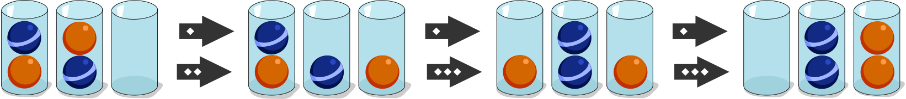

## Body

Les castors aimeraient trier des balles par couleur. À la fin, toutes les balles doivent se trouver dans deux verres. Toutes les balles qui se trouvent dans un verre doivent avoir la même couleur. Ils doivent suivre les règles suivantes:

)") Règle 1: Seule la balle la plus haute d'un verre peut être déplacée dans un autre verre.

)") Règle 2: Une balle peut toujours être mise dans un verre vide.

)") Règle 3: Une balle peut être mise dans un verre non vide uniquement s'il y reste de la place et que la balle en dessous a la même couleur que la balle déplacée.

## Question/Challenge - for the brochures

Trie les balles en les déplaçant d'après les trois règles.

")

## Question/Challenge - for the online challenge

Trie les balles en les déplaçant d'après les trois règles. Clique sur la balle que tu veux déplacer et glisse-la au bon endroit.

")

## Answer Options/Interactivity Description

<!-- empty -->

:::comment 
Eine Kugel kann mit Klicken und Ziehen von einem Glas in ein anderes bewegt werden. Dabei kann jeweils nur die oberste Kugel des Glases angeklickt werden.
:::

## Answer Explanation

Les balles peuvent être déplacées dans l'ordre suivant:

Il faut au moins six étapes pour réarranger les balles. Il existe d'autres possibilités de réarranger les balles en seulement six étapes.

## It's Informatics

Dans cet exercice, tu déplaces les balles comme un ordinateur gère les données enregistrées dans une _pile_: il ne peut qu'_empiler_ (_push_ en anglais) un élément en haut de la pile et _dépiler_ (_pop_ en anlgais) l'élément du haut de la pile. 

")

L'ordinateur ne peut accéder aux éléments du bas que si les balles du dessus ont d'abord été retirées. L'élément qui a été enregistré en dernier va être retiré en premier par l'ordinateur. Ce principe est appelé _dernier arrivé, premier sorti_ en informatique.

## Keywords and Websites

 - Pile: https://fr.wikipedia.org/wiki/Pile_(informatique)

## Wording and Phrases

(Not reported from original file)

## Comments

(Not reported from original file)
