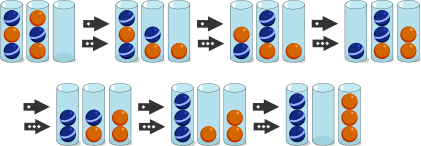

## Body

I castori vogliono ordinare le palline secondo il loro colore. Alla fine, tutte le palline dovrebbero essere in due bicchieri: ogni bicchiere conterrà palline dello stesso colore. Queste tre regole devono essere seguite:

)") Regola 1: Solo la pallina superiore di un bicchiere può essere mossa in un passo.

)") Regola 2: Una pallina può essere spostata in un bicchiere vuoto.

)") Regola 3: Una pallina può essere spostata in un bicchiere se c'è ancora spazio libero e la palla sotto ha lo stesso colore.

## Question/Challenge - for the brochures

Disponi le palline spostandole secondo le tre regole.

")

## Question/Challenge - for the online challenge

Disponi le palline spostandole secondo le tre regole. Clicca sulla pallina che vuoi spostare e trascinala nel posto giusto.

")

## Answer Options/Interactivity Description

<!-- empty -->

:::comment 
Eine Kugel kann mit Klicken und Ziehen von einem Glas in ein anderes bewegt werden. Dabei kann jeweils nur die oberste Kugel des Glases angeklickt werden.
:::

## Answer Explanation

Le palle possono essere spostate nel seguente ordine:

Per disporre le palline, hai bisogno di almeno 6 passi. Ci sono anche altri modi per disporre le palline in soli 6 passi.

## It's Informatics

In questo compito si spostano le palline in modo simile a come il computer gestisce i dati in una _pila_: Può solo _aggiungere un elemento in alto_ (_push_ in inglese) e solo _rimuovere l'elemento in alto_ (_pop_ in inglese). L'elemento in questo compito è una pallina.

")

Il computer può accedere agli elementi inferiori solo se prima vengono rimosse gli elementi superiori. E l'elemento che è stato memorizzato per ultimo, il computer lo rimuoverà di nuovo per primo. Gli informatici chiamano questo il principio _Last-in-First-out_ (_LIFO_ in breve)

## Keywords and Websites

 - Pila: https://it.wikipedia.org/wiki/Pila_(informatica)

## Wording and Phrases

(Not reported from original file)

## Comments

(Not reported from original file)
