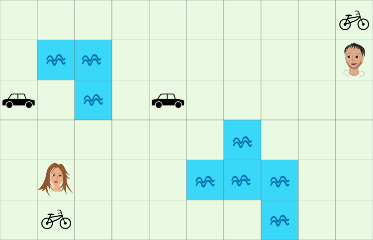
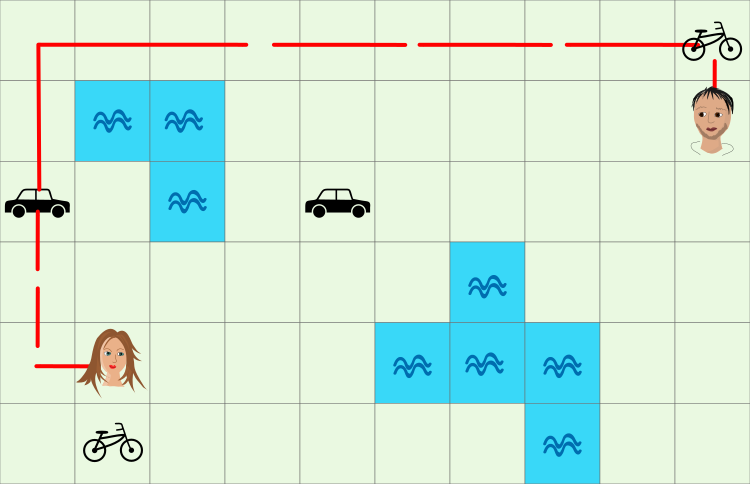

## Body

Due amici vogliono incontrarsi il più presto possibile. Possono spostarsi da una casella a una casella adiacente a sinistra, a destra, in alto o in basso. Ci vuole 1 minuto per farlo a piedi. Se raggiungono una casella con un veicolo, possono usarlo. Con una bicicletta possono raggiungere 2 campi in un minuto e con una macchina 5 campi. I cambi di direzione sono possibili. Non possono attraversare le superfici d'acqua.

## Question/Challenge - for the brochures

Di quanti minuti hanno bisogno i due amici per incontrarsi su una casella?

## Question/Challenge - for the online challenge

Di quanti minuti hanno bisogno i due amici per incontrarsi su una casella?

## Answer Options/Interactivity Description

--: | --
 A) | 1 minuto
 B) | 2 minuti
 C) | 3 minuti
 D) | 4 minuti
 E) | 5 minuti
 F) | 6 minuti

:::comment 
Optionally some interactivity could be added (e.g., allowing the two characters to be moved around the map with the mouse) to help students to think systematically without using pen and paper or needing to touch the screen.
:::

## Answer Explanation

La risposta corretta è 4. L'immagine mostra un percorso che permette ai due amici di incontrarsi in una casella in 4 minuti.

Ora bisogna dimostrare che non possono incontrarsi in 3 minuti:
I due amici sono a 11 campi di distanza l'uno dall'altro. In 3 minuti, però, possono avvicinarsi a piedi solo un totale di 6 campi. 
Se uno ha raggiunto la bicicletta e l'altro sta camminando, allora possono avvicinarsi di 9 caselle l'uno all'altro in 3 minuti, che non è neanche abbastanza. 
Anche se entrambi camminano verso una bicicletta, non è sufficiente. Perché allora potrebbero avvicinarsi di 12 spazi in 3 minuti, ma le due biciclette sono distanti 13 spazi.

Quindi l'unica opzione è usare una macchina. In 3 minuti, solo la ragazza può raggiungere una macchina. Ma poi non c'è più tempo per usare la macchina. E in 3 minuti il ragazzo non può raggiungere una casella con una macchina. 

## It's Informatics

Come hai risolto il compito? Hai trovato un percorso veloce per caso e hai sperato che non ce ne fosse uno più veloce? O hai provato molte possibilità e hai scoperto quella più veloce?

I programmi per computer progettati per questo tipo di problemi di solito usano un metodo chiamato _ricerca in ampiezza_. In questo problema, la ricerca in ampiezza funziona come segue:

------------------------------------------------------------------ | --+
") | 1. Segna tutte le caselle che possono essere raggiunte dai due amici in un minuto. \
                                                                   |   
") | 2. Segna tutti i campi che possono essere raggiunti in (al massimo) un minuto dai campi segnati nel passo&nbsp;1. Annota anche i mezzi di trasporto utilizzati. \
                                                                   |   
") | 3. Segna tutti i campi che possono essere raggiunti in un minuto dai campi che sono stati segnati nel passo&nbsp;2. \
                                                                   |   

Poiché le due aree che hai segnato finora non si sovrappongono, gli amici non possono incontrarsi dopo 3&nbsp;minuti. 

------------------------------------------------------------------ | --+
") | 4. Ora segna tutti i campi che possono essere raggiunti in un minuto dai campi segnati nel passo&nbsp;3. \
                                                                   |   

Ora le due aree si sovrappongono in un campo. Può essere raggiunto dopo 4 minuti dalla ragazza con una macchina e dal ragazzo con una bicicletta.
I sistemi di navigazione trovano il percorso più veloce tra due punti. Si assicurano che il percorso segua strade e sentieri adatti - e non attraverso la campagna e i fiumi. Questo compito è simile al problema della navigazione, tranne che qui due persone devono essere guidate verso una destinazione comune - inizialmente sconosciuta - piuttosto che una sola persona verso una destinazione fissa.

Poiché un computer procede sistematicamente nella ricerca in ampiezzza, trova anche soluzioni che non sono immediatamente ovvie. A volte una deviazione con meno semafori è più veloce del percorso più breve tra la partenza e la destinazione. Un collegamento in treno con un cambio di treno può essere più veloce di un collegamento diretto in autobus.
Nell'informatica, ci sono diversi metodi per trovare la migliore soluzione a un problema di questo tipo. Oltre alla ricerca in ampiezza, che è stata appena descritta, c'è anche un approccio chiamato _Branch and Bound_ (_ramificazione e limitazione_ in inglese).

Nella ricerca in ampiezza, viene considerata ogni soluzione parziale. Con _Branch and Bound_, non si perseguono ulteriormente le soluzioni parziali se si sa che non possono portare alla soluzione ottimale.

Se un problema diventa troppo complesso, ci vorrebbe troppo tempo anche per il computer più veloce del mondo per passare attraverso tutte le possibilità e trovare la soluzione migliore. In pratica, con un sistema di navigazione, è spesso sufficiente trovare un ottimo percorso, anche se non è il migliore possibile (se puoi raggiungere la tua destinazione in 78 minuti, probabilmente non ti importa se potrebbe teoricamente essere raggiunta in 77 minuti).

## Keywords and Websites

  - Ricerca in ampiezza: https://it.wikipedia.org/wiki/Ricerca_in_ampiezza
  - Algortimo branch and bound: https://it.wikipedia.org/wiki/Branch_and_bound

## Wording and Phrases

(Not reported from original file)

## Comments

(Not reported from original file)
