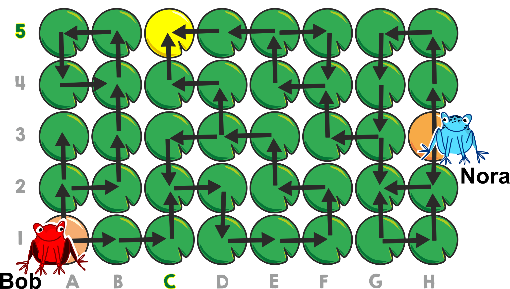
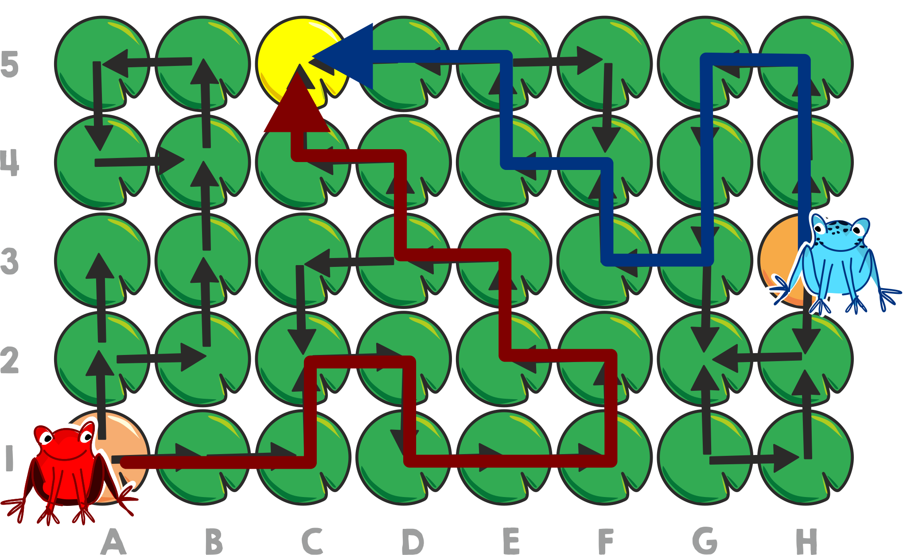
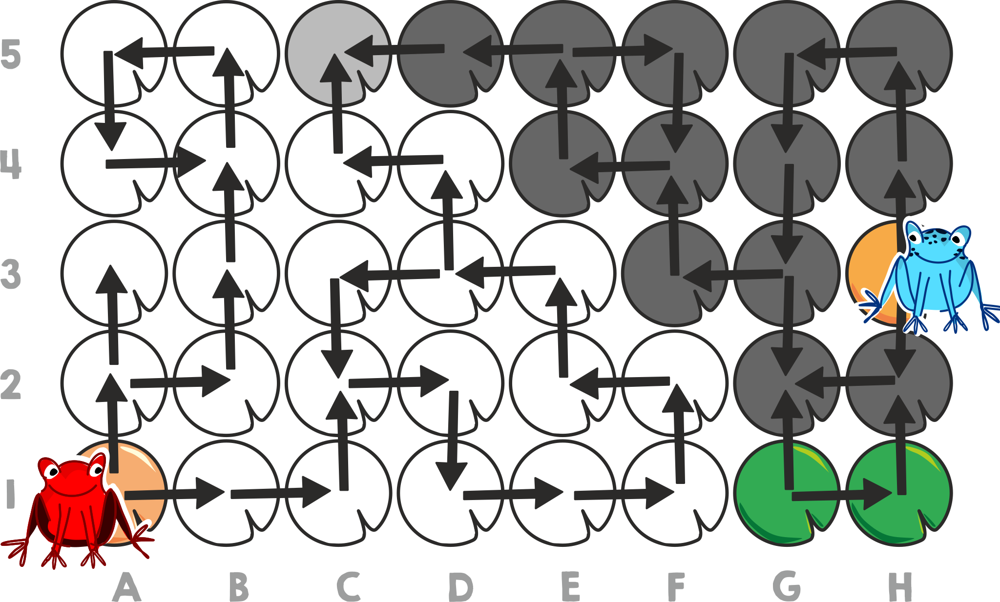

## Body

Auf einem See können zwei Frösche von Seerosenblatt zu Seerosenblatt springen – aber nur entlang der Pfeile.

## Question/Challenge - for the brochures

Auf welchem Seerosenblatt können sie sich treffen?

## Question/Challenge - for the online challenge

Auf welchem Seerosenblatt können sie sich treffen? Klicke auf das richtige Seerosenblatt.

## Answer Options/Interactivity Description

<!-- empty -->

Man kann auf die Blätter klicken. Klickt man auf ein Blatt, wird dieses ausgewählt und gleichzeitig ein bereits ausgewähltes Blatt wieder deaktiviert.

## Answer Explanation

Die Frösche können sich nur auf dem Blatt C5 treffen.

Auf seiner Startposition hat der rote Frosch Bob zwei Möglichkeiten: Geht er nach "oben", gerät er entweder in die Sackgasse A3 oder bleibt im Kreis stecken, der bei B4 beginnt. Geht er anfangs "rechts" (nach B1), kann er zunächst bis D3 weiterspringen. Dort kann er "links" in einen Kreis springen, der ihn wieder zu D3 bringt, oder nach "oben", was ihn weiter zu C5 bringt – eine weitere Sackgasse.

Der blaue Frosch Nora hat am Start auch zwei Wahlmöglichkeiten. Geht sie nach "unten", gerät sie in die Sackgasse G2. Falls sie nach "oben" startet, erreicht sie zunächst G3. Von dort kann sie entweder wieder in die Sackgasse G2 geraten oder nach "links" gehen und schliesslich E5 erreichen. Von dort geht es wieder in einen Kreis, der sie zu E5 bringt, oder zur Sackgasse in C5.

Wir wissen bereits, dass auch Bob C5 erreichen kann, also können sie sich dort treffen. Die Zeichnung zeigt die Wege, wie sie beide zu C5 gelangen können.

Das garantiert allerdings noch nicht, dass sie sich nicht auch woanders treffen könnten. Die nächste Zeichnung zeigt alle Blätter, die Bob (weiss) and Nora (dunkelgrau) erreichen können, wenn sie den Pfeilen auf jede erdenkliche Art folgen. Wir sehen, dass nur C5 von beiden erreicht werden kann.

## It's Informatics

Wie kann das letzte Bild erstellt werden?  Die Blätter, die von einem Frosch erreicht werden können, können mit einer _Breiten- oder Tiefensuche_ gefunden werden.  Dies sind zwei der wichtigsten Standardverfahren in der Informatik. Mit ihrer Hilfe kann man die dunkelgrauen und die weissen Blätter bestimmen. Schliesslich müssen nur noch die Blätter gefunden werden, welche von beiden Fröschen erreicht werden können.

## Keywords and Websites

 - Breitensuche: https://de.wikipedia.org/wiki/Breitensuche
 - Tiefensuche: https://de.wikipedia.org/wiki/Tiefensuche

## Wording and Phrases

Seerosenblatt – Blatt von einer Seerose https://de.wikipedia.org/wiki/Victoria_amazonica <!--SD: ;-) - Hier hätten auch Biber Platz gehabt! 3 Meter Durchmesser - krass -->

## Comments

(Not reported from original file)
