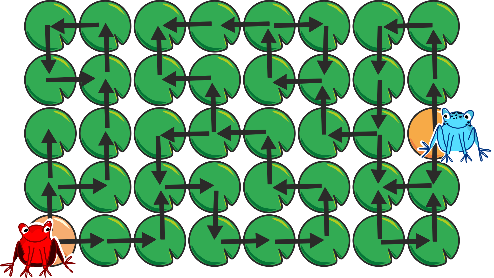
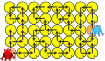
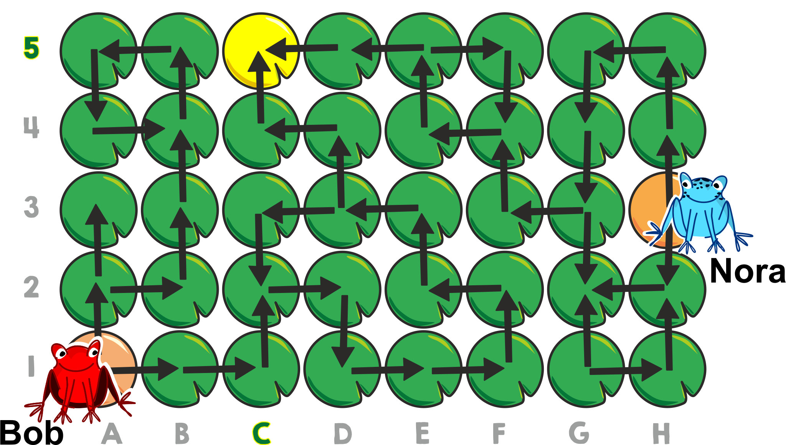
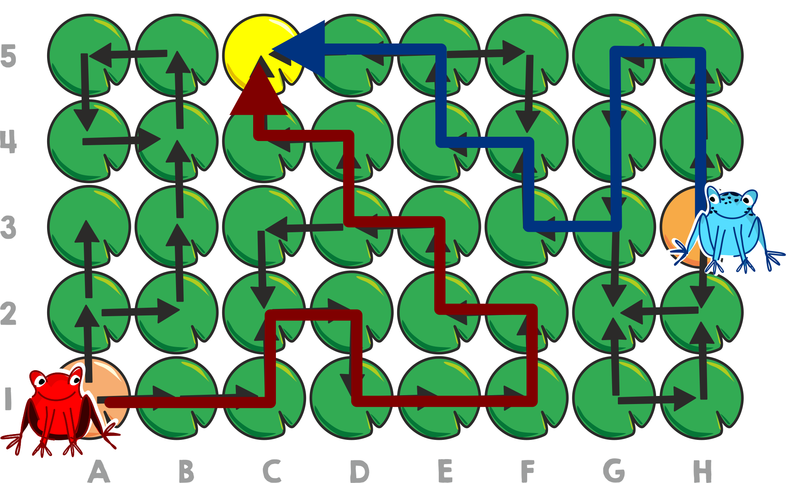
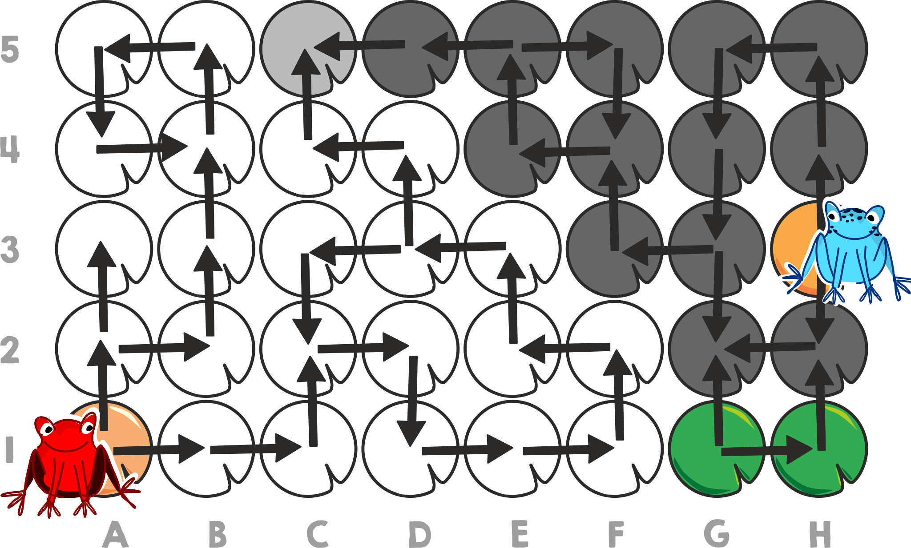

## Body

Sur un étang couvert de nénuphars, deux grenouilles peuvent se déplacer en sautant de feuille en feuille — mais seulement en suivant le sens des flèches.

## Question/Challenge - for the brochures

Sur quelle feuille les deux grenouilles peuvent-elles se rencontrer?

## Question/Challenge - for the online challenge

Clique sur la feuille de nénuphar sur laquelle les deux grenouilles peuvent se rencontrer.

## Answer Options/Interactivity Description

<!-- empty -->

Man kann auf die Blätter klicken. Klickt man auf ein Blatt, wird dieses ausgewählt und gleichzeitig ein bereits ausgewähltes Blatt wieder deaktiviert.

## Answer Explanation

Les grenouilles ne peuvent se rencontrer que sur la feuille C5.

Bob, la grenouille rouge, a deux possibilités depuis sa feuille de départ: si elle va vers le "haut", elle arrive soit dans le cul de sac sur A3 ou elle reste bloquée dans le cercle qui commence sur B4. Si elle va vers la "droite" (en direction de B1), elle peut sauter jusqu'à D3. Depuis D3, elle peut soit tourner en rond en partant vers la "gauche", soit aller vers le "haut" jusqu'à un autre cul de sac sur C5.

Nora, la grenouille bleue, a aussi le choix entre deux directions depuis sa feuille de départ. Si elle va vers le "bas", elle arrive dans le cul de sac sur G2. Si elle va vers le "haut", elle peut sauter jusqu'à G3. Depuis là, elle peut soit arriver dans le cul de sac sur G2 ou partir à "gauche" et atteindre E5. Depuis E5, elle peut soit tourner en rond, soit partir à "gauche" et arriver dans le cul de sac sur C5.

Nous savons que Bob peut aussi atteindre C5, elles peuvent donc s'y rencontrer. Le dessin montre les chemins qu'elles suivent pour y arriver.

Cela ne garantit pas encore qu'elle ne puissent pas aussi se rencontrer ailleurs. Le dessin suivant montre toutes le feuilles que Bob (en blanc) en Nora (en gris foncé) peuvent atteindre en suivant les flèches de toutes les manières possibles. On voit que seule la feuille C5 peut être atteinte par les deux grenouilles.

## It's Informatics

Comment peut-on générer la dernière image? Les feuilles pouvant être atteintes par une grenouille peuvent être trouvées à l'aide d'un _parcours en largeur_ ou d'un _parcours en profondeur_. Ce sont deux des méthodes les plus importantes en informatique. Grâce à elles, on peut déterminer quelles sont les feuilles blanches et les feuilles gris foncé. Il ne reste ensuite plus qu'à trouver les feuilles pouvant être atteintes par les deux grenouilles.

## Keywords and Websites

 - Parcours en largeur: https://fr.wikipedia.org/wiki/Algorithme_de_parcours_en_largeur
 - Parcours en profondeur: https://fr.wikipedia.org/wiki/Algorithme_de_parcours_en_profondeur

## Wording and Phrases

Seerosenblatt – Blatt von einer Seerose https://de.wikipedia.org/wiki/Victoria_amazonica

## Comments

(Not reported from original file)
