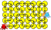

## Body

Su un lago, due rane possono saltare da una foglia di ninfea all'altra - ma solo lungo le frecce.

## Question/Challenge - for the brochures

Su quale foglia di ninfea possono incontrarsi?

## Question/Challenge - for the online challenge

Su quale foglia di ninfea possono incontrarsi? Clicca sulla foglia corretta.

## Answer Options/Interactivity Description

<!-- empty -->

Man kann auf die Blätter klicken. Klickt man auf ein Blatt, wird dieses ausgewählt und gleichzeitig ein bereits ausgewähltes Blatt wieder deaktiviert.

## Answer Explanation

Le rane possono incontrarsi solo sulla foglia C5.

Nella sua posizione di partenza, la rana rossa Bob ha due opzioni: se va "su", o entra nel vicolo cieco A3 o rimane bloccato nel cerchio che inizia in B4. Se inizialmente va "a destra" (a B1), può prima saltare su D3. Lì può saltare "a sinistra" in un cerchio, che lo riporta a D3, o "su", che lo porta ulteriormente a C5 - un altro vicolo cieco.

Anche la rana blu Nora ha due scelte all'inizio. Se va "giù", entra nel vicolo cieco G2. Se parte "in alto", raggiunge prima il G3. Da lì può entrare di nuovo nel vicolo cieco G2 o andare a "sinistra" e raggiungere finalmente la foglia E5. Da lì va di nuovo in un cerchio che la porta alla foglia E5, o al punto morto in C5.

Sappiamo già che anche Bob può raggiungere C5, quindi possono incontrarsi lì. Il disegno mostra i modi in cui entrambi possono arrivare a C5.

Tuttavia, questo non garantisce che non si incontreranno da qualche altra parte. Il prossimo disegno mostra tutte le foglie che Bob (bianco) e Nora (grigio scuro) possono raggiungere se seguono le frecce in ogni modo possibile. Vediamo che solo C5 può essere raggiunto da entrambi.

## It's Informatics

Come si può creare l'ultima immagine? Le foglie che possono essere raggiunte da una rana possono essere trovate con una _ricerca in ampiezza_ o una _ricerca in profondità_.  Queste sono due delle procedure standard più importanti nell'informatica. Con il loro aiuto, si può determinare le foglie grigie e bianche. Infine, bisogna trovare solo le foglie che possono essere raggiunte da entrambe le rane.

## Keywords and Websites

 - Ricerca in ampiezza: https://it.wikipedia.org/wiki/Ricerca_in_ampiezza
 - Ricerca in profondità: https://it.wikipedia.org/wiki/Ricerca_in_profondit%C3%A0

## Wording and Phrases

Seerosenblatt – Blatt von einer Seerose https://de.wikipedia.org/wiki/Victoria_amazonica

## Comments

(Not reported from original file)
