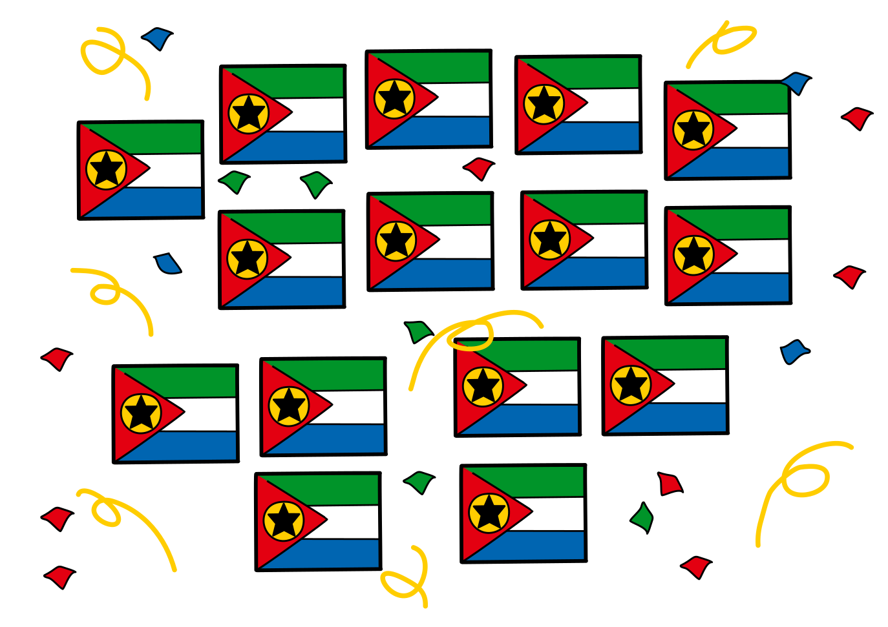

## Body

À Castorland vivent cinq clans, autrefois ennemis, qui possèdent chacun un certain nombre de maisons, comme on peut le voir dans l'image: les Mac Intosh, les Applondt, les Mac Rosoft, les Androidier et les Libredosset. Comme ils vivent en paix depuis longtemps, ils décident d'accomplir le rituel d'union. Les règles de ce rituel sont les suivantes:
- Seuls deux clans peuvent s'unir en même temps.
- Une fête d'une semaine a lieu dans chacune des maisons appartenant aux clans qui s'unissent afin de sceller le pacte. La durée du rituel de l'union, en semaines, est donc égale au nombre de maisons des deux clans.
- Après ce rituel, les deux clans ne forment plus qu'un clan. L'union des clans peut alors continuer.

Les clans décident de procéder à l'union en le moins de temps possible. Pour cela, il faut bien planifier l'ordre dans lequel les unions se feront.

")

## Question/Challenge - for the brochures

Combien de semaines au minimum l'union de tous les clans dure-t-elle?

## Question/Challenge - for the online challenge

Combien de semaines au minimum l'union de tous les clans dure-t-elle?

## Answer Options/Interactivity Description

--: | --+
 A) | 15 semaines
 B) | 33 semaines
 C) | 35 semaines
 D) | 50 semaines
 E) | 120 semaines

## Answer Explanation

La bonne réponse est B) 33 semaines.

La stratégie optimale pour minimiser le nombre total de semaines nécessaire à l'union de tous les clans consiste à minimiser le nombre de maisons y prenant part. Les maisons des clans unis au début doivent aussi être prises en compte dans les unions suivantes, c'est donc raisonnable de commencer avec les petits clans afin que les grands clans ne doivent pas participer au rituel trop souvent. Pour cela, à chaque étape, les deux clans avec le moins de maisons devraient être unis. 

Les étapes du processus sont représentées dans le tableau suivant; pour avoir une meilleure vue d'ensemble, nous laissons les noms des clans de côté et mentionnons seulement la taille des clans entre parenthèses: 

-------- | --+
![expl1] | (1) et (2) deviennent un seul clan (3); cela dure trois semaines.
![expl2] | (3) et (3) sont réunis en (6) en six semaines.
![expl3] | Maintenant, c'est le tour de (4) et (5) de former (9) en neuf semaines.
![expl4] | Finalement, les deux clans (6) et (9) restant sont réunis. Cela dure quinze semaines.

Le processus est donc terminé après $15+9+6+3=33$ semaines, ce qui correspond à la réponse B).

[expl1]: graphics/2021-PH-03-explan1.svg "explication étape 1"
[expl2]: graphics/2021-PH-03-explan2.svg "explication étape 2"
[expl3]: graphics/2021-PH-03-explan3.svg "explication étape 3"
[expl4]: graphics/2021-PH-03-explan4.svg "explication étape 4"

## It's Informatics

Cet exercice est un _problème d'optimisation_ — une tâche consistant à minimiser (dans ce cas, la durée du rituel d'union) ou maximiser une valeur. Souvent, des algorithmes sont utilisés pour cela, dont on ne peut ajourd'hui plus se passer pour des méthodes de production écologiques qui économisent les ressources, par exemple

Dans notre cas, le problème peut être résolu de manière optimale à l'aide d'un simple _algorithme glouton_. Celui-ci fait à chaque étape ce qui semble être le mieux d'après un critère simple. Dans notre cas, le critère est que les clans doivent être les plus petits parce que cela prend moins de temps.

## Keywords and Websites

 - Optimisation - https://fr.wikipedia.org/wiki/Optimisation_(mathématiques)
 - Algorithme glouton - https://fr.wikipedia.org/wiki/Algorithme_glouton

## Wording and Phrases

Vereinigung - aus 2 Clans einen einzigen Clan machen

## Comments

(Not reported from original file)
