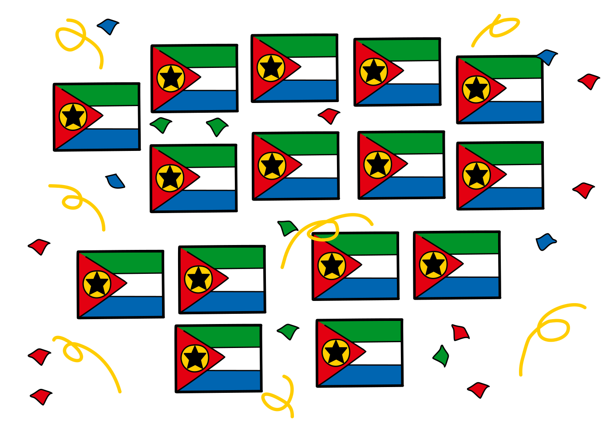

## Body

Cinque clan ostili vivono a Castoria, ogni clan occupa alcune case come puoi vedere nell'immagine. Si chiamano Mac Intosh, Apfler, Mac Rosoft, Androidiani e Freidosiani. Dato che i tempi sono stati pacifici per molto tempo, decidono di eseguire un rituale di unificazione. Le regole per questo rituale sono le seguenti:
- Solo due clan possono unirsi alla volta.
- In ogni casa dei clan che si uniscono, si tiene una celebrazione di una settimana per suggellare il patto. La durata dell'unione in settimane è quindi uguale al numero di case dei due clan.
- Dopo questo tempo, i due clan sono solo un clan. Ora l'unione dei clan può continuare.

I clan decidono di unirsi nel più breve tempo possibile. Questo può essere fatto solo pianificando attentamente l'ordine di unificazione.

")

## Question/Challenge - for the brochures

Qual'è il numero minimo di settimane che ci vogliono prima che tutti i clan siano uniti?

## Question/Challenge - for the online challenge

Qual'è il numero minimo di settimane che ci vogliono prima che tutti i clan siano uniti?

## Answer Options/Interactivity Description

--: | --+
 A) | 15 settimane
 B) | 33 settimane
 C) | 35 settimane
 D) | 50 settimane
 E) | 120 settimane

## Answer Explanation

La risposta corretta è B) 33 settimane.

La strategia ottimale per minimizzare il numero totale di settimane necessarie per unire tutti i clan è quella di minimizzare il numero di case coinvolte. Le case dei primi clan uniti vengono poi prese in considerazione anche per le ulteriori unificazioni. Ha quindi senso unire prima i clan più piccoli, in modo che quelli più grandi non debbano partecipare troppo spesso alla cerimonia. Per ottenere ciò, i due clan con il minor numero di case dovrebbero essere uniti in ogni passo.

Questo processo passo dopo passo è mostrato nella tabella seguente. Per motivi di chiarezza, ometteremo i nomi dei clan e citeremo solo le dimensioni dei clan tra parentesi:

-------- | --+
![expl1] | (1) e (2) sono uniti in un unico clan (3), il che richiede tre settimane.
![expl2] | (3) e (3) saranno uniti in (6) tra sei settimane.
![expl3] | Ora (4) e (5) saranno uniti in nove settimane per formare (9).
![expl4] | Infine, le rimanenti (6) e (9) sono unite. Questo richiede quindici settimane.

Così in totale il processo è completato dopo $15+9+6+3=33$ settimane, che è la risposta B).

[expl1]: graphics/2021-PH-03-explan1.svg "spiegazione passo 1"
[expl2]: graphics/2021-PH-03-explan2.svg "spiegazione passo 2"
[expl3]: graphics/2021-PH-03-explan3.svg "spiegazione passo 3"
[expl4]: graphics/2021-PH-03-explan4.svg "spiegazione passo 4"

## It's Informatics

Questo è un _problema di ottimizzazione_ - un compito per minimizzare o massimizzare un valore (in questo caso la durata dell'unificazione). Per questo, si usano spesso gli _algoritmi_, che, per esempio, sono ormai indispensabili per i processi di produzione rispettosi delle risorse e dell'ambiente.

In questo caso, il problema può anche essere risolto in modo ottimale con un semplice _algoritmo greedy_. Con questo algoritmo ad ogni passo si fa ciò che sembra essere meglio secondo una semplice idea. Nel nostro caso, l'idea è di unire prima i piccoli clan, perché questo richiede meno tempo. 

## Keywords and Websites

 - Problema di ottimizzazione - https://it.wikipedia.org/wiki/Problema_di_ottimizzazione
 - Algoritmo greedy - https://it.wikipedia.org/wiki/Algoritmo_greedy

## Wording and Phrases

Vereinigung - aus 2 Clans einen einzigen Clan machen

## Comments

(Not reported from original file)
