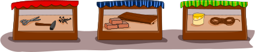

## Body

Bella möchte eine Brücke bauen, über einen Bach.
Sie braucht: Hammer, Nägel, Bretter und ein Seil.
Im Keller findet sie einen Hammer und ein Seil.

Die anderen Sachen muss sie einkaufen.
Unten siehst du drei Geschäfte, und was sie verkaufen.

## Question/Challenge - for the brochures

Wo kann Bella die anderen Sachen einkaufen?

## Question/Challenge - for the online challenge

Wo kann Bella die anderen Sachen einkaufen? Klicke die richtigen Geschäfte an. Klicke noch einmal, um sie wieder abzuwählen.

## Answer Options/Interactivity Description

<!-- empty -->

:::comment 
Durch Anklicken wechselt jedes Geschäft den Status zwischen „ausgewählt" und „nicht ausgewählt". Zu Beginn sind alle Geschäfte „nicht ausgewählt". Ein „ausgewähltes" Geschäft wird grafisch hervorgehoben.
:::

## Answer Explanation

So ist es richtig:

## It's Informatics

Die Geschäfte in dieser Biberaufgabe verkaufen insgesamt sieben Sachen: Schere, Hammer, Nägel, Ziegel, Bretter, Seil und Eimer. Das ist eine ganze Menge! Die beiden Sachen, die Bella einkaufen muss, sind ein _Teil dieser Menge_. Das kann man so malen: Man zeigt alle Sachen der gesamten Menge und markiert für jede Sache, ob sie zu Bellas Einkaufs-Teilmenge gehört oder nicht: 

Genauso kann man malen, was die Geschäfte verkaufen, zum Beispiel das Geschäft links:

So sieht man auf den ersten Blick, was Bella im Geschäft links einkaufen kann: Die Nägel haben einen grünen Haken in der Einkaufs-Teilmenge und in der Verkaufs-Teilmenge.

Auch Computerprogramme müssen häufig Mengen vergleichen. Das können sie so machen wie oben gezeigt: Für jede Sache, die vorkommen kann, wird ein _Bit_ benötigt. In einem Bit kann ein Computer einen von zwei Werten speichern, wie "ja" und "nein". In diesem Fall wird gespeichert, ob die Sache zu einer Menge gehört ("ja") oder nicht ("nein"). Dann kann ein Programm zwei Mengen so vergleichen: Es prüft, ob das Bit für eine Sache in der einen Menge "ja" vist und das Bit für die gleiche Sache in der anderen Menge auch "ja" ist. Eine solche Prüfung zweier Bits kann ein Computer besonders schnell erledigen. In der Informatik ist die Beschreibung von Mengen mit Bits deshalb sehr verbreitet.

## Keywords and Websites

 - Menge: https://de.wikipedia.org/wiki/Menge_(Datenstruktur)
 - Bits: https://de.wikipedia.org/wiki/Bit
 - Bitstrings: https://de.wikipedia.org/wiki/Bitkette

## Wording and Phrases

(Not reported from original file)

## Comments

(Not reported from original file)
